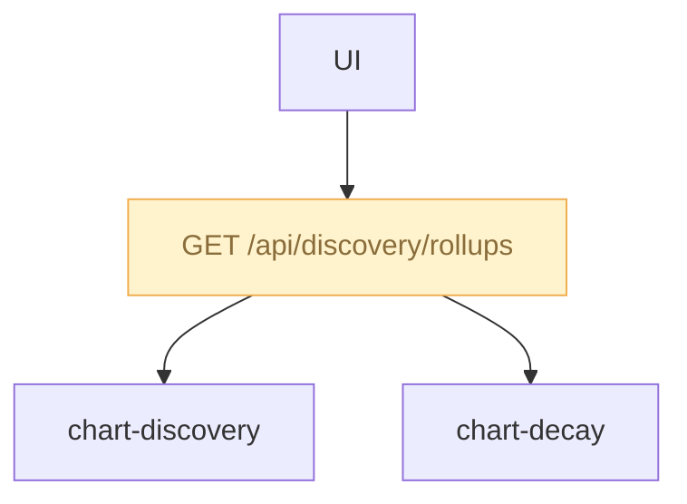

# SF — Dashboard

```mermaid
graph TD
  UI --> ROLL[GET /api/discovery/rollups]:::gap
  classDef gap fill:#fff3cd,stroke:#f0ad4e,color:#8a6d3b
  ROLL --> DISC[chart-discovery]
  ROLL --> DEC[chart-decay]
```
