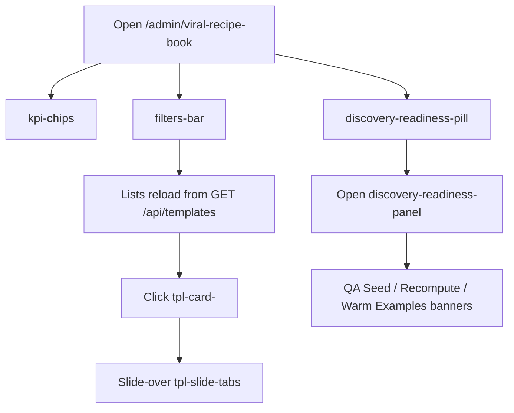

# UF — Templates

```mermaid
graph TD
  A[Open /admin/viral-recipe-book] --> B[kpi-chips]
  A --> C[discovery-readiness-pill]
  A --> D[filters-bar]
  D --> E[Lists reload from GET /api/templates]
  E --> F[Click tpl-card-<id>]
  F --> G[Slide-over tpl-slide-tabs]
  C --> H[Open discovery-readiness-panel]
  H --> I[QA Seed / Recompute / Warm Examples banners]
```
