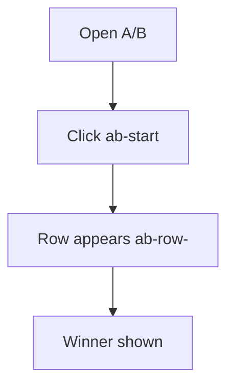

# A/B Test — UF/SF

## UF
1. Open A/B tab.
2. Click `ab-start` on a draft.
3. See row appear and update.



## SF
1. POST `/api/ab/start` [GAP] → returns { id, audit_id }.
2. Poll GET `/api/ab/:id` [GAP] until status=completed.

```mermaid
graph TD
  U[UI] -->|POST| S1[/api/ab/start]
  S1 --> R1[{ audit_id }]
  U -->|poll| S2[GET /api/ab/:id]
  S2 --> W[Winner]
```

### Variants
- Golden: completes with winner.
- Failure: start 4xx/5xx → toast and no row.

