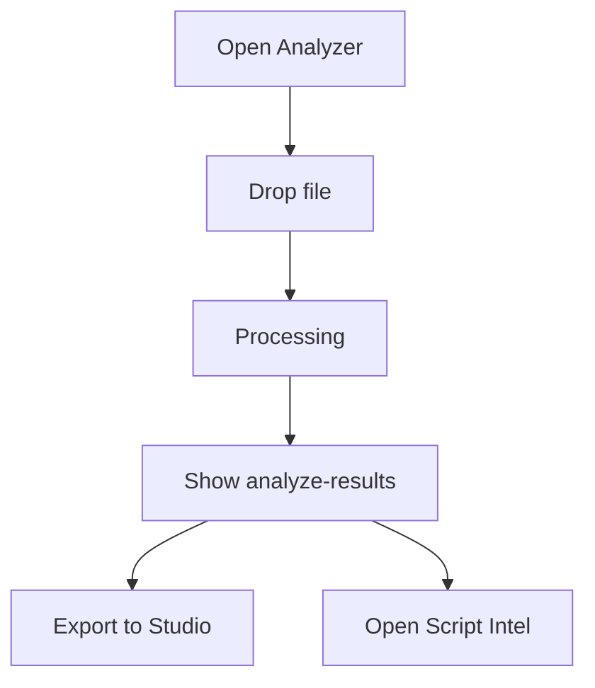

# Analyzer — UF/SF

## UF
1. Open Analyzer tab.
2. Drop a file or paste link.
3. Wait for processing.
4. View results and click a handoff button.



## SF
1. POST `/api/drafts/analyze` with payload.
2. Service extracts features → scores → generates recommendations.
3. Respond with score, features, recommendations, timings, optional `audit_id`.

```mermaid
graph TD
  U[UI] -->|POST| S1[/api/drafts/analyze]
  S1 --> P1[Extract features]
  P1 --> P2[Score draft]
  P2 --> P3[Generate recs]
  P3 --> R[200 JSON + audit_id]
```

### Variants
- Golden: success JSON and banner shows Audit #.
- Failure: 4xx/5xx → error state.

