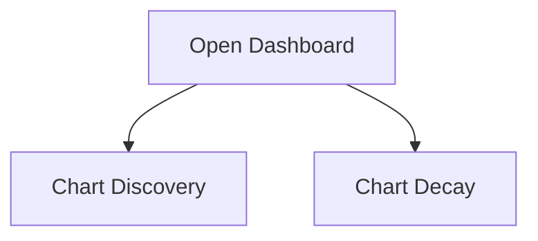
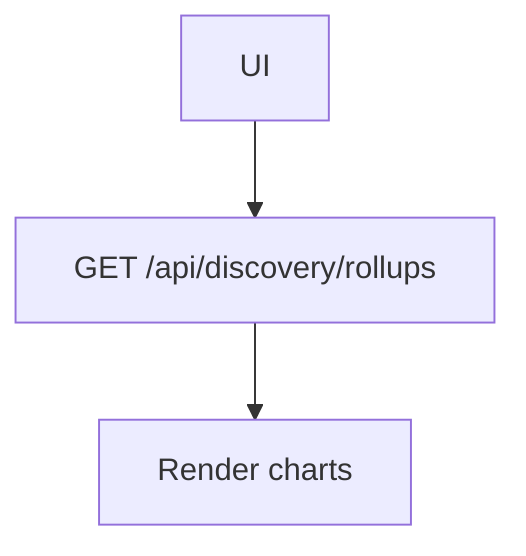

# Dashboard — UF/SF

## UF
1. Open Dashboard tab.
2. View Discovery Freshness and Template Decay.

## SF
1. GET `/api/discovery/rollups` [GAP] → chart series.

### Variants
- Golden: both charts populated.
- Failure: empty arrays → hint.

