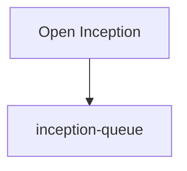
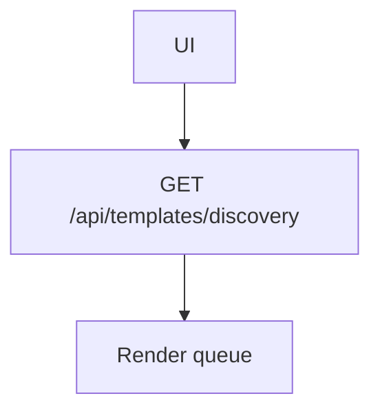

# Inception — UF/SF

## UF
1. Open Inception tab.
2. View discovery queue.

```mermaid
graph TD
  A[Open Inception] --> B[inception-queue]
```

## SF
1. GET `/api/templates/discovery`

```mermaid
graph TD
  U[UI] --> S1[GET /api/templates/discovery]
  S1 --> V[Render queue]
```
