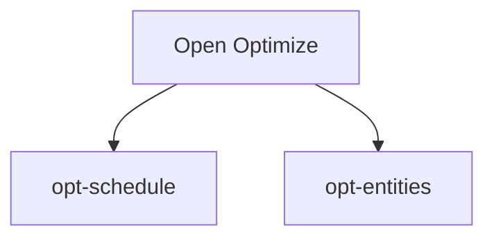
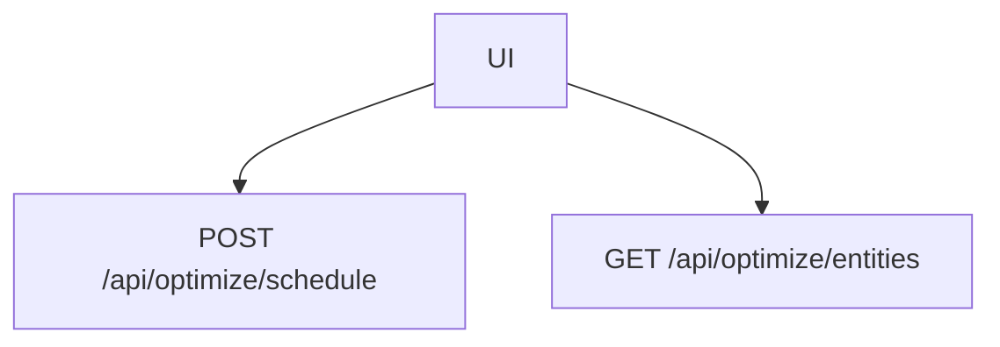

# Optimize — UF/SF

## UF
1. Open Optimize tab.
2. Configure schedule; view entities.

```mermaid
graph TD
  A[Open Optimize] --> B[opt-schedule]
  A --> C[opt-entities]
```

## SF
1. POST `/api/optimize/schedule` [GAP]
2. GET `/api/optimize/entities` [GAP]

```mermaid
graph TD
  U[UI] --> S1[POST /api/optimize/schedule]
  U --> S2[GET /api/optimize/entities]
```
