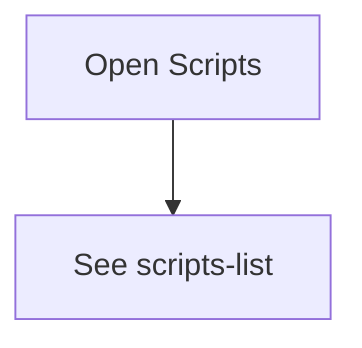
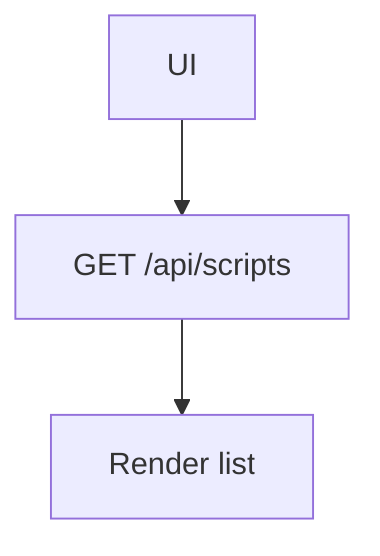

# Scripts — UF/SF

## UF
1. Open Scripts tab.
2. View list.

```mermaid
graph TD
  A[Open Scripts] --> B[See scripts-list]
```

## SF
1. GET `/api/scripts` [GAP]

```mermaid
graph TD
  U[UI] --> S1[GET /api/scripts]
  S1 --> V[Render list]
```
