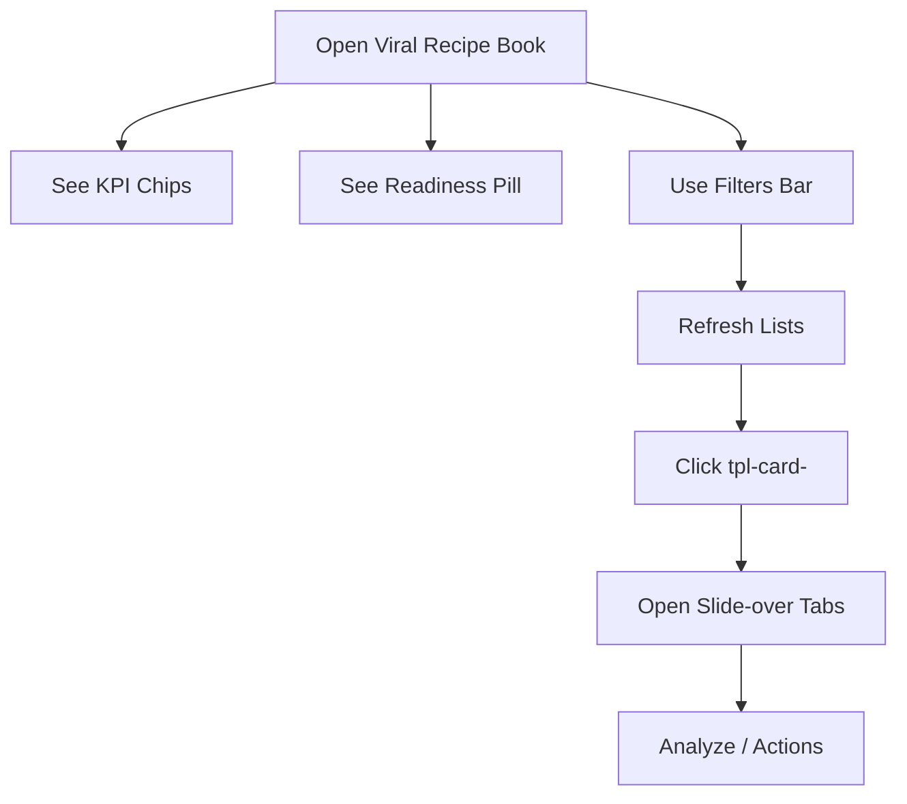

# Templates — UF/SF

## UF (User Flow)
1. Land on `/admin/viral-recipe-book`.
2. View `kpi-chips` and `discovery-readiness-pill`.
3. Adjust `filters-bar` (window/platform/niche).
4. Browse HOT/COOLING/NEW sections; click a `tpl-card-<id>`.
5. Slide-over opens; tabs visible `tpl-slide-tabs`.
6. Optionally proceed to Analyzer or copy-winner.



## SF (System Flow)
1. GET `/api/discovery/metrics` (poll) → update `kpi-chips`. [GAP]
2. GET `/api/templates?range=&platform=&niche=` → lists.
3. Click card → GET `/api/templates/:id` + `/api/templates/:id/examples`.
4. Readiness: GET `/api/discovery/readiness`; if not ready, panel shows reasons + Ops actions (POST `/api/discovery/qa-seed`, `/api/admin/pipeline/actions/recompute-discovery`, `/api/admin/pipeline/actions/warm-examples`).
5. Audit: all POST responses include `{ audit_id }`.

```mermaid
graph TD
  M[UI] -->|poll| M1[GET /api/discovery/metrics]
  M -->|load| M2[GET /api/templates]
  M -->|select| M3[GET /api/templates/:id]
  M -->|select| M4[GET /api/templates/:id/examples]
  M -->|readiness| M5[GET /api/discovery/readiness]
  M -->|ops action| M6[POST qa-seed/recompute/warm-examples]
  M6 -->|returns| M7[{ audit_id }]
```

### Variants
- Golden Path: metrics ok, lists populated, slide-over opens.
- Failure Path: `/api/templates` 500 → show error state; readiness panel hints Ops actions.

