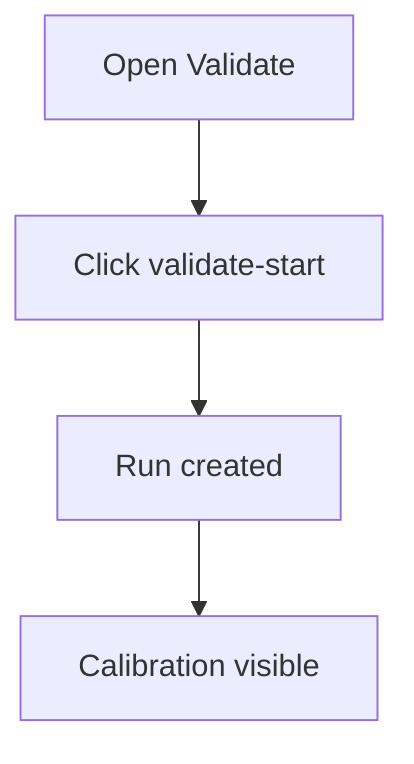

# Validate — UF/SF

## UF
1. Open Validate tab.
2. Click `validate-start`.
3. View calibration and metrics.



## SF
1. POST `/api/validation/start` [GAP] → { run_id, audit_id }.
2. GET `/api/validation/metrics` [GAP] → { auc, ece, accuracy_pct, f1 }.

```mermaid
graph TD
  U[UI] -->|POST| S1[/api/validation/start]
  S1 --> R1[{ audit_id }]
  U -->|poll| S2[GET /api/validation/metrics]
  S2 --> V[Charts]
```

### Variants
- Golden: metrics available.
- Failure: metrics missing → skeleton + hint.

