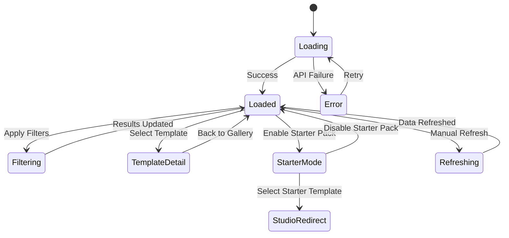

# Tab 1: Templates

## Summary & Goals

The Templates tab serves as the primary discovery interface for viral video templates. Admins can browse, filter, and select from HOT, COOLING, and NEW templates to understand current viral trends and template performance.

**Primary Goals:**
- Provide real-time visibility into template performance
- Enable efficient template discovery and selection
- Support Starter Pack workflow for new users
- Maintain template library through curation actions

## Personas & Scenarios

### Primary Persona: Platform Admin
**Scenario 1: Morning Template Review**
- Admin opens Templates tab to review overnight discovery results
- Filters by "7d" to see recent trends
- Reviews HOT templates for anomalies or new patterns
- Flags templates for further analysis or optimization

**Scenario 2: Creator Support**  
- Creator reports template underperformance
- Admin searches for template by name/niche
- Reviews template metrics and recent changes
- Provides guidance or initiates template optimization

### Secondary Persona: Growth Analyst
**Scenario 3: Performance Analysis**
- Analyst reviews 30d template performance
- Compares success rates across platforms
- Identifies declining templates (COOLING section)
- Recommends templates for retirement or refresh

## States & Navigation



## Workflow Specifications

### Browse Templates (Happy Path)
1. **Entry**: Admin navigates to `/admin/viral-recipe-book?tab=templates`
2. **System**: Loads template data from `/api/templates` with default 30d window
3. **Display**: Shows 3-column layout (HOT/COOLING/NEW) with template cards
4. **Filter**: Admin applies time/platform/niche filters
5. **Update**: System refreshes data with filtered results
6. **Select**: Admin clicks template card for detailed view

### Starter Pack Workflow  
1. **Enable**: Admin clicks "Starter Pack" toggle
2. **Calculate**: System selects top 3 HOT templates for user's niche+goal
3. **Highlight**: Selected templates show special styling/badges
4. **Select**: Admin chooses starter template
5. **Redirect**: System navigates to `/admin/studio/script?starter=on`

### Template Detail View
1. **Select**: Admin clicks template card
2. **Transition**: Slide-in detail panel or modal
3. **Display**: Full template spec with examples, metrics, guidance
4. **Actions**: Copy, Edit, Archive, Optimize buttons
5. **Close**: Return to gallery view

## UI Inventory

### Filter Bar
- `data-testid="filters-bar"`
- Time selector: `select[data-testid="time-filter"]`
- Platform input: `input[data-testid="platform-filter"]`
- Niche input: `input[data-testid="niche-filter"]`
- Refresh button: `button[data-testid="btn-refresh"]`
- Starter toggle: `button[data-testid="starter-chip"]`

### Template Lists
- HOT section: `div[data-testid="hot-list"]`
- COOLING section: `div[data-testid="cooling-list"]`
- NEW section: `div[data-testid="new-list"]`
- Template cards: `div[data-testid="tpl-card-{id}"]`

### KPI Dashboard
- System accuracy: `div[data-testid="kpi-accuracy"]`
- Active templates: `div[data-testid="kpi-templates"]`
- Discovery freshness: `div[data-testid="kpi-freshness"]`
- Readiness pill: `button[data-testid="discovery-readiness-pill"]`

### Template Cards
Each template card displays:
- Template name/title (truncated to 40 chars)
- Success rate percentage with trend indicator
- Usage count (30d)
- Platform badges (TikTok/Instagram/YouTube icons)
- Status badge (HOT/COOLING/NEW with color coding)

## Data Contracts

### Input (GET /api/templates)
```yaml
query_params:
  range: "7d" | "30d" | "90d"
  platform: string (optional)
  niche: string (optional)
```

### Output (Template List)
```yaml
templates:
  - id: string
    name: string
    status: "HOT" | "COOLING" | "NEW"
    success_rate: number (0-1)
    uses: number
    trend_delta_7d: number
    niche: string
    platform_optimized: string[]
    last_updated: ISO datetime
    preview_thumb: string (URL)
```

### Starter Pack Selection
```yaml
starter_templates:
  - id: string
    title: string
    score: number (0-100)
    confidence: number (0-1)
```

## Events Emitted

### Template Discovery
- `templates.loaded`: When template data successfully loads
- `templates.filtered`: When filters applied with result count
- `template.viewed`: When template card clicked
- `template.selected`: When template chosen for workflow

### Starter Pack
- `starter.enabled`: When Starter Pack activated
- `starter.template_selected`: When starter template chosen
- `starter.studio_redirect`: When redirecting to studio

### System Actions
- `discovery.refresh_requested`: When manual refresh triggered
- `discovery.readiness_checked`: When readiness panel opened

## Credit Metering

**No direct credit consumption** - Templates tab is browsing/discovery only.

**Downstream credit costs:**
- Template detail view: 0.1 credits (cached for 1 hour)
- Copy to drafts: 0.5 credits
- Optimization request: 2 credits

## Edge Cases & Error States

### API Failures
- Connection timeout: Show retry button with exponential backoff
- Invalid response: Display "Data temporarily unavailable" with manual refresh
- Rate limiting: Queue requests with user notification

### Empty States
- No templates found: "Run QA Seed or Recompute in Operations Center"
- Filtered results empty: "No templates match current filters" with clear filters action
- Discovery offline: Link to Engine Room for diagnostics

### Performance Issues
- Large result sets: Implement virtual scrolling for >100 templates
- Slow API response: Show skeleton loading with progress indicator
- Image loading failures: Fallback to template type icons

## Security & Privacy

### Row Level Security (RLS)
- Templates visible to all authenticated admins
- User-generated templates restricted to owner + shared users
- Archived templates hidden unless explicitly requested

### PII Handling
- No personal information stored in template metadata
- Example video links anonymized
- User attribution only for audit logs

## Accessibility

### Screen Reader Support
- Template cards announced with name, status, and success rate
- Filter controls properly labeled
- Loading states announced
- Error messages read aloud

### Keyboard Navigation
- Tab order: Filters → Template cards (left-to-right, top-to-bottom)
- Enter/Space activates template selection
- Escape closes detail views
- Arrow keys navigate between cards

### Visual Requirements
- Color contrast minimum 4.5:1 for all text
- Status indicators use shape + color (not color alone)
- Focus indicators clearly visible
- Text scales to 200% without horizontal scrolling

## Acceptance Criteria

- [ ] Templates load within 2 seconds on first visit
- [ ] All 3 sections (HOT/COOLING/NEW) display templates when available
- [ ] Filters work correctly and update results in <500ms
- [ ] Starter Pack toggle functions and highlights appropriate templates
- [ ] Template cards display all required information legibly
- [ ] Error states provide actionable recovery options
- [ ] Discovery readiness panel shows accurate system status
- [ ] Manual refresh updates data and timestamps
- [ ] All interactive elements have proper focus management
- [ ] Page works correctly with JavaScript disabled (progressive enhancement)

---

*Testing Notes: Use QA Seed button to populate templates for testing. Starter Pack requires user profile with niche/goal preferences.*