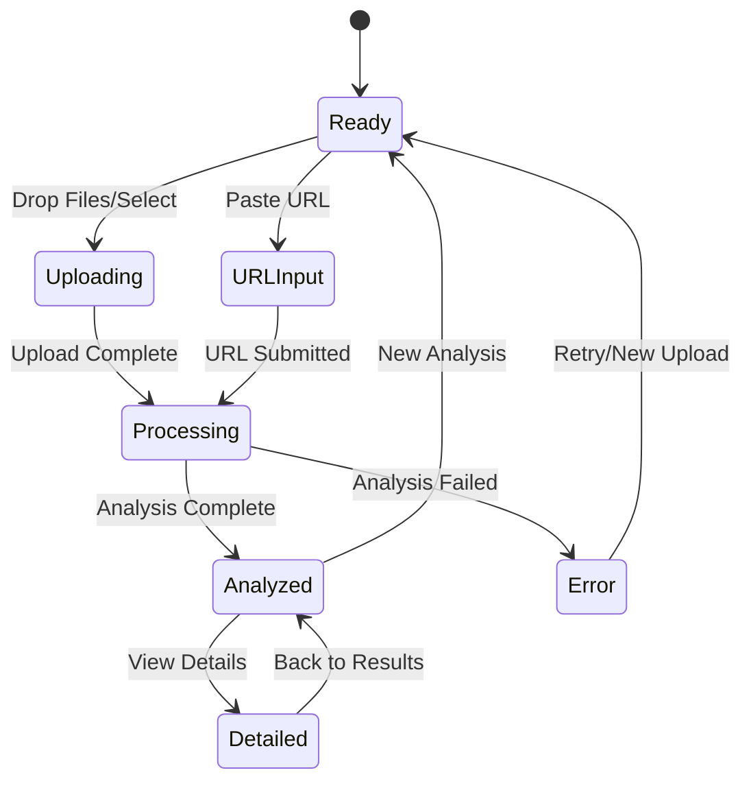

# Tab 2: Analyzer

## Summary & Goals

The Analyzer tab enables admins to upload video content or provide URLs for AI-powered viral potential analysis. The system analyzes content against known viral patterns, provides scores, and suggests specific improvements.

**Primary Goals:**
- Analyze uploaded content for viral potential  
- Identify specific improvement opportunities
- Validate template adherence and effectiveness
- Generate actionable optimization recommendations

## Personas & Scenarios

### Primary Persona: Content Quality Manager
**Scenario 1: Content Review**
- Manager receives creator submission for review
- Uploads video file to Analyzer tab  
- Reviews viral score and recommendation details
- Provides feedback to creator with specific improvements

**Scenario 2: Template Validation**
- Manager wants to verify template effectiveness
- Uploads multiple videos using same template
- Compares scores and identifies pattern variations
- Updates template guidance based on analysis

### Secondary Persona: Creator Success Coach  
**Scenario 3: Creator Training**
- Coach works with struggling creator
- Analyzes creator's recent content uploads
- Identifies common issues (poor hooks, timing, etc.)
- Provides targeted coaching based on analyzer insights

## States & Navigation



## Workflow Specifications

### Upload & Analyze (Happy Path)
1. **Entry**: Admin navigates to Analyzer tab
2. **Upload**: Admin drops video file or pastes URL in dropzone
3. **Validation**: System validates file format, size, duration
4. **Processing**: Analysis engine extracts features and compares to templates
5. **Results**: Display viral score, template matches, improvement suggestions
6. **Actions**: Admin can copy recommendations, request optimization, or save analysis

### URL Analysis Workflow
1. **Input**: Admin pastes TikTok/Instagram/YouTube URL
2. **Fetch**: System downloads video using platform APIs
3. **Extract**: Analysis engine processes video content
4. **Compare**: System matches against template database
5. **Score**: Generate viral probability with confidence intervals
6. **Report**: Present findings with visual breakdown

### Batch Analysis (Advanced)
1. **Multi-Select**: Admin uploads multiple files simultaneously
2. **Queue**: System processes files in parallel (up to 5 concurrent)
3. **Progress**: Real-time progress indicators for each file
4. **Summary**: Aggregate results with comparison matrix
5. **Export**: Option to download results as CSV/PDF report

## UI Inventory

### Upload Zone
- `data-testid="analyze-dropzone"`
- Drag-and-drop area with file type indicators
- URL input field: `input[data-testid="url-input"]`
- File browser button: `button[data-testid="file-browse"]`
- Progress bar: `div[data-testid="upload-progress"]`

### Analysis Results
- `data-testid="analyze-results"`
- Viral score display: `div[data-testid="viral-score"]`
- Template matches: `div[data-testid="template-matches"]`
- Improvement suggestions: `div[data-testid="suggestions"]`
- Confidence indicators: `div[data-testid="confidence"]`

### File List (Batch Mode)
- `data-testid="file-list"`
- Individual file status: `div[data-testid="file-{id}-status"]`
- Analysis progress: `div[data-testid="file-{id}-progress"]`
- Results preview: `div[data-testid="file-{id}-result"]`

## Data Contracts

### Input (POST /api/analyze)
```yaml
# File Upload
multipart/form-data:
  video: File (MP4/MOV/AVI, max 100MB)
  metadata:
    platform: "tiktok" | "instagram" | "youtube"
    niche: string (optional)
    creator_id: string (optional)

# URL Analysis  
application/json:
  url: string (platform video URL)
  platform: string (detected from URL)
  fetch_options:
    quality: "high" | "medium" | "low"
```

### Output (Analysis Results)
```yaml
analysis:
  id: string
  viral_score: number (0-100)
  confidence: number (0-1)
  processing_time_ms: number
  
  template_matches:
    - template_id: string
      template_name: string
      match_confidence: number (0-1)
      elements_matched: string[]
      
  improvement_suggestions:
    - category: "hook" | "timing" | "visual" | "audio"
      suggestion: string
      impact: "high" | "medium" | "low"
      difficulty: "easy" | "medium" | "hard"
      
  feature_analysis:
    hook_strength: number (0-1)
    timing_score: number (0-1)
    visual_engagement: number (0-1)
    audio_sync: number (0-1)
    
  metadata:
    duration_seconds: number
    resolution: string
    file_size_bytes: number
    analyzed_at: ISO datetime
```

## Events Emitted

### File Operations
- `analyzer.file_uploaded`: When file successfully uploaded
- `analyzer.url_submitted`: When URL provided for analysis
- `analyzer.batch_started`: When multiple files queued

### Analysis Process
- `analyzer.processing_started`: When analysis begins
- `analyzer.feature_extracted`: For each analysis milestone
- `analyzer.analysis_completed`: When full analysis finishes
- `analyzer.analysis_failed`: When analysis errors occur

### User Actions
- `analyzer.results_viewed`: When results panel opened
- `analyzer.suggestion_copied`: When improvement copied to clipboard
- `analyzer.template_suggested`: When template recommended to user

## Credit Metering

### Analysis Costs
- **Video Upload Analysis**: 5 credits per video
- **URL Analysis**: 3 credits per URL (cached 24h)
- **Batch Analysis**: 4 credits per video (bulk discount)
- **Re-analysis**: 1 credit (using cached features)

### Free Tier Limits
- 3 analyses per day for free accounts
- File size limit: 50MB for free, 100MB for paid
- Batch analysis: Paid accounts only

## Edge Cases & Error States

### File Upload Issues
- **Unsupported format**: Clear error with supported formats list
- **File too large**: Progress indicator with size limit message
- **Corrupted file**: "File appears damaged, please try another"
- **Network interruption**: Resume upload functionality

### Analysis Failures
- **Processing timeout**: "Analysis taking longer than expected, please try again"
- **Template matching fails**: Show basic score without template recommendations
- **Low confidence results**: Display warning about result reliability

### Platform-Specific Issues
- **URL access denied**: "Unable to access video, check privacy settings"
- **Video deleted**: "Video no longer available at provided URL"
- **Rate limiting**: "Too many requests, please wait before analyzing more content"

## Security & Privacy

### Content Handling
- Uploaded videos stored temporarily (max 48 hours)
- Video content never stored permanently without explicit consent
- Analysis metadata stored for system learning (anonymized)

### URL Privacy
- URLs not stored in logs or analytics
- Downloaded content processed in memory only
- No screenshots or thumbnails stored

### Access Control
- Analysis results private to uploading user
- Batch analysis results not shareable by default
- Admin users can access anonymized aggregate data

## Accessibility

### File Upload Interface
- Drag-and-drop zone clearly labeled for screen readers
- Keyboard-accessible file browser integration
- Progress indicators announced for screen readers
- File format errors clearly communicated

### Results Display
- Viral scores presented with both numerical and visual indicators
- Color-coded suggestions include text labels
- Results structure uses proper heading hierarchy
- Long recommendation lists use proper list markup

### Error Handling
- Error messages clearly identify what went wrong
- Recovery actions are keyboard accessible  
- Progress interruptions clearly communicated
- Timeout warnings provide adequate notice

## Acceptance Criteria

- [ ] File uploads work for MP4, MOV, AVI formats up to 100MB
- [ ] URL analysis supports TikTok, Instagram Reels, YouTube Shorts
- [ ] Analysis completes within 30 seconds for videos under 2 minutes
- [ ] Viral scores display with confidence intervals and explanations
- [ ] Template matches show relevance scores and matched elements
- [ ] Improvement suggestions are actionable and specific
- [ ] Batch upload handles up to 10 files with progress tracking
- [ ] Error states provide clear guidance for resolution
- [ ] Credit consumption is accurately tracked and displayed
- [ ] Results can be exported in PDF format with branding

---

*Testing Notes: Use sample viral videos from public TikTok accounts. Ensure test videos represent different niches and performance levels for comprehensive testing.*