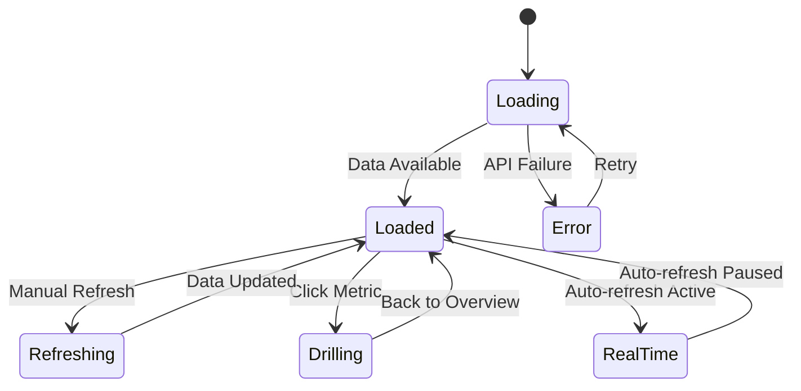

# Tab 3: Dashboard

## Summary & Goals

The Dashboard tab provides real-time monitoring of system health, viral prediction accuracy, template performance, and overall platform metrics. It serves as the command center for admins to monitor the 24/7 Pipeline and other core objectives.

**Primary Goals:**
- Monitor system health and performance metrics in real-time
- Track viral prediction accuracy and model performance  
- Display template discovery freshness and classification status
- Provide actionable insights for system optimization

## Personas & Scenarios

### Primary Persona: Platform Operations Manager
**Scenario 1: Daily Health Check**
- Manager opens Dashboard tab first thing each morning
- Reviews overnight system performance and any alerts
- Checks discovery freshness and template classification status
- Identifies any issues requiring immediate attention

**Scenario 2: Performance Analysis**
- Manager reviews weekly prediction accuracy trends
- Analyzes template performance across different categories
- Identifies declining patterns that need investigation
- Plans optimization activities based on dashboard insights

### Secondary Persona: Technical Lead  
**Scenario 3: System Troubleshooting**
- Lead investigates reported system performance issues
- Uses dashboard metrics to isolate problem areas
- Reviews error rates and processing times
- Coordinates with development team on fixes

## States & Navigation



## Workflow Specifications

### System Health Monitoring (Core Workflow)
1. **Entry**: Admin navigates to Dashboard tab
2. **Load**: Dashboard fetches latest system metrics from APIs
3. **Display**: Show health indicators, uptime, and performance metrics
4. **Monitor**: Real-time updates every 30 seconds with WebSocket connection
5. **Alert**: Visual indicators for any metrics outside normal ranges
6. **Action**: Admin can drill down into specific metrics or trigger remediation

### Prediction Accuracy Tracking  
1. **Data Collection**: System aggregates prediction vs. actual viral outcomes
2. **Calculation**: Compute accuracy percentages over time periods
3. **Visualization**: Display accuracy trends with confidence intervals
4. **Benchmarking**: Compare current performance to historical baselines
5. **Alerting**: Flag accuracy degradation below acceptable thresholds

### Template Performance Analysis
1. **Classification Review**: Display HOT/COOLING/NEW template counts
2. **Success Rate Monitoring**: Track template success rates over time
3. **Usage Analytics**: Monitor template adoption and creator satisfaction
4. **Discovery Freshness**: Show time since last viral pattern discovery
5. **Quality Metrics**: Display template matching confidence and coverage

## UI Inventory

### Header KPI Cards
- `data-testid="kpi-system-uptime"`
- `data-testid="kpi-prediction-accuracy"`  
- `data-testid="kpi-active-templates"`
- `data-testid="kpi-discovery-freshness"`

### Main Dashboard Sections
- `data-testid="chart-system-health"`
- `data-testid="chart-accuracy-trends"`
- `data-testid="chart-template-performance"`
- `data-testid="chart-usage-analytics"`

### Real-time Monitoring
- `data-testid="realtime-status"`
- `data-testid="auto-refresh-toggle"`
- `data-testid="last-updated-timestamp"`
- `data-testid="refresh-button"`

### Alert & Status Indicators
- `data-testid="system-alerts"`
- `data-testid="service-status-grid"`
- `data-testid="error-rate-indicator"`
- `data-testid="performance-warnings"`

### Time Range Controls
- `data-testid="time-range-selector"`
- `data-testid="custom-date-range"`
- `data-testid="zoom-controls"`

## Data Contracts

### System Health Metrics
```yaml
system_health:
  uptime_percent: number (0-100)
  response_time_p50: number (milliseconds)
  response_time_p95: number (milliseconds)  
  error_rate_percent: number (0-100)
  active_connections: number
  queue_depth: number
  last_updated: ISO datetime

service_status:
  - service_name: string
    status: "healthy" | "degraded" | "down"
    response_time_ms: number
    error_count: number
    last_check: ISO datetime
```

### Prediction Accuracy Metrics
```yaml
accuracy_metrics:
  current_accuracy_percent: number (0-100)
  confidence_interval: {lower: number, upper: number}
  accuracy_trend_7d: number (-100 to 100)
  total_predictions: number
  validated_predictions: number
  accuracy_by_timeframe:
    - timeframe: "24h" | "7d" | "30d"
      accuracy: number (0-100)
      sample_size: number
```

### Template Performance Data
```yaml
template_metrics:
  total_templates: number
  hot_templates: number
  cooling_templates: number
  new_templates: number
  archived_templates: number
  avg_success_rate: number (0-1)
  discovery_freshness_hours: number
  template_usage_30d: number
  creator_satisfaction_score: number (1-5)
```

## Events Emitted

### Dashboard Lifecycle
- `dashboard.loaded`: Dashboard data successfully loaded
- `dashboard.refreshed`: Manual or automatic refresh completed
- `dashboard.error`: Dashboard failed to load or refresh
- `dashboard.metric_clicked`: User drilled down into specific metric

### System Monitoring  
- `system.health_degraded`: System health metrics below threshold
- `accuracy.threshold_breached`: Prediction accuracy below acceptable level
- `discovery.freshness_stale`: Template discovery freshness exceeded limits
- `template.performance_alert`: Template performance requires attention

### User Interactions
- `dashboard.timerange_changed`: User changed time range for charts
- `dashboard.realtime_toggled`: User enabled/disabled real-time updates  
- `dashboard.alert_acknowledged`: User acknowledged system alert
- `dashboard.drill_down`: User accessed detailed metrics view

## Performance Requirements

### Real-time Updates
- **Auto-refresh Interval**: 30 seconds for critical metrics
- **WebSocket Connection**: Maintain persistent connection for live updates
- **Batch Updates**: Group multiple metric updates to reduce network overhead
- **Progressive Loading**: Load critical metrics first, secondary metrics async

### Chart Performance
- **Rendering Speed**: Charts load within 2 seconds
- **Data Points**: Handle up to 1000 data points without performance issues
- **Interactive Response**: Chart interactions respond within 200ms
- **Memory Management**: Efficiently handle time series data without memory leaks

### Data Freshness
- **System Health**: Real-time (30 second updates)
- **Prediction Accuracy**: Updated hourly with daily aggregation
- **Template Metrics**: Updated every 15 minutes
- **Discovery Status**: Real-time updates when new patterns found

## Error Handling & Recovery

### API Failures
- **Connection Issues**: Display "Connecting..." indicator during outages
- **Partial Failures**: Show available metrics, flag unavailable sections
- **Timeout Handling**: Retry with exponential backoff, user notification
- **Graceful Degradation**: Show cached data with staleness indicators

### Data Quality Issues
- **Missing Data**: Clear indicators for incomplete datasets
- **Outlier Detection**: Flag suspicious metrics for manual review
- **Calculation Errors**: Fallback to previous known good values
- **Validation Failures**: Display data quality warnings

### User Experience Recovery
- **Auto-retry Logic**: Automatically retry failed requests up to 3 times
- **Manual Refresh**: Always provide manual refresh option
- **Offline Indicators**: Clear messaging when system is unavailable
- **Historical Fallback**: Show last known good data when live updates fail

## Security & Compliance

### Access Control
- **Role-based Access**: Dashboard metrics restricted to admin users
- **Metric Filtering**: Sensitive metrics filtered based on user permissions
- **Audit Logging**: Track all dashboard access and interactions
- **Session Management**: Automatic session timeout for security

### Data Privacy
- **Metric Anonymization**: Personal user data excluded from dashboard metrics
- **Aggregation Only**: Only aggregated, non-identifying data displayed
- **Retention Policies**: Historical data retention follows privacy guidelines
- **Export Controls**: Dashboard data export restricted to authorized users

## Acceptance Criteria

- [ ] Dashboard loads all metrics within 3 seconds on initial access
- [ ] Real-time updates function correctly with 30-second refresh interval
- [ ] System health indicators accurately reflect actual system status
- [ ] Prediction accuracy charts display historical trends with confidence intervals
- [ ] Template performance metrics update within 15 minutes of actual changes
- [ ] Alert indicators clearly highlight metrics outside acceptable ranges
- [ ] Time range controls allow filtering of all charts and metrics
- [ ] Drill-down functionality provides detailed views of summary metrics
- [ ] Error states provide clear guidance for resolution
- [ ] Dashboard remains functional during partial system outages
- [ ] All interactive elements have proper keyboard accessibility
- [ ] Charts and metrics scale appropriately for different screen sizes

---

*The Dashboard tab serves as mission control for the viral prediction platform, providing real-time visibility into all critical system metrics and performance indicators.*