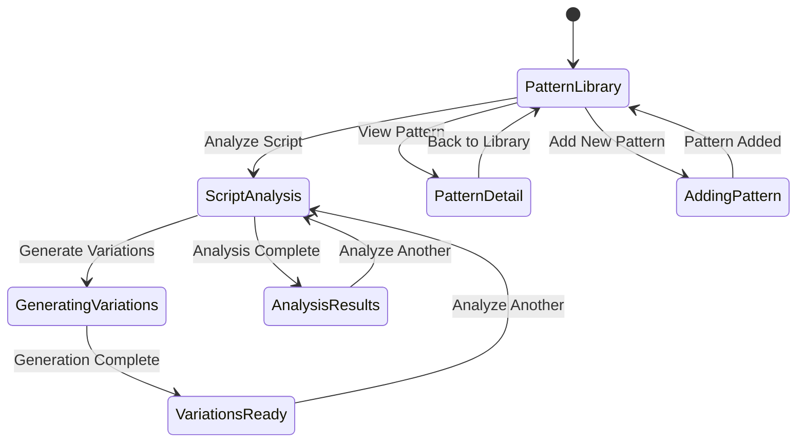

# Tab 4: Scripts

## Summary & Goals

The Scripts tab manages the Script Intelligence Integration system, providing tools for analyzing script patterns, managing hook generation libraries, and optimizing viral content scripts. This tab implements Objective 06: Script Intelligence Integration.

**Primary Goals:**
- Manage script pattern library for viral content recognition
- Analyze script content for viral potential and optimization
- Generate hook variations using AI-powered script intelligence
- Track script pattern performance and effectiveness

## Personas & Scenarios

### Primary Persona: Content Strategy Manager
**Scenario 1: Pattern Library Management**
- Manager reviews newly discovered script patterns from viral content
- Evaluates pattern effectiveness and adds high-performing patterns to library
- Archives outdated patterns that no longer drive engagement
- Categories patterns by content type and viral potential

**Scenario 2: Script Analysis & Optimization**
- Manager analyzes creator-submitted scripts for viral potential
- Identifies specific improvements based on successful pattern library
- Generates script variations for A/B testing
- Tracks which script optimizations lead to viral success

### Secondary Persona: Creator Success Coach
**Scenario 3: Creator Script Guidance**
- Coach works with creators struggling with script development
- Uses script analysis to identify weak points in creator content
- Provides specific script recommendations from pattern library
- Tracks creator improvement after applying script intelligence insights

## States & Navigation



## Workflow Specifications

### Script Pattern Management (Core Workflow)
1. **Library Display**: Show categorized script patterns with performance metrics
2. **Pattern Search**: Allow filtering by category, performance, recency
3. **Pattern Details**: Display pattern structure, examples, success metrics
4. **Pattern Editing**: Update patterns based on performance data
5. **Archive/Activate**: Manage pattern lifecycle based on effectiveness

### Script Content Analysis
1. **Input**: User pastes or uploads script content for analysis  
2. **Pattern Matching**: Compare script against library patterns
3. **Scoring**: Generate viral potential score based on pattern adherence
4. **Gap Analysis**: Identify missing elements from high-performing patterns
5. **Recommendations**: Provide specific improvements with impact estimates

### Variation Generation
1. **Base Script**: Use analyzed script as foundation
2. **Pattern Application**: Apply high-performing patterns to base script
3. **AI Generation**: Create multiple script variations using ML models
4. **Quality Scoring**: Score each variation for viral potential
5. **Presentation**: Display variations ranked by predicted effectiveness

## UI Inventory

### Pattern Library Section
- `data-testid="script-patterns"`
- `data-testid="patterns-list"`  
- `data-testid="pattern-search"`
- `data-testid="pattern-filters"`
- `data-testid="pattern-categories"`

### Individual Pattern Cards
- `data-testid="pattern-{id}"` (e.g., "pattern-hook_strong_01")
- `data-testid="pattern-{id}-score"`
- `data-testid="pattern-{id}-usage"`
- `data-testid="pattern-{id}-examples"`

### Script Analysis Section
- `data-testid="script-input"`
- `data-testid="analyze-script"`
- `data-testid="script-results"`
- `data-testid="viral-score-display"`

### Analysis Results Display
- `data-testid="pattern-matches"`
- `data-testid="improvement-suggestions"`  
- `data-testid="missing-elements"`
- `data-testid="script-strengths"`

### Variation Generation
- `data-testid="generate-variations"`
- `data-testid="variation-count"`
- `data-testid="variations-output"`
- `data-testid="variation-{index}"` (e.g., "variation-1")
- `data-testid="variation-{index}-score"`

### Pattern Management Controls
- `data-testid="add-pattern"`
- `data-testid="edit-pattern"`
- `data-testid="archive-pattern"`
- `data-testid="pattern-performance"`

## Data Contracts

### Script Pattern Structure
```yaml
script_pattern:
  id: string
  name: string
  category: "hook" | "build" | "payoff" | "cta" | "transition"
  pattern_template: string
  success_metrics:
    viral_success_rate: number (0-1)
    usage_count: number
    avg_engagement_lift: number
    last_success_date: ISO datetime
  examples:
    - text: string
      video_id: string
      performance_score: number
  metadata:
    created_at: ISO datetime
    last_updated: ISO datetime
    created_by: string
    status: "active" | "archived" | "testing"
```

### Script Analysis Input/Output
```yaml
analysis_request:
  script_text: string
  content_category: string (optional)
  target_platform: "tiktok" | "instagram" | "youtube" (optional)
  
analysis_response:
  viral_score: number (0-100)
  confidence: number (0-1)
  pattern_matches:
    - pattern_id: string
      pattern_name: string
      match_strength: number (0-1)
      matched_elements: array<string>
  improvement_suggestions:
    - suggestion: string
      category: string
      impact_estimate: number
      difficulty: "easy" | "medium" | "hard"
  missing_elements:
    - element: string
      importance: "critical" | "high" | "medium"
      suggested_addition: string
```

### Variation Generation
```yaml
generation_request:
  base_script: string
  variation_count: number (1-10)
  style_preferences: array<string>
  target_improvements: array<string>
  
generation_response:
  variations:
    - id: string
      script_text: string
      viral_score: number (0-100)
      improvements_applied: array<string>
      pattern_adherence: number (0-1)
  generation_metadata:
    processing_time_ms: number
    model_version: string
    generated_at: ISO datetime
```

## Events Emitted

### Pattern Management
- `pattern.viewed`: User accessed pattern details
- `pattern.added`: New pattern added to library
- `pattern.updated`: Existing pattern modified
- `pattern.archived`: Pattern removed from active use
- `pattern.performance_updated`: Pattern success metrics recalculated

### Script Analysis
- `script.analyzed`: Script analysis completed
- `script.pattern_matched`: Script matched against pattern library
- `script.improvements_generated`: Improvement suggestions created
- `script.score_calculated`: Viral score computed for script

### Variation Generation
- `variations.requested`: User requested script variations
- `variations.generated`: AI completed variation generation
- `variations.selected`: User selected preferred variation
- `variations.applied`: User applied generated variation to content

## AI/ML Integration

### Pattern Recognition Engine
```yaml
pattern_matching:
  nlp_models:
    - semantic_similarity: "sentence-transformers/all-MiniLM-L6-v2"
    - sentiment_analysis: "cardiffnlp/twitter-roberta-base-sentiment-latest"
    - engagement_prediction: "custom-trained-viral-predictor-v2"
  
  matching_process:
    - tokenize_input_script
    - extract_semantic_features
    - compute_pattern_similarities
    - rank_matches_by_confidence
    - generate_improvement_suggestions
```

### Variation Generation AI
```yaml
generation_models:
  base_model: "gpt-3.5-turbo-fine-tuned-viral-scripts"
  prompt_engineering:
    - pattern_injection: "Apply high-performing viral patterns"
    - style_consistency: "Maintain original voice and tone"
    - platform_optimization: "Optimize for target platform algorithm"
  
  quality_filtering:
    - coherence_check: "Ensure script flows naturally"
    - brand_safety: "Filter inappropriate content"
    - uniqueness_verification: "Avoid exact duplicates"
```

## Performance & Scalability

### Response Time Targets
- **Pattern Library Load**: <2 seconds for full library (500+ patterns)
- **Script Analysis**: <5 seconds for script up to 500 words
- **Variation Generation**: <15 seconds for 5 variations
- **Pattern Search**: <1 second for filtered results

### Caching Strategy
- **Pattern Library**: Cached for 1 hour, invalidated on updates
- **Analysis Results**: Cached for 24 hours per unique script
- **Generated Variations**: Cached for 48 hours per script+parameters
- **Performance Metrics**: Cached for 6 hours, updated with new data

## Error Handling & Edge Cases

### Analysis Failures
- **Empty Script**: Clear message requiring minimum content length
- **Unsupported Language**: Detect non-English content, provide appropriate feedback
- **Processing Timeout**: Fallback to basic analysis if advanced processing fails
- **Low Confidence**: Display uncertainty indicators when confidence <60%

### Generation Issues  
- **Generation Failures**: Retry with simplified parameters, fallback to template-based generation
- **Quality Filtering**: Remove inappropriate or low-quality variations automatically
- **Duplicate Detection**: Identify and remove duplicate variations from results
- **Content Safety**: Block generation containing harmful or inappropriate content

### Pattern Library Issues
- **Pattern Conflicts**: Detect conflicting patterns, provide resolution guidance
- **Performance Degradation**: Archive patterns showing declining success rates
- **Data Inconsistency**: Validate pattern data integrity, flag inconsistencies
- **Outdated Patterns**: Automatically flag patterns with no recent successful usage

## Security & Privacy

### Content Handling
- **Script Privacy**: User scripts not permanently stored without explicit consent
- **Pattern Attribution**: Credit original creators when patterns are derived from their content
- **Data Anonymization**: Remove personally identifiable information from pattern examples
- **Usage Tracking**: Track pattern usage for optimization without exposing user identity

### AI Model Security  
- **Model Protection**: Prevent reverse engineering of proprietary pattern recognition models
- **Input Validation**: Sanitize all user inputs to prevent injection attacks
- **Output Filtering**: Ensure AI-generated content meets platform content policies
- **Rate Limiting**: Prevent abuse of computationally expensive AI operations

## Acceptance Criteria

- [ ] Pattern library displays 500+ viral script patterns organized by category
- [ ] Script analysis completes within 5 seconds for scripts up to 500 words
- [ ] Pattern matching identifies relevant patterns with >85% accuracy
- [ ] Improvement suggestions are specific and actionable
- [ ] Variation generation creates 5+ unique variations ranked by viral potential
- [ ] Pattern performance metrics update based on real-world usage data
- [ ] Search and filtering allow efficient pattern discovery
- [ ] Analysis results include confidence indicators and uncertainty ranges
- [ ] Generated variations maintain original script voice and intent
- [ ] Pattern management allows adding, editing, and archiving patterns
- [ ] Error handling provides clear guidance for all failure scenarios
- [ ] All interactive elements support keyboard navigation and screen readers

---

*The Scripts tab implements advanced Script Intelligence Integration, enabling data-driven optimization of viral content scripts through pattern recognition and AI-powered generation.*