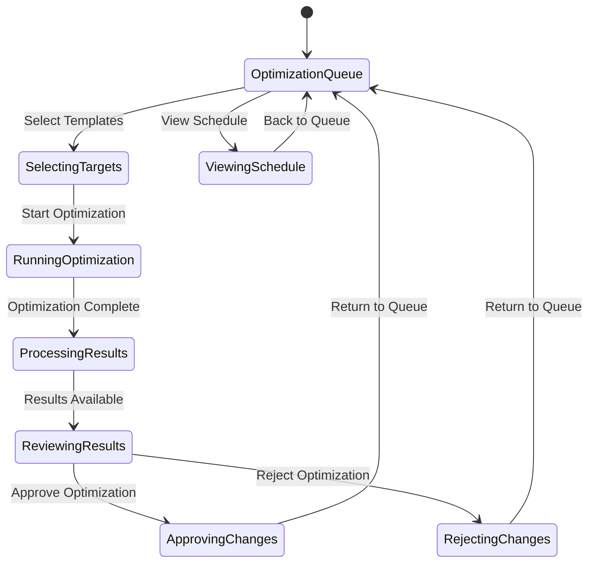

# Tab 5: Optimize

## Summary & Goals

The Optimize tab implements the Algorithm Adaptation Engine (Objective 07), providing automated and manual optimization of templates and content for maximum viral potential. It manages template evolution, performance improvements, and algorithm adaptation.

**Primary Goals:**
- Optimize existing templates based on performance data and algorithm changes
- Schedule and execute optimization runs for template improvements
- Adapt templates to platform algorithm changes within 48 hours
- Track optimization impact and success rates

## Personas & Scenarios

### Primary Persona: Algorithm Performance Manager
**Scenario 1: Platform Algorithm Adaptation**
- Manager detects performance decline across TikTok templates
- Initiates algorithm adaptation analysis to identify changes
- Reviews optimization recommendations and approves template updates
- Monitors template performance recovery after optimization

**Scenario 2: Scheduled Optimization Review**
- Manager reviews weekly optimization candidates (COOLING templates)
- Analyzes optimization potential and resource requirements
- Schedules optimization runs during low-traffic periods
- Validates optimization results and approves production deployment

### Secondary Persona: Template Quality Analyst
**Scenario 3: Performance-Based Optimization**
- Analyst identifies templates with declining success rates
- Runs diagnostic analysis to understand performance factors
- Applies targeted optimizations to improve viral potential
- A/B tests optimized versions against original templates

## States & Navigation



## Workflow Specifications

### Template Optimization Process (Core Workflow)
1. **Candidate Identification**: System identifies templates needing optimization
2. **Performance Analysis**: Analyze historical performance and current metrics
3. **Optimization Planning**: Generate optimization strategies and expected improvements
4. **Execution**: Apply optimizations using AI models and data analysis
5. **Validation**: Test optimized templates against original versions
6. **Deployment**: Roll out successful optimizations to production

### Algorithm Adaptation Workflow  
1. **Change Detection**: Monitor platform algorithm indicators and template performance
2. **Impact Assessment**: Analyze which templates are affected by algorithm changes
3. **Adaptation Strategy**: Develop platform-specific optimization approaches
4. **Batch Optimization**: Apply adaptations to affected templates simultaneously
5. **Performance Monitoring**: Track recovery and effectiveness of adaptations
6. **Continuous Learning**: Update adaptation models based on results

### Manual Optimization Workflow
1. **Template Selection**: Admin selects specific templates for optimization
2. **Optimization Type**: Choose optimization focus (viral score, engagement, retention)
3. **Parameter Configuration**: Set optimization parameters and constraints
4. **Preview Results**: Review proposed optimizations before applying
5. **Apply Changes**: Execute optimizations with rollback capability
6. **Monitor Impact**: Track post-optimization performance metrics

## UI Inventory

### Optimization Queue & Scheduling
- `data-testid="optimization-queue"`
- `data-testid="opt-schedule"`
- `data-testid="pending-optimizations"`
- `data-testid="completed-optimizations"`

### Template Selection & Targeting
- `data-testid="template-selector"`
- `data-testid="optimization-candidates"`
- `data-testid="opt-entities"`
- `data-testid="bulk-select-templates"`

### Optimization Controls
- `data-testid="optimization-type"`
- `data-testid="optimization-priority"`
- `data-testid="schedule-optimization"`
- `data-testid="run-optimization-now"`

### Results & Analysis
- `data-testid="optimization-results"`
- `data-testid="before-after-comparison"`
- `data-testid="performance-improvements"`
- `data-testid="impact-metrics"`

### Progress & Status
- `data-testid="optimization-progress"`
- `data-testid="processing-status"`
- `data-testid="estimated-completion"`
- `data-testid="optimization-logs"`

## Data Contracts

### Optimization Request
```yaml
optimization_request:
  template_ids: array<string>
  optimization_type: "viral_score" | "engagement" | "retention" | "platform_adaptation"
  parameters:
    target_improvement: number (percentage)
    max_changes: number
    preserve_core_elements: boolean
    platform_focus: "tiktok" | "instagram" | "youtube" | "all"
  scheduling:
    run_immediately: boolean
    scheduled_time: ISO datetime (optional)
    priority: "high" | "normal" | "low"
```

### Optimization Results
```yaml
optimization_result:
  optimization_id: string
  template_id: string
  status: "completed" | "failed" | "partial"
  improvements:
    viral_score_change: number
    engagement_lift: number
    success_rate_improvement: number
  changes_applied:
    - change_type: string
      old_value: any
      new_value: any
      impact_score: number
  metadata:
    processing_time_ms: number
    model_version: string
    completed_at: ISO datetime
    rollback_available: boolean
```

### Algorithm Adaptation Status
```yaml
adaptation_status:
  platform: "tiktok" | "instagram" | "youtube"
  last_detected_change: ISO datetime
  affected_templates: number
  adaptation_status: "pending" | "in_progress" | "completed"
  success_rate: number (0-1)
  estimated_recovery_time: ISO datetime
  adaptations_applied:
    - template_id: string
      adaptation_type: string
      performance_change: number
```

## Events Emitted

### Optimization Lifecycle
- `optimization.requested`: User initiated optimization process
- `optimization.started`: Optimization processing began
- `optimization.completed`: Optimization finished successfully
- `optimization.failed`: Optimization encountered errors
- `optimization.approved`: Admin approved optimization results
- `optimization.deployed`: Optimization changes applied to production

### Algorithm Adaptation
- `algorithm.change_detected`: Platform algorithm change identified
- `adaptation.triggered`: Automatic adaptation process started
- `adaptation.completed`: Algorithm adaptation finished
- `templates.adapted`: Templates updated for algorithm changes

### Performance Tracking
- `optimization.impact_measured`: Post-optimization performance data available
- `template.performance_improved`: Template showing improvement after optimization
- `optimization.rollback_triggered`: Optimization changes reverted due to poor performance

## Technical Implementation

### Optimization Engine Architecture
```yaml
optimization_components:
  performance_analyzer:
    function: "Analyze template performance patterns and decline factors"
    models: ["time_series_analysis", "performance_regression_detection"]
    
  improvement_generator:
    function: "Generate specific optimization recommendations"
    models: ["template_optimization_ml", "viral_pattern_enhancement"]
    
  change_validator:
    function: "Validate optimization changes before deployment"
    models: ["impact_prediction", "quality_assurance_checks"]
    
  algorithm_monitor:
    function: "Detect platform algorithm changes and impacts"
    data_sources: ["template_performance_trends", "platform_api_changes"]
```

### Optimization Strategies
```yaml
optimization_types:
  viral_score_improvement:
    focus: "Increase predicted viral potential"
    methods: ["pattern_enhancement", "timing_optimization", "element_addition"]
    
  engagement_optimization:
    focus: "Improve user engagement metrics"
    methods: ["hook_strengthening", "retention_improvement", "cta_optimization"]
    
  platform_adaptation:
    focus: "Adapt to platform algorithm changes"
    methods: ["algorithm_compliance", "trend_alignment", "format_optimization"]
    
  success_rate_improvement:
    focus: "Increase template success consistency"
    methods: ["risk_reduction", "proven_pattern_integration", "quality_enhancement"]
```

### Performance Monitoring
```yaml
monitoring_metrics:
  pre_optimization:
    - viral_success_rate
    - average_engagement
    - user_satisfaction
    - usage_frequency
    
  post_optimization:
    - performance_delta
    - improvement_sustainability
    - user_adoption_rate
    - rollback_necessity
    
  algorithm_adaptation:
    - recovery_speed
    - adaptation_accuracy
    - cross_template_impact
    - platform_compliance
```

## Scheduling & Resource Management

### Optimization Scheduling
- **Automatic Scheduling**: Daily optimization runs during low-traffic periods
- **Priority Queuing**: High-priority optimizations processed first
- **Resource Allocation**: Limit concurrent optimizations to prevent system overload
- **Batch Processing**: Group similar optimizations for efficiency

### Resource Requirements
- **CPU Intensive**: Template analysis and optimization generation
- **Memory Requirements**: Load multiple templates and historical data
- **GPU Utilization**: AI model inference for optimization recommendations
- **Network Bandwidth**: Template data retrieval and result storage

## Error Handling & Recovery

### Optimization Failures
- **Processing Errors**: Log detailed error information, retry with simplified parameters
- **Model Failures**: Fallback to rule-based optimization when AI models fail
- **Resource Exhaustion**: Queue optimization for later processing when resources unavailable
- **Validation Failures**: Reject optimizations that don't meet quality standards

### Rollback Mechanisms
- **Automatic Rollback**: Revert optimizations showing poor performance after 48 hours
- **Manual Rollback**: Admin-triggered rollback with one-click restoration
- **Partial Rollback**: Revert specific optimization changes while keeping others
- **Version Control**: Maintain optimization history for analysis and learning

### Recovery Procedures
- **Queue Recovery**: Restart interrupted optimization jobs from checkpoints
- **Data Consistency**: Ensure template data remains consistent during optimization
- **Performance Recovery**: Monitor and restore system performance after optimization runs
- **User Communication**: Notify users of optimization status and any issues

## Security & Compliance

### Template Integrity
- **Change Validation**: Verify all template changes maintain structural integrity
- **Permission Checks**: Ensure only authorized users can approve optimizations
- **Audit Trail**: Log all optimization decisions and changes for compliance
- **Backup Strategy**: Maintain template backups before applying optimizations

### Algorithm Protection
- **Model Security**: Protect proprietary optimization algorithms from exposure
- **Data Privacy**: Ensure optimization doesn't expose sensitive user data
- **IP Protection**: Safeguard optimization methodologies and improvements
- **Rate Limiting**: Prevent abuse of optimization resources

## Acceptance Criteria

- [ ] System identifies optimization candidates automatically based on performance data
- [ ] Optimization process completes within 30 minutes for individual templates
- [ ] Algorithm adaptation responds to platform changes within 48 hours
- [ ] Optimization results show measurable improvement in target metrics
- [ ] Batch optimization handles 50+ templates efficiently
- [ ] Rollback capability restores previous template versions within 5 minutes
- [ ] Optimization scheduling prevents system overload during peak usage
- [ ] Success rate of optimizations exceeds 70% improvement threshold
- [ ] Admin interface provides clear visualization of optimization impact
- [ ] Error handling gracefully manages optimization failures with clear messaging
- [ ] Optimization history maintains detailed logs for analysis and learning
- [ ] Performance monitoring tracks long-term optimization sustainability

---

*The Optimize tab implements sophisticated Algorithm Adaptation Engine capabilities, ensuring templates remain effective as platform algorithms evolve and viral patterns shift.*