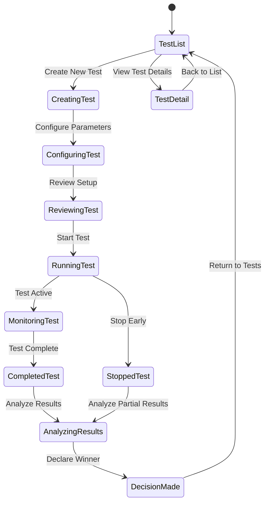

# Tab 6: A/B Testing

## Summary & Goals

The A/B Testing tab provides a comprehensive framework for testing template variations, optimization strategies, and viral prediction improvements. It supports the Prediction Validation (≥90% Accuracy) objective by enabling systematic testing and validation of platform improvements.

**Primary Goals:**
- Design and execute A/B tests for template variations and optimizations
- Measure statistical significance of viral prediction improvements
- Validate new features and algorithm changes before full deployment
- Track experiment results and provide actionable insights

## Personas & Scenarios

### Primary Persona: Data Science Manager
**Scenario 1: Template Variation Testing**
- Manager wants to test new hook patterns against established templates
- Sets up A/B test with 50/50 traffic split for new vs. original template
- Monitors statistical significance and viral success rates
- Makes data-driven decision to adopt or reject new patterns

**Scenario 2: Algorithm Validation**
- Manager needs to validate improved viral prediction model
- Creates champion/challenger test comparing old vs. new algorithm
- Tracks prediction accuracy and user satisfaction metrics
- Rolls out winning algorithm based on statistical evidence

### Secondary Persona: Product Manager
**Scenario 3: Feature Testing**
- Product manager testing new Quick Win pipeline optimization
- Measures completion rates and user satisfaction between versions
- Analyzes impact on viral content creation success
- Decides on feature launch based on A/B test results

## States & Navigation



## Workflow Specifications

### A/B Test Creation Workflow
1. **Test Design**: Define hypothesis, success metrics, and experimental parameters
2. **Variant Configuration**: Set up control and treatment groups with specific parameters
3. **Traffic Allocation**: Configure traffic split percentages and targeting rules
4. **Duration Planning**: Set test duration based on statistical power requirements
5. **Launch**: Deploy test configuration and begin data collection
6. **Monitoring**: Track test progress and early indicators of significance

### Test Execution & Monitoring
1. **Traffic Routing**: Direct users to control or treatment groups based on configuration
2. **Metrics Collection**: Gather performance data for all defined success metrics
3. **Statistical Analysis**: Calculate significance, confidence intervals, and effect sizes
4. **Early Stopping**: Monitor for statistical significance or serious performance issues
5. **Data Quality**: Validate data integrity and identify any collection issues
6. **Progress Reporting**: Provide real-time updates on test status and preliminary results

### Results Analysis & Decision Making
1. **Statistical Validation**: Confirm results meet significance thresholds and sample size requirements
2. **Effect Size Analysis**: Evaluate practical significance beyond statistical significance
3. **Secondary Metrics**: Review impact on secondary and guardrail metrics
4. **Winner Declaration**: Make data-driven decision on winning variant
5. **Rollout Planning**: Plan gradual rollout of winning variant if applicable
6. **Learning Documentation**: Document insights and recommendations for future tests

## UI Inventory

### Test Management
- `data-testid="ab-test-list"`
- `data-testid="create-test-button"`
- `data-testid="test-{id}"` (e.g., "test-hook_variation_001")
- `data-testid="test-{id}-status"`
- `data-testid="test-{id}-results"`

### Test Creation & Configuration
- `data-testid="test-name-input"`
- `data-testid="hypothesis-input"`
- `data-testid="success-metrics"`
- `data-testid="traffic-allocation"`
- `data-testid="test-duration"`

### Variant Configuration  
- `data-testid="control-group"`
- `data-testid="treatment-group"`
- `data-testid="variant-parameters"`
- `data-testid="targeting-rules"`

### Test Execution Controls
- `data-testid="start-test"`
- `data-testid="stop-test"`
- `data-testid="pause-test"`
- `data-testid="declare-winner"`

### Results & Analytics
- `data-testid="test-results-summary"`
- `data-testid="statistical-significance"`
- `data-testid="confidence-intervals"`
- `data-testid="effect-size"`
- `data-testid="secondary-metrics"`

### Test History & Archive
- `data-testid="completed-tests"`
- `data-testid="test-archive"`
- `data-testid="historical-results"`

## Data Contracts

### A/B Test Configuration
```yaml
ab_test_config:
  test_id: string
  name: string
  hypothesis: string
  status: "draft" | "running" | "paused" | "completed" | "stopped"
  
  variants:
    control:
      name: string
      description: string
      parameters: object
      traffic_allocation: number (0-1)
    treatment:
      name: string  
      description: string
      parameters: object
      traffic_allocation: number (0-1)
      
  success_metrics:
    primary:
      - metric_name: string
        target_improvement: number
        measurement_type: "absolute" | "relative"
    secondary:
      - metric_name: string
        guardrail_threshold: number
        
  test_parameters:
    target_users: number
    min_duration_days: number
    max_duration_days: number
    significance_threshold: number (typically 0.05)
    power: number (typically 0.8)
    
  created_at: ISO datetime
  created_by: string
```

### Test Results Data
```yaml
test_results:
  test_id: string
  status: "running" | "completed" | "inconclusive"
  duration_days: number
  
  sample_sizes:
    control: number
    treatment: number
    total: number
    
  primary_results:
    - metric_name: string
      control_value: number
      treatment_value: number
      absolute_difference: number
      relative_improvement: number
      statistical_significance: boolean
      p_value: number
      confidence_interval: {lower: number, upper: number}
      
  secondary_results:
    - metric_name: string
      control_value: number
      treatment_value: number
      guardrail_breached: boolean
      
  recommendation:
    winner: "control" | "treatment" | "inconclusive"
    confidence_level: number
    effect_size: "small" | "medium" | "large"
    business_impact: string
    
  completed_at: ISO datetime
```

### Template A/B Test Specific
```yaml
template_ab_test:
  test_type: "template_variation" | "optimization_method" | "algorithm_update"
  template_ids: array<string>
  
  viral_metrics:
    success_rate_improvement: number
    avg_viral_score_change: number
    user_adoption_rate: number
    creator_satisfaction: number
    
  platform_metrics:
    tiktok_performance: object
    instagram_performance: object
    youtube_performance: object
    
  timeline_analysis:
    - day: number
      control_performance: number
      treatment_performance: number
      significance: boolean
```

## Events Emitted

### Test Lifecycle
- `ab_test.created`: New A/B test configured and saved
- `ab_test.started`: A/B test began collecting data
- `ab_test.paused`: Test temporarily paused by admin
- `ab_test.resumed`: Paused test resumed data collection
- `ab_test.completed`: Test reached completion criteria
- `ab_test.stopped_early`: Test stopped before completion due to significance or issues

### Statistical Events
- `ab_test.significance_reached`: Statistical significance achieved for primary metric
- `ab_test.sample_size_reached`: Minimum sample size requirement met
- `ab_test.guardrail_breached`: Secondary metric exceeded safety threshold
- `ab_test.winner_declared`: Admin declared winning variant

### Data Quality Events
- `ab_test.data_quality_issue`: Data collection or integrity problem detected
- `ab_test.traffic_allocation_error`: Traffic routing not matching configuration
- `ab_test.metric_calculation_error`: Error in statistical calculations

## Statistical Framework

### Statistical Methods
```yaml
statistical_analysis:
  significance_testing:
    method: "Two-tailed t-test for continuous metrics, Chi-square for categorical"
    alpha_level: 0.05
    multiple_comparisons: "Bonferroni correction for multiple metrics"
    
  effect_size_calculation:
    continuous_metrics: "Cohen's d"
    categorical_metrics: "Odds ratio and relative risk"
    
  confidence_intervals:
    level: 95
    method: "Bootstrap for non-normal distributions"
    
  bayesian_analysis:
    prior_distribution: "Non-informative priors for new tests"
    credible_intervals: 95
    probability_of_superiority: "P(treatment > control)"
```

### Sample Size Calculation
```yaml
power_analysis:
  statistical_power: 0.8
  significance_level: 0.05
  effect_sizes:
    small: "2% improvement"
    medium: "5% improvement"  
    large: "10% improvement"
    
  minimum_detectable_effect:
    viral_success_rate: "3% absolute improvement"
    template_adoption: "5% relative improvement"
    user_satisfaction: "0.2 point improvement (1-5 scale)"
```

### Early Stopping Rules
```yaml
stopping_criteria:
  statistical_significance:
    condition: "p < 0.01 AND sample_size > minimum"
    review_frequency: "Daily after 25% minimum sample size"
    
  futility_stopping:
    condition: "95% confidence interval excludes meaningful effect"
    review_frequency: "Weekly after 50% planned duration"
    
  safety_stopping:
    condition: "Guardrail metric degradation > 10%"
    immediate_review: true
```

## Test Types & Templates

### Template Variation Tests
- **Hook Optimization**: Test different hook patterns for same content type
- **Structure Changes**: Test modifications to template beat structure
- **Platform Adaptation**: Test platform-specific template optimizations
- **Success Rate Improvement**: Test changes aimed at improving template consistency

### Algorithm & Feature Tests
- **Prediction Model Updates**: Test improved viral prediction algorithms
- **Analysis Engine Changes**: Test modifications to content analysis pipeline
- **UI/UX Improvements**: Test interface changes in admin tools
- **Workflow Optimizations**: Test improvements to Quick Win pipeline

### Optimization Strategy Tests
- **Optimization Methods**: Test different approaches to template optimization
- **Scheduling Strategies**: Test different optimization scheduling approaches
- **Personalization**: Test personalized template recommendations
- **Learning Rate**: Test different model update frequencies

## Error Handling & Quality Assurance

### Data Quality Monitoring
- **Sample Ratio Mismatch**: Detect when traffic allocation doesn't match configuration
- **Metric Anomalies**: Flag unusual metric values that may indicate data issues
- **Segment Imbalances**: Ensure balanced distribution across user segments
- **External Factors**: Account for external events affecting test results

### Statistical Validity Checks
- **Randomization Validation**: Verify proper randomization across user characteristics
- **Pre-test Bias**: Check for systematic differences between groups before test start
- **Simpson's Paradox**: Detect paradoxical results when segmenting data
- **Novelty Effects**: Account for temporary effects from new feature exposure

### Business Logic Validation
- **Metric Definitions**: Ensure consistent metric calculation across test variants
- **Attribution Logic**: Verify proper attribution of outcomes to test variants
- **Seasonal Adjustments**: Account for known seasonal patterns in baseline metrics
- **Historical Comparison**: Compare results to historical baselines and similar tests

## Security & Ethics

### Ethical Testing Standards
- **User Consent**: Ensure testing complies with user consent and privacy policies
- **Harm Prevention**: Prevent tests that could negatively impact user experience
- **Fair Distribution**: Ensure test groups represent diverse user populations
- **Transparency**: Maintain appropriate transparency about testing activities

### Data Protection
- **PII Handling**: Anonymize personal data in test results and analysis
- **Access Control**: Restrict test data access to authorized personnel only
- **Retention Policies**: Implement appropriate data retention for test results
- **Audit Trail**: Maintain comprehensive logs of test configuration and results

## Acceptance Criteria

- [ ] A/B test creation wizard guides users through proper test design
- [ ] Statistical significance calculations are accurate and validated
- [ ] Traffic allocation works correctly across all test variants
- [ ] Real-time monitoring displays test progress and early results
- [ ] Early stopping rules function correctly for significance and safety
- [ ] Results analysis provides clear recommendations with confidence levels
- [ ] Test results are reproducible and auditable
- [ ] Multiple concurrent tests can run without interference
- [ ] Historical test results are searchable and comparable
- [ ] Integration with template system enables seamless template testing
- [ ] Error handling prevents invalid test configurations
- [ ] Security controls protect sensitive test data and results

---

*The A/B Testing tab provides rigorous statistical testing capabilities essential for validating viral prediction improvements and ensuring platform optimization decisions are data-driven.*