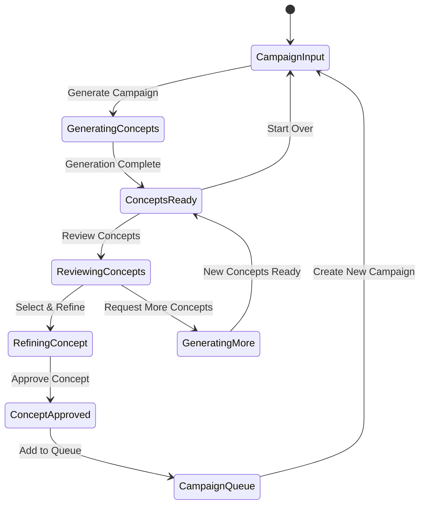

# Tab 7: Inception

## Summary & Goals

The Inception tab implements Marketing Inception (Objective 11), providing AI-powered generation of viral marketing campaigns, content concepts, and creative strategies. It serves as the creative intelligence center for generating marketing campaigns that leverage viral prediction capabilities.

**Primary Goals:**
- Generate viral marketing campaign concepts with >70% approval rate
- Create content strategies optimized for viral potential
- Provide campaign templates and frameworks for different niches
- Track campaign concept performance and refinement

## Personas & Scenarios

### Primary Persona: Marketing Campaign Manager
**Scenario 1: Campaign Concept Generation**
- Manager needs viral marketing concepts for product launch
- Inputs campaign parameters (audience, platform, goals, budget)
- Reviews AI-generated campaign concepts and selects preferred options
- Refines concepts and develops full campaign strategy

**Scenario 2: Content Strategy Development**
- Manager developing content calendar for influencer partnerships
- Uses inception system to generate content themes and viral hooks
- Applies viral prediction insights to optimize content strategy
- Tracks campaign performance against predicted viral metrics

### Secondary Persona: Creative Strategy Director
**Scenario 3: Campaign Innovation**
- Director exploring new creative approaches for brand campaigns
- Uses inception system to generate unconventional campaign ideas
- Combines multiple generated concepts into innovative campaign strategy
- A/B tests generated concepts against traditional campaign approaches

## States & Navigation



## Workflow Specifications

### Campaign Concept Generation (Core Workflow)
1. **Input Parameters**: Define target audience, platform, campaign goals, and constraints
2. **Context Analysis**: Analyze current viral trends and successful campaign patterns
3. **Concept Generation**: AI generates multiple campaign concepts with viral potential
4. **Concept Scoring**: Rate each concept for viral potential, feasibility, and brand fit
5. **Presentation**: Display concepts with explanations, examples, and implementation guidance
6. **Refinement**: Allow iterative refinement based on user feedback and preferences

### Content Strategy Development
1. **Niche Analysis**: Analyze viral patterns specific to target niche and audience
2. **Content Themes**: Generate content themes aligned with viral prediction data
3. **Hook Generation**: Create viral hooks and opening concepts for content series
4. **Platform Optimization**: Adapt concepts for specific platform algorithms and audiences
5. **Timeline Planning**: Suggest optimal timing and sequencing for campaign rollout
6. **Performance Prediction**: Provide viral potential scores for generated concepts

### Campaign Template Creation
1. **Pattern Recognition**: Identify successful campaign patterns from viral data
2. **Template Generation**: Create reusable campaign templates for different niches
3. **Customization Options**: Provide parameters for adapting templates to specific brands
4. **Success Metrics**: Define KPIs and success criteria for each template type
5. **Implementation Guides**: Provide step-by-step implementation instructions
6. **Performance Tracking**: Monitor template usage and success rates

## UI Inventory

### Campaign Input Section
- `data-testid="campaign-input"`
- `data-testid="target-audience"`
- `data-testid="platform-selector"`
- `data-testid="campaign-goals"`
- `data-testid="budget-range"`
- `data-testid="niche-selector"`
- `data-testid="tone-selector"`

### Generation Controls
- `data-testid="generate-campaign"`
- `data-testid="generation-parameters"`
- `data-testid="concept-count"`
- `data-testid="creativity-level"`

### Concept Display
- `data-testid="concept-list"`
- `data-testid="concept-{id}"` (e.g., "concept-viral_launch_001")
- `data-testid="concept-{id}-preview"`
- `data-testid="concept-{id}-score"`
- `data-testid="concept-{id}-details"`

### Campaign Queue Management
- `data-testid="inception-queue"`
- `data-testid="approved-concepts"`
- `data-testid="campaign-{id}"` (e.g., "campaign-fitness_transformation")
- `data-testid="campaign-{id}-status"`

### Refinement & Editing
- `data-testid="refine-concept"`
- `data-testid="concept-editor"`
- `data-testid="concept-preview"`
- `data-testid="save-refinements"`

### Action Buttons
- `data-testid="approve-concept"`
- `data-testid="reject-concept"`
- `data-testid="request-variations"`
- `data-testid="export-campaign"`

## Data Contracts

### Campaign Generation Request
```yaml
campaign_request:
  parameters:
    target_audience:
      demographics: object
      interests: array<string>
      platform_behavior: object
    campaign_objectives:
      primary_goal: "awareness" | "engagement" | "conversion" | "viral_reach"
      secondary_goals: array<string>
      success_metrics: array<string>
    constraints:
      budget_range: string
      timeline: string
      brand_guidelines: object
      content_restrictions: array<string>
    platform_focus:
      primary_platform: "tiktok" | "instagram" | "youtube"
      secondary_platforms: array<string>
    creative_parameters:
      tone: "professional" | "casual" | "humorous" | "inspirational"
      style: "minimalist" | "bold" | "storytelling" | "educational"
      viral_elements: array<string>
```

### Generated Campaign Concept
```yaml
campaign_concept:
  concept_id: string
  title: string
  description: string
  viral_score: number (0-100)
  
  campaign_elements:
    hook_strategy: string
    content_pillars: array<string>
    viral_mechanisms: array<string>
    platform_adaptations: object
    
  implementation:
    timeline: array<{phase: string, duration: string, activities: array<string>}>
    resource_requirements: object
    success_metrics: array<string>
    risk_factors: array<string>
    
  creative_assets:
    content_types: array<string>
    visual_style: object
    messaging_themes: array<string>
    hashtag_strategies: array<string>
    
  performance_prediction:
    viral_potential: number (0-1)
    expected_reach: number
    engagement_rate_estimate: number
    conversion_probability: number
    
  generated_at: ISO datetime
  model_version: string
```

### Campaign Approval & Tracking
```yaml
campaign_approval:
  concept_id: string
  approval_status: "approved" | "rejected" | "pending_review"
  approval_notes: string
  approved_by: string
  approved_at: ISO datetime
  
  refinements_applied:
    - refinement_type: string
      old_value: any
      new_value: any
      reason: string
      
  implementation_plan:
    start_date: ISO date
    phases: array<object>
    assigned_team: array<string>
    budget_allocated: number
    
  tracking_setup:
    kpis: array<string>
    measurement_intervals: string
    success_thresholds: object
```

## Events Emitted

### Campaign Generation
- `inception.generation_requested`: User requested campaign concept generation
- `inception.concepts_generated`: AI completed concept generation
- `inception.concept_viewed`: User viewed specific campaign concept
- `inception.concept_refined`: User modified generated concept
- `inception.generation_failed`: Concept generation encountered errors

### Campaign Management
- `campaign.concept_approved`: Admin approved campaign concept for implementation
- `campaign.concept_rejected`: Admin rejected campaign concept
- `campaign.queued`: Approved campaign added to implementation queue
- `campaign.implementation_started`: Campaign implementation began
- `campaign.performance_tracked`: Campaign performance metrics recorded

### Quality & Learning
- `inception.feedback_provided`: User provided feedback on concept quality
- `inception.concept_rated`: User rated generated concept
- `inception.success_measured`: Campaign success measured against predictions
- `model.performance_updated`: Generation model performance metrics updated

## AI/ML Integration

### Campaign Generation Models
```yaml
ai_models:
  concept_generator:
    base_model: "GPT-4-fine-tuned-marketing-campaigns"
    specializations:
      - viral_pattern_integration
      - brand_voice_adaptation
      - platform_optimization
      
  viral_scoring:
    model_type: "ensemble_classifier"
    features:
      - historical_campaign_performance
      - viral_pattern_alignment
      - trend_analysis
      - audience_engagement_prediction
      
  content_optimizer:
    function: "Optimize generated concepts for viral potential"
    methods:
      - hook_strengthening
      - timing_optimization
      - platform_adaptation
      - audience_targeting_refinement
```

### Training Data & Feedback
```yaml
training_pipeline:
  data_sources:
    - successful_viral_campaigns
    - platform_trending_content
    - brand_campaign_performance
    - user_feedback_data
    
  feedback_integration:
    approval_rates: "Track concept approval rates by type"
    performance_correlation: "Correlate predictions with actual campaign performance"
    user_preferences: "Learn from user refinements and selections"
    
  model_updates:
    frequency: "Weekly model retraining with new data"
    validation: "A/B test new models against current production"
    rollout: "Gradual rollout based on performance metrics"
```

### Quality Assurance
```yaml
quality_controls:
  content_safety:
    brand_safety_check: "Ensure concepts align with brand guidelines"
    content_policy_compliance: "Verify compliance with platform policies"
    appropriateness_filtering: "Remove inappropriate or risky concepts"
    
  originality_verification:
    duplicate_detection: "Prevent generation of duplicate concepts"
    plagiarism_check: "Ensure generated content is original"
    trademark_screening: "Avoid trademark and copyright issues"
    
  feasibility_assessment:
    budget_alignment: "Ensure concepts fit within budget constraints"
    timeline_feasibility: "Verify realistic implementation timelines"
    resource_requirements: "Assess resource needs and availability"
```

## Performance & Scalability

### Generation Performance
- **Concept Generation Time**: <60 seconds for 5 campaign concepts
- **Concurrent Generations**: Support 10+ simultaneous generation requests
- **Model Response Time**: <30 seconds for viral scoring and optimization
- **Cache Utilization**: Cache similar requests for improved response times

### Content Quality Metrics
- **Approval Rate Target**: >70% of generated concepts approved by users
- **Uniqueness Score**: >90% original content with minimal similarity to existing campaigns
- **Viral Prediction Accuracy**: >75% correlation between predicted and actual campaign performance
- **User Satisfaction**: >4.2/5.0 average rating for generated concepts

## Error Handling & Edge Cases

### Generation Failures
- **Model Timeouts**: Fallback to template-based generation when AI models timeout
- **Quality Filtering**: Reject and regenerate concepts that don't meet quality thresholds
- **Input Validation**: Handle invalid or incomplete input parameters gracefully
- **Resource Exhaustion**: Queue generation requests when system resources are limited

### Content Issues
- **Inappropriate Content**: Filter and flag potentially inappropriate generated content
- **Brand Misalignment**: Detect and prevent concepts that conflict with brand guidelines
- **Legal Concerns**: Screen for potential trademark, copyright, or legal issues
- **Cultural Sensitivity**: Ensure concepts are appropriate for target cultural contexts

### User Experience Issues
- **Low Approval Rates**: Adjust generation parameters when approval rates drop below thresholds
- **Repetitive Content**: Implement diversity mechanisms to prevent repetitive concept generation
- **Feedback Integration**: Continuously improve based on user feedback and ratings
- **Performance Correlation**: Track and improve correlation between predictions and actual performance

## Security & Privacy

### Content Protection
- **IP Protection**: Ensure generated concepts don't infringe on existing intellectual property
- **Confidentiality**: Protect proprietary campaign concepts and strategies
- **User Data Privacy**: Anonymize user data used in model training and generation
- **Access Control**: Restrict campaign concept access to authorized team members

### Model Security
- **Model Protection**: Prevent reverse engineering of proprietary generation algorithms
- **Training Data Security**: Protect sensitive training data used in model development
- **API Security**: Secure generation API endpoints against unauthorized access
- **Audit Logging**: Maintain comprehensive logs of generation requests and results

## Acceptance Criteria

- [ ] Campaign concept generation completes within 60 seconds for standard requests
- [ ] Generated concepts achieve >70% approval rate from marketing professionals
- [ ] Viral scoring accurately predicts campaign performance with >75% correlation
- [ ] Platform-specific adaptations optimize concepts for TikTok, Instagram, and YouTube
- [ ] Content safety filters prevent inappropriate or risky concept generation
- [ ] User feedback integration improves concept quality over time
- [ ] Campaign queue management tracks approved concepts through implementation
- [ ] Refinement tools allow users to customize generated concepts effectively
- [ ] Performance tracking correlates predictions with actual campaign outcomes
- [ ] Error handling provides clear guidance for generation failures
- [ ] Generation diversity prevents repetitive or similar concept output
- [ ] Security controls protect proprietary campaign concepts and model IP

---

*The Inception tab harnesses AI-powered Marketing Inception capabilities to generate innovative viral marketing campaigns that leverage the platform's viral prediction intelligence.*