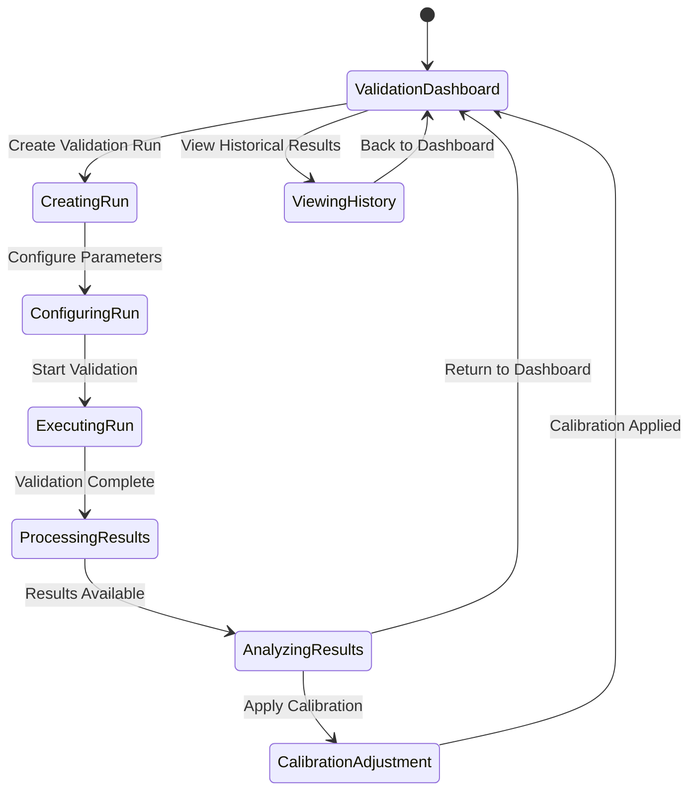

# Tab 8: Validation

## Summary & Goals

The Validation tab implements Prediction Validation (≥90% Accuracy) and supports the Exponential Learning System by providing comprehensive testing, calibration, and accuracy measurement capabilities for the viral prediction platform.

**Primary Goals:**
- Achieve and maintain ≥90% viral prediction accuracy
- Execute systematic validation runs to measure prediction performance
- Calibrate prediction models based on actual viral outcomes
- Track accuracy trends and identify model drift or degradation

## Personas & Scenarios

### Primary Persona: ML Engineering Manager
**Scenario 1: Weekly Accuracy Validation**
- Manager schedules weekly validation run with 100 recent viral videos
- Reviews prediction accuracy across different content types and platforms
- Identifies accuracy degradation in specific categories
- Initiates model recalibration based on validation results

**Scenario 2: Model Release Validation**
- Manager validates new prediction model before production deployment
- Runs champion/challenger validation against current production model
- Analyzes accuracy improvements and potential performance regressions
- Makes data-driven decision on model deployment

### Secondary Persona: Data Science Lead
**Scenario 3: Calibration & Drift Analysis**
- Lead analyzes prediction calibration to ensure confidence scores are accurate
- Identifies systematic bias or drift in viral predictions
- Implements calibration adjustments to improve prediction reliability
- Monitors long-term accuracy trends and seasonal variations

## States & Navigation



## Workflow Specifications

### Validation Run Execution (Core Workflow)
1. **Run Configuration**: Define validation parameters, test set size, and success criteria
2. **Data Preparation**: Select representative sample of content with known viral outcomes
3. **Prediction Generation**: Run current model predictions on validation dataset
4. **Accuracy Calculation**: Compare predictions against actual viral performance
5. **Statistical Analysis**: Calculate accuracy metrics, confidence intervals, and significance
6. **Results Documentation**: Store validation results and generate detailed reports

### Model Calibration Process
1. **Calibration Assessment**: Analyze relationship between prediction confidence and actual accuracy
2. **Bias Detection**: Identify systematic over-prediction or under-prediction patterns
3. **Calibration Mapping**: Create calibration curve to adjust confidence scores
4. **Validation Testing**: Test calibration adjustments on hold-out dataset
5. **Production Deployment**: Apply calibration adjustments to production predictions
6. **Monitoring**: Track calibration effectiveness over time

### Accuracy Monitoring & Alerting
1. **Continuous Tracking**: Monitor prediction accuracy in real-time as outcomes become available
2. **Drift Detection**: Identify when accuracy degrades below acceptable thresholds
3. **Alert Generation**: Notify stakeholders when accuracy issues are detected
4. **Root Cause Analysis**: Investigate causes of accuracy degradation
5. **Remediation Planning**: Develop action plans to restore accuracy performance
6. **Performance Recovery**: Implement fixes and monitor accuracy restoration

## UI Inventory

### Validation Dashboard
- `data-testid="validation-dashboard"`
- `data-testid="current-accuracy-display"`
- `data-testid="accuracy-trend-chart"`
- `data-testid="recent-validation-runs"`

### Validation Run Management
- `data-testid="create-validation-run"`
- `data-testid="validation-type"`
- `data-testid="test-sample-size"`
- `data-testid="validation-parameters"`

### Run Configuration
- `data-testid="content-filters"`
- `data-testid="platform-selection"`
- `data-testid="time-range-selector"`
- `data-testid="confidence-thresholds"`

### Results Display
- `data-testid="validation-results"`
- `data-testid="accuracy-metrics"`
- `data-testid="confusion-matrix"`
- `data-testid="calibration-chart"`

### Calibration Controls
- `data-testid="calibration-analysis"`
- `data-testid="calibration-adjustments"`
- `data-testid="apply-calibration"`
- `data-testid="test-calibration"`

### Historical Analysis
- `data-testid="validation-history"`
- `data-testid="accuracy-trends"`
- `data-testid="model-comparison"`
- `data-testid="performance-regression"`

### Validation Run Items
- `data-testid="run-{id}"` (e.g., "run-val_20250102_001")
- `data-testid="run-{id}-status"`
- `data-testid="run-{id}-accuracy"`
- `data-testid="run-{id}-details"`

## Data Contracts

### Validation Run Configuration
```yaml
validation_config:
  run_id: string
  name: string
  validation_type: "accuracy_check" | "model_comparison" | "calibration_test" | "drift_detection"
  
  test_parameters:
    sample_size: number
    confidence_threshold: number
    accuracy_target: number
    time_window: string
    
  data_selection:
    platforms: array<string>
    content_types: array<string>
    date_range: {start: ISO date, end: ISO date}
    viral_threshold: number
    
  model_configuration:
    model_version: string
    prediction_mode: "production" | "experimental" | "comparison"
    calibration_applied: boolean
    
  created_by: string
  scheduled_time: ISO datetime
```

### Validation Results
```yaml
validation_results:
  run_id: string
  status: "completed" | "failed" | "partial"
  execution_time: ISO datetime
  duration_minutes: number
  
  accuracy_metrics:
    overall_accuracy: number (0-1)
    precision: number (0-1)
    recall: number (0-1)
    f1_score: number (0-1)
    auc_roc: number (0-1)
    
  confidence_calibration:
    calibration_error: number
    reliability_score: number
    over_confidence_bias: number
    under_confidence_bias: number
    
  segment_analysis:
    - segment: string
      sample_size: number
      accuracy: number
      confidence_interval: {lower: number, upper: number}
      
  statistical_tests:
    accuracy_significance: {p_value: number, significant: boolean}
    calibration_goodness_of_fit: {chi_square: number, p_value: number}
    model_comparison: {improvement: number, significance: number}
    
  detailed_results:
    true_positives: number
    true_negatives: number
    false_positives: number
    false_negatives: number
    prediction_distribution: object
    
  recommendations:
    - recommendation: string
      priority: "high" | "medium" | "low"
      impact: string
      effort: string
```

### Calibration Data
```yaml
calibration_analysis:
  calibration_curve:
    - confidence_bin: number
      predicted_probability: number
      actual_frequency: number
      sample_count: number
      
  calibration_metrics:
    brier_score: number
    expected_calibration_error: number
    maximum_calibration_error: number
    
  calibration_function:
    type: "platt_scaling" | "isotonic_regression" | "beta_calibration"
    parameters: object
    validation_accuracy: number
    
  before_after_comparison:
    uncalibrated_accuracy: number
    calibrated_accuracy: number
    improvement: number
```

## Events Emitted

### Validation Lifecycle
- `validation.run_created`: New validation run configured
- `validation.run_started`: Validation execution began
- `validation.run_completed`: Validation finished successfully
- `validation.run_failed`: Validation encountered errors
- `validation.results_available`: Validation results ready for review

### Accuracy Monitoring
- `accuracy.threshold_breached`: Accuracy dropped below acceptable level
- `accuracy.target_achieved`: Accuracy reached or exceeded target threshold
- `accuracy.drift_detected`: Systematic accuracy degradation identified
- `accuracy.recovery_confirmed`: Accuracy restored after remediation

### Calibration Events
- `calibration.analysis_completed`: Calibration analysis finished
- `calibration.adjustment_applied`: Calibration changes deployed to production
- `calibration.improvement_measured`: Calibration effectiveness validated
- `calibration.degradation_detected`: Calibration effectiveness declining

## Technical Implementation

### Validation Pipeline Architecture
```yaml
validation_components:
  data_preparation:
    function: "Select and prepare validation datasets"
    components: ["content_sampling", "outcome_verification", "data_cleaning"]
    
  prediction_engine:
    function: "Generate predictions for validation dataset"
    components: ["model_inference", "confidence_calculation", "batch_processing"]
    
  accuracy_calculator:
    function: "Compute accuracy metrics and statistical tests"
    components: ["metric_calculation", "significance_testing", "confidence_intervals"]
    
  calibration_analyzer:
    function: "Analyze and adjust prediction calibration"
    components: ["calibration_curve_fitting", "bias_detection", "adjustment_computation"]
```

### Statistical Methods
```yaml
statistical_framework:
  accuracy_metrics:
    classification_accuracy: "Correct predictions / Total predictions"
    precision_recall: "TP/(TP+FP) and TP/(TP+FN)"
    f1_score: "Harmonic mean of precision and recall"
    auc_roc: "Area under ROC curve for binary classification"
    
  confidence_intervals:
    method: "Wilson score interval for proportions"
    confidence_level: 0.95
    bootstrap_samples: 1000
    
  significance_testing:
    mcnemar_test: "Compare paired predictions for model comparison"
    permutation_test: "Non-parametric significance testing"
    multiple_testing_correction: "Bonferroni correction for multiple comparisons"
    
  calibration_methods:
    platt_scaling: "Logistic regression on prediction scores"
    isotonic_regression: "Non-parametric monotonic calibration"
    beta_calibration: "Beta distribution based calibration"
```

### Performance Monitoring
```yaml
monitoring_framework:
  real_time_tracking:
    accuracy_decay: "Monitor accuracy degradation over time"
    prediction_distribution: "Track changes in prediction score distribution"
    outcome_correlation: "Measure correlation between predictions and outcomes"
    
  alerting_thresholds:
    accuracy_degradation: "Alert when accuracy drops >5% below baseline"
    calibration_drift: "Alert when calibration error increases >0.1"
    volume_anomalies: "Alert when prediction volume changes significantly"
    
  dashboard_metrics:
    current_accuracy: "Latest validated accuracy score"
    accuracy_trend: "7-day and 30-day accuracy trends"
    confidence_reliability: "Calibration quality score"
    validation_freshness: "Time since last validation run"
```

## Performance & Quality Standards

### Accuracy Targets
- **Overall Accuracy**: ≥90% for viral/non-viral classification
- **Precision**: ≥85% to minimize false positive viral predictions
- **Recall**: ≥85% to minimize missed viral opportunities
- **Calibration Error**: <0.1 expected calibration error
- **Confidence Reliability**: >90% correlation between confidence and accuracy

### Validation Frequency
- **Continuous Monitoring**: Real-time accuracy tracking as outcomes become available
- **Scheduled Validation**: Weekly validation runs with 100+ sample size
- **Model Release Validation**: Complete validation before any model deployment
- **Drift Detection**: Daily monitoring for systematic accuracy changes

### Response Time Requirements
- **Validation Setup**: <30 seconds to configure and start validation run
- **Validation Execution**: <10 minutes for 100-sample validation run
- **Results Display**: <5 seconds to load and display validation results
- **Calibration Adjustment**: <2 minutes to apply calibration changes

## Error Handling & Recovery

### Validation Failures
- **Data Unavailability**: Handle missing ground truth data gracefully with partial validation
- **Model Errors**: Detect and report model inference failures during validation
- **Statistical Issues**: Handle edge cases in statistical calculations with appropriate fallbacks
- **Resource Constraints**: Queue validation runs when system resources are limited

### Accuracy Issues
- **Systematic Bias**: Detect and alert on systematic over/under-prediction patterns
- **Performance Regression**: Identify accuracy decreases and recommend remediation
- **Calibration Drift**: Detect calibration degradation and trigger recalibration
- **Segment-Specific Issues**: Identify accuracy problems in specific content segments

### Recovery Procedures
- **Model Rollback**: Revert to previous model version if accuracy degrades significantly
- **Recalibration**: Apply calibration adjustments to restore prediction reliability
- **Retraining Trigger**: Initiate model retraining when accuracy issues persist
- **Data Quality Investigation**: Investigate data quality issues affecting validation

## Security & Compliance

### Data Protection
- **Ground Truth Security**: Protect sensitive viral outcome data used in validation
- **Model Protection**: Secure validation procedures to prevent model reverse engineering
- **Result Confidentiality**: Restrict access to validation results to authorized personnel
- **Audit Trail**: Maintain comprehensive logs of validation activities and decisions

### Validation Integrity
- **Data Isolation**: Ensure validation data is separate from training data
- **Result Reproducibility**: Ensure validation results can be reproduced and audited
- **Bias Prevention**: Implement procedures to prevent validation bias and data leakage
- **Statistical Validity**: Ensure all statistical procedures are methodologically sound

## Acceptance Criteria

- [ ] Validation runs execute reliably with configurable parameters
- [ ] Accuracy calculations are statistically sound and reproducible
- [ ] Calibration analysis identifies and corrects prediction confidence issues
- [ ] Validation dashboard provides clear visibility into model performance
- [ ] Alert system notifies stakeholders of accuracy degradation within 1 hour
- [ ] Model comparison validation supports champion/challenger testing
- [ ] Historical validation results are searchable and comparable
- [ ] Statistical significance testing prevents false positive accuracy claims
- [ ] Calibration adjustments improve prediction reliability measurably
- [ ] Validation frequency scales with platform usage and model updates
- [ ] Error handling manages validation failures without data loss
- [ ] Security controls protect validation data and model performance information

---

*The Validation tab provides the critical measurement and calibration capabilities needed to achieve and maintain ≥90% viral prediction accuracy, enabling continuous improvement of the platform's core value proposition.*