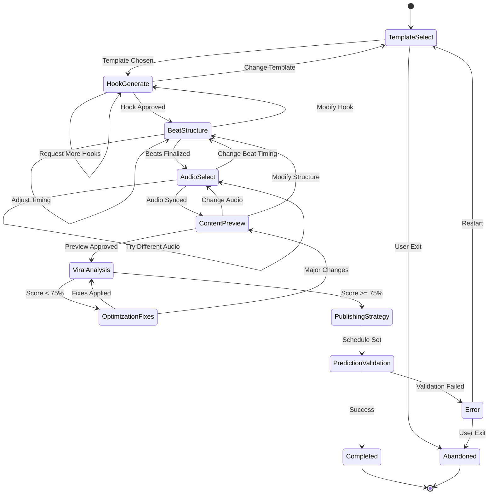
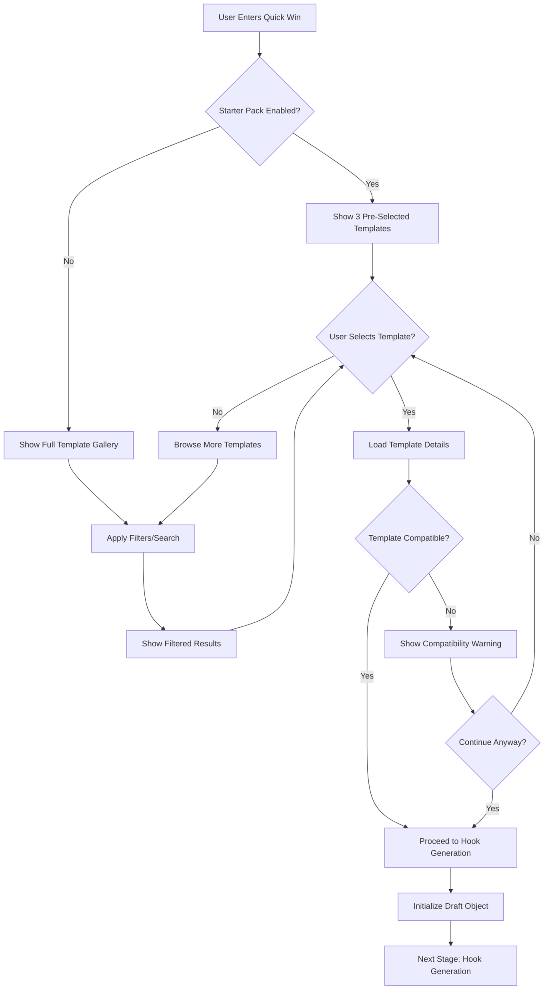
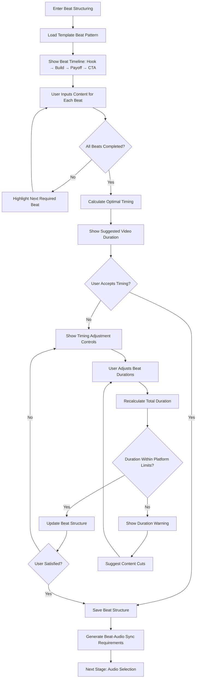
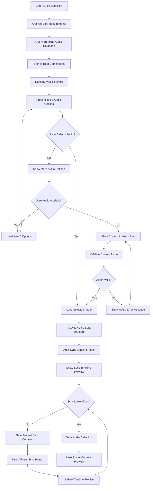
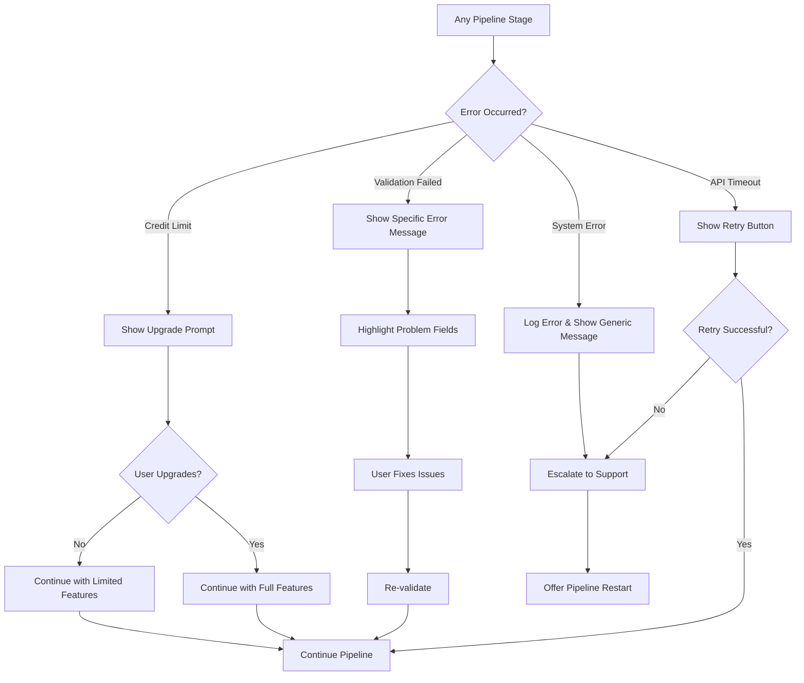
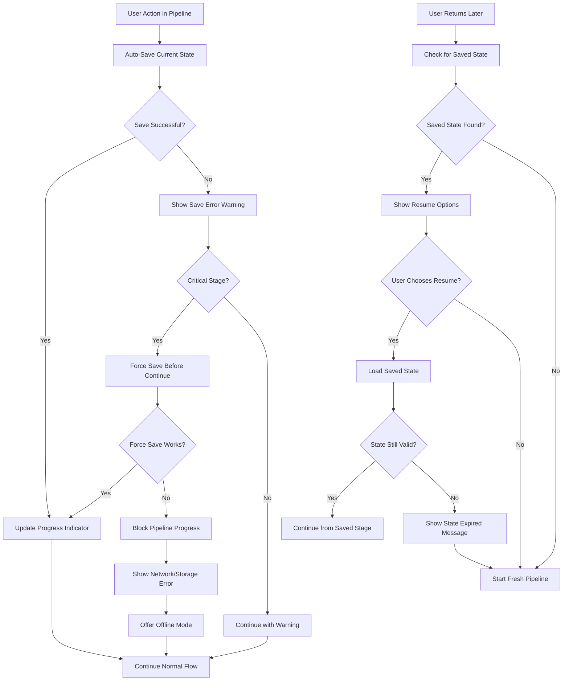
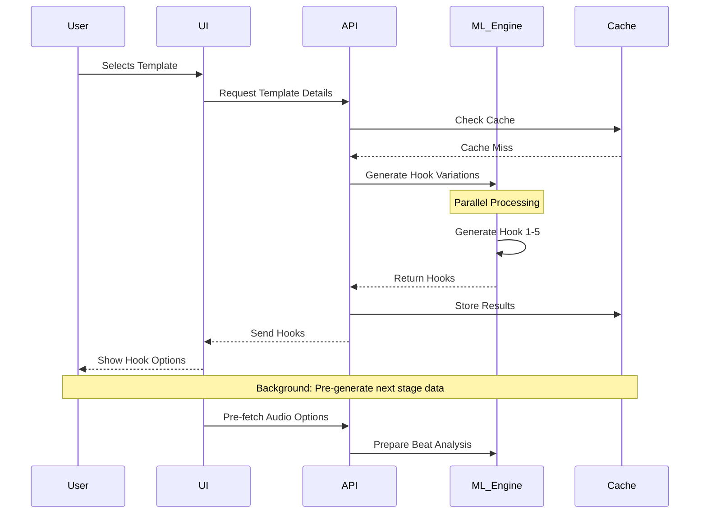

# Quick Win Pipeline - State Machine & Flow Diagrams

## Primary State Machine



## Detailed Stage Flows

### Template Selection Flow



### Hook Generation & Refinement Flow

```mermaid
flowchart TD
    A[Enter Hook Generation] --> B[Analyze Template Requirements]
    
    B --> C[Generate 5 Hook Variations]
    C --> D[Calculate Hook Strength Scores]
    D --> E[Present Hooks to User]
    
    E --> F{User Satisfied?}
    F -->|No| G{Request More Hooks?}
    F -->|Yes| H[User Selects Hook]
    
    G -->|Yes| I[Generate 5 More Variations]
    G -->|No| J[Switch to Manual Hook Entry]
    
    I --> K{Reached Generation Limit?}
    K -->|No| D
    K -->|Yes| L[Show "No More Variations" Message]
    L --> J
    
    J --> M[User Enters Custom Hook]
    M --> N[Validate Hook Against Template]
    N --> O{Hook Valid?}
    
    O -->|Yes| H
    O -->|No| P[Show Validation Errors]
    P --> M
    
    H --> Q[Save Hook to Draft]
    Q --> R[Calculate Hook-Template Compatibility]
    R --> S[Next Stage: Beat Structure]
```

### Beat Structure & Timing Flow



### Audio Selection & Sync Flow



## Error Handling & Recovery

### Common Error States



### Save & Resume Logic



## Performance & Optimization Flows

### Background Processing



## Validation & Quality Gates

### Stage Completion Requirements

| Stage | Must Complete | Optional | Quality Gate |
|-------|--------------|----------|--------------|
| Template Select | Template chosen, compatibility check | Niche/platform filters | Template has >60% success rate |
| Hook Generate | Hook selected or custom entered | Hook refinement | Hook strength score >70% |
| Beat Structure | All beats have content, timing set | Manual timing adjustments | Total duration within platform limits |
| Audio Select | Audio chosen and synced | Manual sync adjustments | Sync confidence >80% |
| Content Preview | Preview generated, user approval | Preview regeneration | All elements render correctly |
| Viral Analysis | Analysis completed, score calculated | AI fixes applied | Minimum 60% viral probability |
| Publishing Strategy | Schedule selected | Caption/hashtag generation | Schedule within optimal windows |
| Prediction Setup | Tracking configured | Custom success metrics | Baseline metrics established |

---

*These state machines represent the complete Quick Win Pipeline workflow including all decision points, error handling, and quality validation steps.*