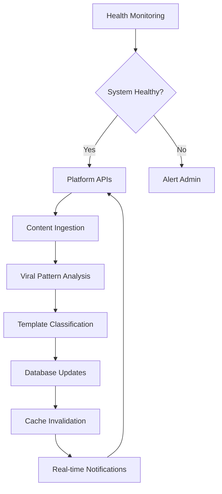

# Objective 01: 24/7 Pipeline

## Summary & Goals

Establish a continuous, always-on system that discovers viral patterns, classifies templates, and maintains real-time data freshness without manual intervention. This forms the foundational infrastructure enabling all other viral prediction capabilities.

**Primary Goal**: System uptime >99.5% with real-time template updates and discovery freshness <24 hours

## Success Criteria & KPIs

### Technical Metrics
- **System Uptime**: >99.5% excluding planned maintenance
- **Discovery Freshness**: New viral patterns identified within 24 hours
- **Template Updates**: Real-time classification (HOT/COOLING/NEW) updates
- **API Response Time**: Discovery endpoints respond <2 seconds P95
- **Data Pipeline Latency**: End-to-end data processing <1 hour

### Business Metrics  
- **Template Inventory Growth**: 50+ new templates discovered monthly
- **Pattern Recognition**: 90% of viral content matches existing or new templates
- **System Reliability**: <0.1% error rate across all pipeline operations
- **Automated Coverage**: 95% of operations require no manual intervention

## Actors & Workflow

### Primary Actors
- **Discovery Engine**: Automated viral pattern detection system
- **Classification System**: Template status determination (HOT/COOLING/NEW)
- **Monitoring System**: Health checks and alerting infrastructure
- **Admin Users**: System oversight and manual intervention when needed

### Core Workflows

#### Continuous Discovery Loop


#### Template Status Management
1. **Continuous Monitoring**: Track performance metrics for all templates
2. **Status Evaluation**: Recalculate HOT/COOLING/NEW status every 6 hours
3. **Threshold Checking**: Apply success rate and trend delta thresholds
4. **Status Updates**: Update template status in database and cache
5. **Notification**: Push status changes to connected admin interfaces

### Preconditions
- Platform API access configured (TikTok, Instagram, YouTube)
- Database schema deployed with proper indexing
- Caching infrastructure operational (Redis/equivalent)
- Monitoring and alerting systems configured
- Discovery algorithms trained and validated

### Postconditions  
- Template database current with latest viral patterns
- All templates have accurate, up-to-date status classifications
- System health metrics within acceptable ranges
- Admin dashboard shows real-time system status

## Data Contracts

### Input Data Sources
```yaml
platform_apis:
  tiktok:
    endpoints: ["/trending", "/videos/{id}", "/hashtags/trending"]
    rate_limits: "100 requests/minute"
    data_types: ["video_metadata", "engagement_metrics", "trending_sounds"]
    
  instagram:
    endpoints: ["/reels/trending", "/hashtags/recent", "/music/trending"]
    rate_limits: "200 requests/hour"
    data_types: ["reel_metadata", "hashtag_performance", "audio_trends"]
    
  youtube:
    endpoints: ["/videos/trending", "/search", "/channels/videos"]
    rate_limits: "10000 requests/day"
    data_types: ["shorts_metadata", "view_velocity", "engagement_patterns"]
```

### Output Data Structure
```yaml
template_updates:
  template_id: string
  status: "HOT" | "COOLING" | "NEW" | "ARCHIVED"
  metrics:
    success_rate: number (0-1)
    trend_delta_7d: number (-1 to 1)
    uses_count: number
    last_viral_date: ISO datetime
  updated_at: ISO datetime
  confidence_score: number (0-1)

discovery_results:
  patterns_found: number
  new_templates_created: number
  status_changes: number
  processing_duration_ms: number
  errors: array<string>
```

## Technical Implementation

### Core Components

#### Discovery Service
- **Pattern Recognition ML Model**: Identifies viral content patterns
- **Template Matching Engine**: Associates content with existing templates  
- **Classification Algorithm**: Determines template status based on performance
- **Data Pipeline**: ETL processes for continuous data ingestion

#### Monitoring & Health
- **System Health Checks**: API availability, database connectivity, cache status
- **Performance Monitoring**: Response times, throughput, error rates
- **Alerting System**: Slack/email notifications for system issues
- **Dashboard Integration**: Real-time metrics display in admin interface

#### Caching Strategy
- **Template Cache**: Redis-based caching with 1-hour TTL
- **Discovery Cache**: Pattern recognition results cached for 24 hours
- **Status Cache**: Template status cached with smart invalidation
- **API Response Cache**: External API responses cached per platform limits

### API Specifications

#### System Health Endpoint
```yaml
GET /api/discovery/metrics:
  response:
    system:
      uptime_seconds: number
      last_discovery_run: ISO datetime
      discovery_queue_length: number
    templates:
      total_count: number
      hot_count: number
      cooling_count: number  
      new_count: number
    processing:
      avg_processing_time_ms: number
      error_rate_percent: number
```

#### Manual Discovery Trigger
```yaml
POST /api/discovery/scan:
  request:
    platforms: array<string>
    priority: "high" | "normal" | "low"
    scope: "full" | "incremental"
  response:
    scan_id: string
    estimated_completion: ISO datetime
    queued_platforms: array<string>
```

## Events Emitted

### System Events
- `pipeline.started`: Discovery pipeline initiated
- `pipeline.completed`: Discovery cycle finished successfully
- `pipeline.failed`: Discovery cycle encountered errors
- `pipeline.health_check`: Regular health monitoring ping

### Template Events
- `template.status_changed`: Template moved between HOT/COOLING/NEW/ARCHIVED
- `template.created`: New template discovered and classified
- `template.updated`: Template metrics or metadata updated
- `template.archived`: Template marked as inactive/outdated

### Alert Events
- `system.uptime_degraded`: System availability below SLO threshold
- `discovery.delayed`: Discovery freshness exceeds 24-hour target
- `api.rate_limited`: Platform API rate limits reached
- `database.performance_issue`: Database query performance degraded

## Error Handling & Recovery

### Common Error Scenarios

#### API Rate Limiting
- **Detection**: Monitor rate limit headers from platform APIs
- **Response**: Queue requests with exponential backoff
- **Recovery**: Distribute requests across time windows, multiple API keys
- **Notification**: Alert admins when rate limits consistently hit

#### Data Processing Failures
- **Detection**: Exception handling in pattern recognition pipeline
- **Response**: Log errors with context, continue processing other items
- **Recovery**: Dead letter queue for failed items, manual review workflow
- **Notification**: Slack alerts for error rate spikes

#### System Performance Degradation
- **Detection**: Response time and throughput monitoring
- **Response**: Scale resources automatically, enable circuit breakers
- **Recovery**: Health checks confirm system recovery before resuming
- **Notification**: Dashboard indicators and admin alerts

## Performance & Scalability

### Performance Targets
- **Discovery Latency**: Full platform scan completes within 2 hours
- **Template Updates**: Status changes reflected within 15 minutes
- **API Response**: Discovery metrics endpoint <1 second response
- **Throughput**: Process 10,000+ content items per hour

### Scalability Design
- **Horizontal Scaling**: Discovery workers auto-scale based on queue depth
- **Database Optimization**: Proper indexing on frequently queried fields
- **Caching Strategy**: Multi-tier caching reduces database load
- **Queue Management**: Redis-based job queues with priority levels

## Security & Compliance

### Data Protection
- **API Keys**: Secure storage in encrypted environment variables
- **Content Data**: No permanent storage of user-generated content
- **Metadata Only**: Store only non-PII metadata and performance metrics
- **Access Control**: API endpoints require proper authentication

### Rate Limit Compliance
- **Platform Terms**: Respect all platform API terms of service
- **Request Distribution**: Spread requests to avoid detection patterns
- **Backup Strategies**: Multiple data sources reduce single-platform dependence
- **Legal Compliance**: All data collection within fair use guidelines

## Acceptance Criteria

- [ ] System maintains >99.5% uptime over 30-day periods
- [ ] New viral patterns discovered within 24 hours of emergence
- [ ] Template status updates reflect in admin interface within 15 minutes
- [ ] Discovery pipeline processes without manual intervention >95% of time
- [ ] API endpoints respond within SLO targets under normal load
- [ ] Error handling gracefully manages platform API limitations
- [ ] Health monitoring detects and alerts on system issues <5 minutes
- [ ] Database queries perform within acceptable response times
- [ ] Admin dashboard displays real-time accurate system status
- [ ] Recovery procedures restore system function within 1 hour of failure

---

*This objective forms the foundation for all other viral prediction capabilities. Success here enables the entire platform's value delivery.*