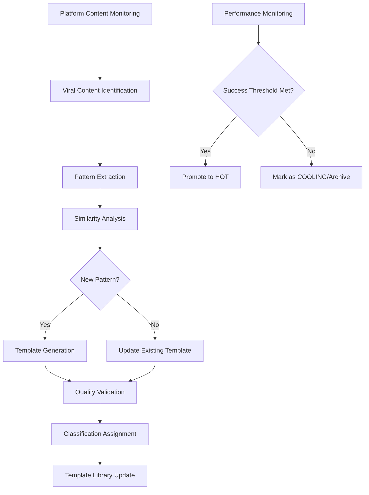

# Objective 02: Automated Viral Template Discovery

## Summary & Goals

Implement an AI-powered system that automatically discovers, analyzes, and classifies viral content patterns into reusable templates within 24 hours of emergence. This system forms the core of the platform's competitive advantage by maintaining an up-to-date library of proven viral patterns.

**Primary Goal**: New viral templates identified and classified within 24 hours of viral emergence

## Success Criteria & KPIs

### Discovery Performance
- **Discovery Latency**: New viral patterns identified within 24 hours of emergence
- **Template Classification**: 95% of discovered patterns correctly classified as HOT/COOLING/NEW
- **Pattern Accuracy**: 90% of newly discovered templates achieve >70% success rate when applied
- **Coverage**: System captures 85% of emerging viral patterns across target platforms

### Quality Metrics
- **False Positive Rate**: <15% of discovered patterns fail to achieve viral success when applied
- **Template Completeness**: 100% of discovered templates include structure, timing, and guidance data
- **Pattern Uniqueness**: 95% of discovered templates are meaningfully distinct from existing library
- **Cross-Platform Recognition**: System identifies patterns across TikTok, Instagram, and YouTube

## Actors & Workflow

### Primary Actors
- **Discovery Engine**: AI system that analyzes content for viral patterns
- **Pattern Classifier**: Algorithm that categorizes and validates discovered patterns
- **Template Generator**: System that converts patterns into reusable templates
- **Quality Validator**: Process that verifies template effectiveness and completeness

### Core Discovery Workflow



### Detailed Process Steps

#### 1. Viral Content Identification (Real-time)
- **Platform Monitoring**: Continuous scanning of TikTok, Instagram, YouTube for trending content
- **Viral Threshold Detection**: Identify content exceeding viral metrics (>100K views in 24h for TikTok)
- **Velocity Analysis**: Detect content with rapid engagement acceleration patterns
- **Cross-Platform Tracking**: Follow viral content across multiple platforms

#### 2. Pattern Extraction (30-60 minutes)
- **Visual Analysis**: Extract visual patterns, transitions, text overlays, composition elements
- **Audio Pattern Recognition**: Identify audio sync patterns, timing, music selection
- **Script Analysis**: Analyze text patterns, hooks, call-to-action structures
- **Timing Pattern Detection**: Extract pacing, beat timing, retention curve patterns

#### 3. Pattern Classification & Validation (2-4 hours)
- **Similarity Matching**: Compare against existing template library using ML similarity models
- **Novelty Assessment**: Determine if pattern represents genuinely new viral approach
- **Quality Scoring**: Assess pattern completeness, replicability, and success potential
- **Cross-Platform Applicability**: Evaluate pattern effectiveness across different platforms

#### 4. Template Generation (4-8 hours)
- **Structure Definition**: Convert patterns into template structure with clear guidance
- **Parameter Extraction**: Identify variable elements that creators can customize
- **Success Metrics Calculation**: Calculate initial success rate estimates based on source content
- **Implementation Guidance**: Generate creator guidance for applying the template

## Data Contracts

### Input Data Sources
```yaml
platform_monitoring:
  tiktok:
    data_sources: ["trending_api", "hashtag_tracking", "sound_trending"]
    metrics: ["view_count", "like_rate", "share_rate", "comment_engagement"]
    refresh_frequency: "15 minutes"
    
  instagram:
    data_sources: ["reels_trending", "hashtag_performance", "audio_trends"]
    metrics: ["view_count", "saves", "shares", "reach"]
    refresh_frequency: "30 minutes"
    
  youtube:
    data_sources: ["shorts_trending", "viral_velocity", "engagement_spikes"]
    metrics: ["view_count", "watch_time", "subscriber_gain", "viral_coefficient"]
    refresh_frequency: "1 hour"
```

### Pattern Analysis Output
```yaml
discovered_pattern:
  pattern_id: string
  discovery_timestamp: ISO datetime
  source_content: 
    - platform: string
      content_id: string
      performance_metrics: object
      viral_indicators: object
      
  pattern_elements:
    visual_signature:
      - element_type: string
        timing: number
        confidence: number (0-1)
        description: string
        
    audio_signature:
      timing_pattern: array<number>
      sync_points: array<object>
      music_characteristics: object
      
    script_pattern:
      hook_structure: string
      content_flow: array<string>
      cta_pattern: string
      
    timing_signature:
      total_duration: number
      beat_structure: array<object>
      retention_curve: array<number>
      
  novelty_analysis:
    similarity_to_existing: number (0-1)
    uniqueness_score: number (0-1)
    innovation_elements: array<string>
    
  success_prediction:
    viral_potential: number (0-1)
    cross_platform_applicability: array<string>
    estimated_success_rate: number (0-1)
    confidence_interval: {lower: number, upper: number}
```

### Template Generation Output
```yaml
generated_template:
  template_id: string
  name: string
  discovery_source: string
  created_at: ISO datetime
  status: "NEW"
  
  template_structure:
    beats: array<object>
    timing_requirements: object
    visual_requirements: array<string>
    audio_requirements: object
    
  pattern_recognition:
    visual_patterns: array<object>
    audio_patterns: array<object>
    text_patterns: array<object>
    timing_patterns: array<object>
    
  success_metrics:
    initial_success_rate: number (0-1)
    source_performance: object
    prediction_confidence: number (0-1)
    
  creator_guidance:
    implementation_steps: array<string>
    customization_options: array<object>
    platform_optimizations: object
    success_tips: array<string>
```

## Technical Implementation

### AI/ML Pipeline Architecture
```yaml
ml_pipeline:
  content_ingestion:
    batch_processors: ["tiktok_scraper", "instagram_monitor", "youtube_tracker"]
    real_time_streams: ["viral_velocity_detector", "engagement_spike_monitor"]
    
  pattern_extraction:
    computer_vision: "YOLOv8 + custom viral pattern detector"
    audio_analysis: "Librosa + custom beat detection models"
    nlp_processing: "BERT-based script pattern recognition"
    
  similarity_analysis:
    embedding_models: ["CLIP for visual", "sentence-transformers for text"]
    clustering: "HDBSCAN for pattern grouping"
    novelty_detection: "One-class SVM for new pattern identification"
    
  template_generation:
    structure_generator: "Rule-based system with ML validation"
    guidance_generator: "GPT-4 fine-tuned for creator instructions"
    success_predictor: "Ensemble model combining all pattern features"
```

### Data Processing Pipeline
```yaml
processing_stages:
  stage_1_ingestion:
    duration: "Real-time"
    operations: ["content_scraping", "metadata_extraction", "viral_detection"]
    
  stage_2_analysis:
    duration: "30-60 minutes"
    operations: ["feature_extraction", "pattern_recognition", "quality_assessment"]
    
  stage_3_validation:
    duration: "2-4 hours"
    operations: ["similarity_checking", "novelty_validation", "success_prediction"]
    
  stage_4_template_creation:
    duration: "4-8 hours"
    operations: ["template_generation", "guidance_creation", "quality_review"]
    
  stage_5_deployment:
    duration: "12-24 hours"
    operations: ["human_review", "template_activation", "library_integration"]
```

### Quality Assurance Pipeline
```yaml
quality_gates:
  pattern_validation:
    completeness_check: "Verify all required pattern elements present"
    uniqueness_verification: "Confirm pattern is meaningfully different"
    success_prediction: "Validate predicted success rate >70%"
    
  template_validation:
    structure_coherence: "Ensure template structure is logical and implementable"
    guidance_clarity: "Verify creator instructions are clear and actionable"
    cross_platform_applicability: "Confirm template works across target platforms"
    
  human_review:
    quality_assessment: "Human reviewer validates template quality"
    brand_safety: "Ensure templates promote appropriate content"
    success_potential: "Expert assessment of viral potential"
```

## Events Emitted

### Discovery Events
- `discovery.viral_content_detected`: Viral content identified across platforms
- `discovery.pattern_extracted`: New pattern extracted from viral content
- `discovery.template_generated`: New template created from discovered pattern
- `discovery.template_activated`: New template added to active library

### Quality Events
- `quality.pattern_validated`: Pattern passed validation checks
- `quality.template_approved`: Template approved for library inclusion
- `quality.success_threshold_met`: Template achieved success rate threshold
- `quality.template_promoted`: Template status upgraded (NEW → HOT)

### Performance Events  
- `performance.discovery_latency`: Time from viral emergence to template creation
- `performance.success_rate_achieved`: Template achieved predicted success rate
- `performance.cross_platform_validation`: Template success validated across platforms

## Performance & Scalability

### Discovery Performance Targets
- **Content Processing**: 10,000+ pieces of content analyzed per hour
- **Pattern Recognition**: 95% accuracy in identifying replicable patterns
- **Template Generation**: 5-10 new templates created daily across all platforms
- **Quality Filtering**: 85% of generated templates pass quality validation

### Scalability Architecture
- **Horizontal Scaling**: Discovery workers auto-scale based on content volume
- **Distributed Processing**: Pattern extraction distributed across GPU clusters  
- **Caching Strategy**: Similarity calculations cached to prevent duplicate work
- **Queue Management**: Priority queues ensure viral content processed first

## Error Handling & Edge Cases

### Content Access Issues
- **Private Content**: Handle content that becomes private after going viral
- **Deleted Content**: Graceful handling of content removed by creators
- **Geographic Restrictions**: Account for region-locked content
- **Platform API Limits**: Manage rate limits and API access restrictions

### Pattern Recognition Failures
- **Low Confidence Patterns**: Handle patterns with unclear viral elements
- **Contradictory Signals**: Resolve conflicts between different pattern indicators
- **Multi-Pattern Content**: Handle content that combines multiple viral patterns
- **Platform-Specific Patterns**: Manage patterns that only work on single platforms

### Template Generation Issues
- **Incomplete Patterns**: Handle patterns missing essential viral elements
- **Overly Specific Patterns**: Generalize patterns that are too narrow for reuse
- **Conflicting Requirements**: Resolve template requirements that conflict
- **Success Rate Validation**: Handle templates with unpredictable success patterns

## Security & Privacy

### Content Rights & Ethics
- **Fair Use**: Ensure pattern extraction operates within fair use guidelines
- **Creator Attribution**: Maintain ethical standards around pattern attribution
- **Platform Terms**: Comply with all platform terms of service for data usage
- **Copyright Respect**: Avoid templates that infringe on copyrighted material

### Data Protection
- **Personal Data**: Strip personally identifiable information from pattern data
- **Content Privacy**: Respect creator privacy settings and content permissions
- **Competitive Intelligence**: Protect proprietary discovery algorithms and data
- **User Data**: Ensure template usage data doesn't expose individual creator behavior

## Acceptance Criteria

- [ ] System monitors TikTok, Instagram, and YouTube for viral content continuously
- [ ] Viral content identified within 1 hour of exceeding platform viral thresholds
- [ ] Pattern extraction completes within 4 hours of viral content identification
- [ ] Template generation produces complete, actionable templates with >85% success
- [ ] Discovery latency averages <24 hours from viral emergence to template availability
- [ ] False positive rate for viral pattern identification remains <15%
- [ ] Generated templates achieve >70% success rate when applied by creators
- [ ] Cross-platform pattern recognition identifies patterns across multiple platforms
- [ ] Quality validation ensures 100% of activated templates meet completeness standards
- [ ] Template library grows by 5-10 high-quality templates per day
- [ ] Human review process validates template quality and brand safety
- [ ] System scales to handle 50+ viral content pieces analyzed simultaneously

---

*Automated Viral Template Discovery provides the platform's core competitive advantage by maintaining an always-current library of proven viral patterns, enabling creators to leverage the latest viral trends for maximum content success.*