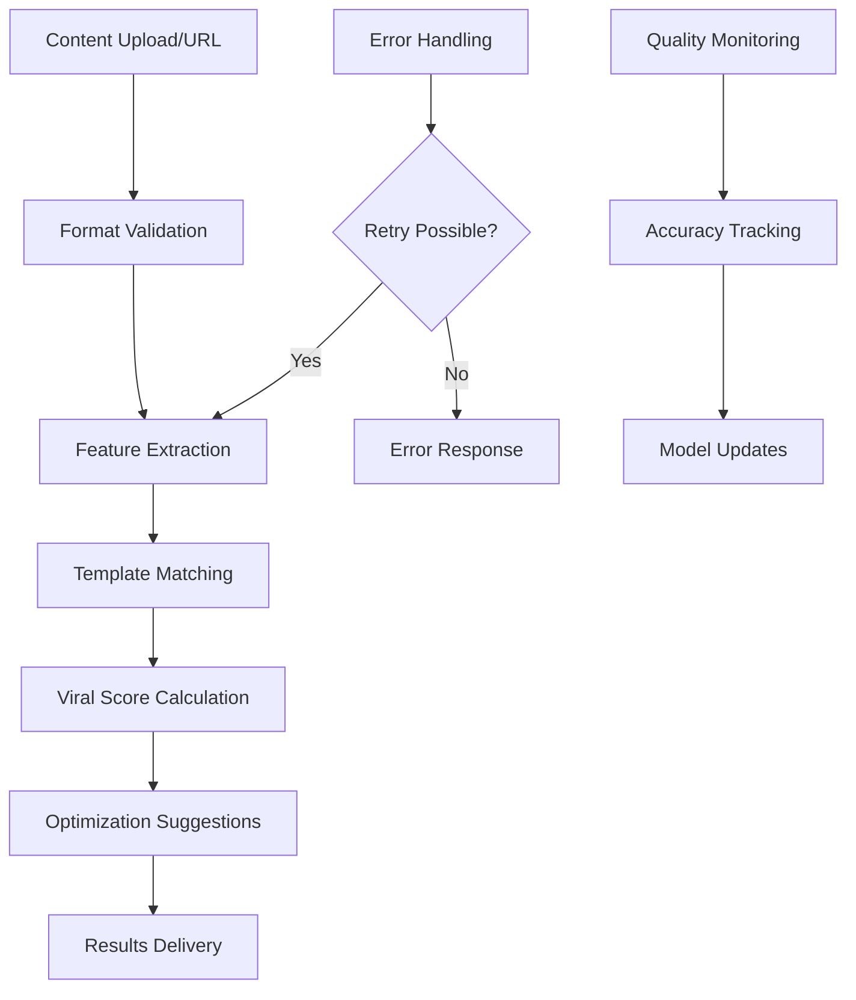

# Objective 03: Instant Content Analysis Engine

## Summary & Goals

Deliver real-time AI-powered analysis of video content that provides viral probability scores, template matching, and actionable optimization recommendations within 30 seconds. This engine forms the core value proposition of the platform.

**Primary Goal**: Analysis completion <30 seconds with >80% viral prediction accuracy

## Success Criteria & KPIs

### Performance Metrics
- **Analysis Speed**: Video analysis completes within 30 seconds for content <2 minutes
- **Viral Prediction Accuracy**: >80% accuracy within 3 months, >85% within 6 months
- **Template Matching Precision**: >90% correct template identification
- **Concurrent Processing**: Handle 50+ simultaneous analyses without degradation
- **Uptime**: Analysis service available >99.5% of time

### Quality Metrics
- **Confidence Calibration**: Confidence scores correlate with actual accuracy
- **Suggestion Quality**: >70% of optimization suggestions accepted by users
- **False Positive Rate**: <15% of high-scoring content fails to achieve viral metrics
- **Coverage**: Analysis works for 95%+ of submitted content formats

## Actors & Workflow

### Primary Actors
- **Content Creators**: Upload videos for viral potential analysis
- **Admin Users**: Analyze content for template validation and research
- **Analysis Engine**: AI system processing video content
- **Template Matching System**: Correlates content with viral patterns

### Core Analysis Workflow



### Detailed Process Steps

#### 1. Content Ingestion (2-5 seconds)
- **File Upload**: Accept MP4, MOV, AVI up to 100MB
- **URL Processing**: Download from TikTok, Instagram, YouTube URLs  
- **Format Validation**: Ensure content meets processing requirements
- **Preprocessing**: Standardize format, resolution, frame rate

#### 2. Feature Extraction (10-15 seconds)
- **Visual Analysis**: Scene changes, object detection, text overlay analysis
- **Audio Processing**: Beat detection, speech recognition, music identification
- **Timing Analysis**: Pacing, cut frequency, attention curves
- **Text Recognition**: OCR on video text, caption analysis

#### 3. Template Matching (3-5 seconds)
- **Pattern Recognition**: Compare extracted features to template database
- **Similarity Scoring**: Calculate confidence scores for template matches
- **Multiple Matches**: Rank best-fitting templates with confidence intervals
- **Novel Pattern Detection**: Identify content that doesn't match existing templates

#### 4. Viral Score Calculation (5-8 seconds)
- **Weighted Scoring**: Combine template adherence, feature quality, trend alignment
- **Historical Calibration**: Adjust scores based on historical prediction accuracy
- **Confidence Intervals**: Provide score ranges and reliability indicators
- **Platform Optimization**: Apply platform-specific viral factors

#### 5. Optimization Generation (3-5 seconds)
- **Gap Analysis**: Identify areas where content deviates from optimal patterns
- **Recommendation Engine**: Generate specific, actionable improvement suggestions
- **Impact Estimation**: Predict viral score improvement for each suggestion
- **Priority Ranking**: Order suggestions by potential impact and implementation difficulty

## Data Contracts

### Input Formats
```yaml
video_upload:
  formats: ["mp4", "mov", "avi", "m4v"]
  max_size_mb: 100
  max_duration_sec: 300
  min_resolution: "480x480"
  supported_codecs: ["h264", "h265", "vp9"]

url_analysis:
  supported_platforms: ["tiktok", "instagram", "youtube"]
  url_patterns:
    - "https://www.tiktok.com/@*/video/*"
    - "https://www.instagram.com/reel/*"
    - "https://youtube.com/shorts/*"
  download_timeout_sec: 30
```

### Output Structure
```yaml
analysis_result:
  viral_score:
    score: number (0-100)
    confidence: number (0-1)
    score_range: {min: number, max: number}
    
  template_matches:
    - template_id: string
      template_name: string
      match_confidence: number (0-1)
      elements_matched: array<string>
      
  feature_analysis:
    visual:
      scene_variety: number (0-1)
      text_overlay_quality: number (0-1)
      visual_engagement: number (0-1)
    audio:
      beat_sync_quality: number (0-1)
      audio_clarity: number (0-1)
      trending_audio_match: boolean
    timing:
      hook_strength: number (0-1)
      pacing_score: number (0-1)
      attention_curve: array<number>
      
  optimization_suggestions:
    - category: "hook" | "visual" | "audio" | "timing" | "structure"
      suggestion: string
      impact_score: number (0-1)
      difficulty: "easy" | "medium" | "hard"
      estimated_improvement: number (viral score points)
      
  metadata:
    analysis_duration_ms: number
    processing_version: string
    analyzed_at: ISO datetime
```

## Technical Implementation

### Core Analysis Pipeline

#### Computer Vision Processing
- **Scene Detection**: Identify cuts, transitions, visual patterns
- **Object Recognition**: Detect people, products, text overlays, backgrounds
- **Motion Analysis**: Track camera movement, object motion, visual dynamics
- **Quality Assessment**: Lighting, composition, visual clarity evaluation

#### Audio Processing
- **Beat Detection**: Identify rhythm patterns, tempo, audio structure  
- **Speech Recognition**: Extract spoken content, analyze delivery patterns
- **Music Identification**: Match against trending audio database
- **Audio Quality**: Volume levels, clarity, background noise assessment

#### Natural Language Processing
- **Text Extraction**: OCR from video frames, caption processing
- **Semantic Analysis**: Understand content themes, emotional tone
- **Trend Alignment**: Match text patterns against viral language patterns
- **Hook Analysis**: Evaluate opening text/speech for engagement potential

### AI/ML Model Architecture

#### Ensemble Prediction Model
```yaml
model_components:
  visual_classifier:
    architecture: "CNN + Transformer"
    input: "Video frames at 2fps"
    output: "Visual engagement scores"
    
  audio_analyzer:
    architecture: "Spectrogram CNN + RNN"
    input: "Audio waveform + beat patterns"
    output: "Audio viral potential scores"
    
  text_processor:
    architecture: "BERT-based transformer"
    input: "OCR text + captions"
    output: "Text engagement scores"
    
  temporal_analyzer:
    architecture: "LSTM + attention"
    input: "Time-series features"
    output: "Pacing and timing scores"
    
  ensemble_combiner:
    architecture: "Gradient boosted trees"
    input: "All component scores + metadata"
    output: "Final viral probability"
```

### Performance Optimization

#### Caching Strategy
- **Feature Cache**: Store extracted features for 7 days to avoid reprocessing
- **Template Cache**: Cache template matching results for identical content
- **Model Cache**: Keep AI models loaded in memory for faster inference
- **Result Cache**: Cache analysis results for duplicate URLs (24 hours)

#### Parallel Processing
- **Multi-GPU**: Distribute visual and audio processing across GPUs
- **Async Pipeline**: Overlap feature extraction with template matching
- **Batch Processing**: Group similar analyses for improved throughput
- **Resource Pooling**: Share computational resources across user requests

## API Specifications

### Primary Analysis Endpoint
```yaml
POST /api/analyze/video:
  content_type: "multipart/form-data"
  request:
    video: File
    template_hint: string (optional)
    priority: "high" | "normal" | "low"
  response:
    analysis_id: string
    viral_score: AnalysisResult
    processing_time_ms: number
  rate_limits:
    free_tier: "10 per hour"
    paid_tier: "100 per hour"
```

### URL Analysis Endpoint  
```yaml
POST /api/analyze/url:
  request:
    url: string
    fetch_options:
      quality: "high" | "medium" | "low"
      include_audio: boolean
  response:
    analysis_id: string
    viral_score: AnalysisResult
    source_metadata: object
  rate_limits:
    free_tier: "20 per hour"
    paid_tier: "200 per hour"
```

### Batch Analysis Endpoint
```yaml
POST /api/analyze/batch:
  request:
    items: array<{file: File} | {url: string}>
    options:
      priority: "high" | "normal" | "low"  
      callback_url: string (optional)
  response:
    batch_id: string
    estimated_completion: ISO datetime
    items_queued: number
```

## Events Emitted

### Analysis Lifecycle
- `analysis.started`: Analysis processing initiated
- `analysis.feature_extracted`: Feature extraction completed
- `analysis.template_matched`: Template matching finished
- `analysis.completed`: Full analysis results available
- `analysis.failed`: Analysis encountered unrecoverable error

### Quality Monitoring
- `analysis.accuracy_validated`: Prediction accuracy measured against outcomes
- `analysis.suggestion_applied`: User applied optimization suggestion
- `analysis.feedback_received`: User provided quality feedback
- `model.performance_updated`: AI model performance metrics updated

## Error Handling & Edge Cases

### Content Processing Errors
- **Unsupported Format**: Clear error with supported format list
- **Corrupted Files**: Detect and report file integrity issues
- **Duration Limits**: Handle videos exceeding time limits gracefully
- **Low Quality**: Analyze but flag quality concerns in results

### Platform-Specific Issues
- **URL Access Denied**: Handle private/restricted content appropriately  
- **Content Deleted**: Graceful handling of removed/unavailable content
- **Geographic Restrictions**: Handle region-locked content
- **Rate Limiting**: Manage platform API limits with proper queuing

### Analysis Quality Issues
- **Low Confidence**: Provide uncertainty indicators when confidence <70%
- **No Template Match**: Handle novel content patterns gracefully
- **Processing Timeout**: Fallback to basic analysis for complex content
- **Model Errors**: Graceful degradation when AI models fail

## Security & Privacy

### Content Handling
- **Temporary Storage**: Video content stored max 48 hours for processing
- **No Permanent Storage**: Content deleted after analysis completion
- **Secure Processing**: Analysis performed in isolated processing environments
- **Metadata Only**: Only non-identifying metadata retained long-term

### Privacy Protection  
- **URL Sanitization**: Remove tracking parameters from shared URLs
- **Content Anonymization**: Strip personal information from analysis results
- **Access Control**: Analysis results private to requesting user
- **Audit Logging**: Track access to analysis results for security

## Acceptance Criteria

- [ ] Video analysis completes within 30 seconds for content <2 minutes duration
- [ ] URL analysis handles TikTok, Instagram, YouTube URLs reliably
- [ ] Viral prediction accuracy >80% measured against actual viral performance
- [ ] Template matching identifies correct templates >90% of time
- [ ] Optimization suggestions are actionable and specific
- [ ] System handles 50+ concurrent analyses without performance degradation
- [ ] Error handling provides clear guidance for resolution
- [ ] Batch analysis processes multiple files efficiently with progress tracking
- [ ] Analysis results include confidence indicators and uncertainty ranges
- [ ] API endpoints respect rate limits and provide appropriate error responses

---

*This analysis engine delivers the core platform value proposition: instant, accurate viral prediction with actionable optimization guidance.*