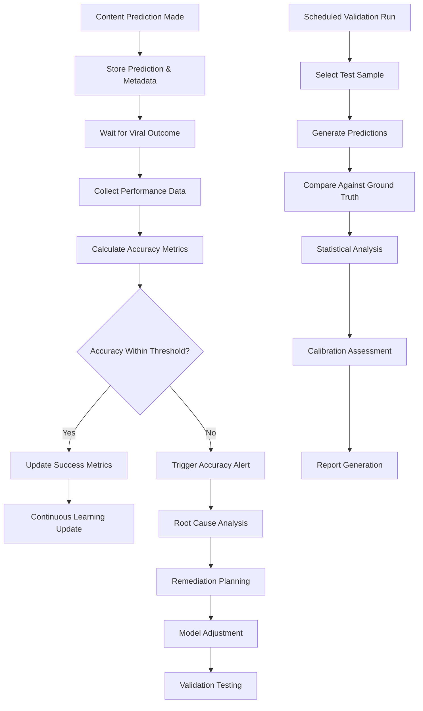

# Objective 04: Prediction Validation (≥90% Accuracy)

## Summary & Goals

Implement a comprehensive prediction validation system that achieves and maintains ≥90% accuracy in viral content predictions through systematic testing, calibration, and continuous learning. This objective ensures the platform's core value proposition is measurably reliable and consistently improves over time.

**Primary Goal**: Maintain ≥90% prediction accuracy across all viral classifications with statistical confidence

## Success Criteria & KPIs

### Accuracy Performance
- **Overall Accuracy**: ≥90% for viral/non-viral binary classification
- **Precision**: ≥85% to minimize false positive viral predictions
- **Recall**: ≥85% to minimize missed viral opportunities  
- **F1 Score**: ≥87% balanced measure of precision and recall
- **AUC-ROC**: ≥0.92 for binary classification performance

### Prediction Reliability
- **Calibration Error**: <0.1 expected calibration error between confidence and accuracy
- **Confidence Correlation**: >90% correlation between prediction confidence and actual accuracy
- **Consistency**: <5% accuracy variance across different content types and platforms
- **Statistical Significance**: 95% confidence intervals for all accuracy measurements

### Validation Operations
- **Validation Frequency**: Automated validation runs every 24 hours with 100+ sample size
- **Real-time Monitoring**: Continuous accuracy tracking as viral outcomes become available
- **Alert Response Time**: <1 hour notification when accuracy drops below thresholds
- **Recovery Time**: <24 hours to identify and resolve accuracy degradation issues

## Actors & Workflow

### Primary Actors
- **Validation Engine**: Automated system for continuous accuracy measurement and testing
- **Calibration System**: Algorithm for adjusting prediction confidence scores based on historical accuracy
- **Drift Detector**: System that identifies systematic changes in prediction accuracy over time
- **Alert Manager**: Service that notifies stakeholders of accuracy issues and threshold breaches

### Core Validation Workflow



### Detailed Process Steps

#### 1. Prediction Capture & Storage (Real-time)
- **Prediction Logging**: Store every prediction with timestamp, model version, and confidence score
- **Metadata Collection**: Capture content features, platform context, and prediction reasoning
- **Prediction ID Tracking**: Maintain unique identifiers linking predictions to content and outcomes
- **Version Control**: Track which model version generated each prediction for accuracy attribution

#### 2. Outcome Collection & Verification (24-48 hours)
- **Viral Metrics Monitoring**: Track view counts, engagement rates, and viral indicators
- **Threshold Application**: Apply platform-specific viral thresholds (e.g., >100K views/24h)
- **Data Validation**: Verify outcome data quality and handle missing or corrupted metrics
- **Multi-Platform Aggregation**: Combine performance data across TikTok, Instagram, and YouTube

#### 3. Accuracy Calculation & Analysis (Continuous)
- **Binary Classification Metrics**: Calculate accuracy, precision, recall, and F1 scores
- **Confidence Calibration**: Analyze relationship between prediction confidence and actual accuracy
- **Segmented Analysis**: Measure accuracy across content types, platforms, and time periods
- **Statistical Testing**: Apply significance tests and confidence intervals to accuracy measurements

#### 4. Drift Detection & Alerting (Real-time)
- **Performance Monitoring**: Track accuracy trends and identify systematic degradation
- **Anomaly Detection**: Identify unusual patterns in prediction accuracy or confidence
- **Threshold Breaches**: Alert when accuracy drops below 90% or calibration error exceeds 0.1
- **Escalation Procedures**: Notify appropriate stakeholders based on severity and persistence

## Data Contracts

### Prediction Record
```yaml
prediction_record:
  prediction_id: string (UUID)
  content_id: string
  user_id: string
  timestamp: ISO datetime
  
  prediction_data:
    viral_probability: number (0-1)
    confidence_score: number (0-1)
    viral_classification: boolean
    prediction_reasoning: array<string>
    
  model_metadata:
    model_version: string
    model_features: object
    feature_importance: object
    processing_time_ms: number
    
  content_context:
    platform: string
    content_type: string
    niche: string
    creator_profile: object
    
  ground_truth: # populated when outcome available
    actual_viral: boolean
    performance_metrics: object
    outcome_timestamp: ISO datetime
    outcome_confidence: number
```

### Validation Run Configuration
```yaml
validation_run:
  run_id: string
  run_type: "scheduled" | "on_demand" | "model_comparison" | "calibration"
  status: "pending" | "running" | "completed" | "failed"
  
  configuration:
    sample_size: number
    time_window: {start: ISO date, end: ISO date}
    content_filters: object
    accuracy_target: number
    confidence_threshold: number
    
  execution_metadata:
    start_time: ISO datetime
    end_time: ISO datetime
    duration_seconds: number
    predictions_evaluated: number
    
  results:
    overall_accuracy: number (0-1)
    precision: number (0-1)
    recall: number (0-1)
    f1_score: number (0-1)
    auc_roc: number (0-1)
    
  calibration_analysis:
    calibration_error: number
    reliability_score: number
    confidence_distribution: object
    
  statistical_analysis:
    confidence_interval: {lower: number, upper: number}
    significance_test: {statistic: number, p_value: number}
    sample_adequacy: boolean
```

### Calibration Model
```yaml
calibration_model:
  model_id: string
  calibration_type: "platt_scaling" | "isotonic_regression" | "beta_calibration"
  training_data_size: number
  
  calibration_function:
    parameters: object
    mapping_curve: array<{input: number, output: number}>
    validation_accuracy: number
    
  performance_metrics:
    before_calibration:
      accuracy: number
      calibration_error: number
      reliability_score: number
      
    after_calibration:
      accuracy: number
      calibration_error: number
      reliability_score: number
      improvement: number
      
  deployment:
    deployed_at: ISO datetime
    validation_period_days: number
    performance_monitoring: boolean
```

## Technical Implementation

### Validation Architecture
```yaml
validation_system:
  data_pipeline:
    prediction_collector: "Real-time collection of all predictions"
    outcome_tracker: "Automated viral outcome measurement"
    data_validator: "Quality checks and data cleaning"
    
  analytics_engine:
    accuracy_calculator: "Statistical accuracy measurement"
    calibration_analyzer: "Confidence score calibration"
    drift_detector: "Model performance drift detection"
    
  alerting_system:
    threshold_monitor: "Real-time accuracy threshold monitoring"
    alert_dispatcher: "Notification routing and escalation"
    dashboard_updater: "Real-time dashboard metrics updates"
    
  calibration_service:
    calibration_trainer: "Train calibration models on historical data"
    model_applier: "Apply calibration to production predictions"
    performance_tracker: "Monitor calibration effectiveness"
```

### Statistical Methods
```yaml
statistical_framework:
  accuracy_metrics:
    binary_classification:
      - accuracy: "Correct predictions / Total predictions"
      - precision: "True positives / (True positives + False positives)"
      - recall: "True positives / (True positives + False negatives)"
      - f1_score: "2 * (Precision * Recall) / (Precision + Recall)"
      - auc_roc: "Area under Receiver Operating Characteristic curve"
      
  confidence_intervals:
    method: "Wilson score interval for proportions"
    confidence_level: 0.95
    minimum_sample_size: 30
    
  significance_testing:
    accuracy_comparison: "McNemar test for paired predictions"
    calibration_goodness_of_fit: "Hosmer-Lemeshow test"
    drift_detection: "Kolmogorov-Smirnov test"
    
  calibration_methods:
    platt_scaling: "Logistic regression on prediction scores"
    isotonic_regression: "Non-parametric monotonic calibration"
    beta_calibration: "Beta distribution parameter estimation"
```

### Performance Monitoring
```yaml
monitoring_system:
  real_time_metrics:
    - current_accuracy: "Latest 24-hour accuracy score"
    - prediction_volume: "Number of predictions per hour"
    - outcome_coverage: "Percentage of predictions with outcomes"
    - calibration_drift: "Change in calibration error over time"
    
  trend_analysis:
    - accuracy_trend_7d: "7-day moving average accuracy"
    - accuracy_trend_30d: "30-day moving average accuracy"
    - seasonal_patterns: "Accuracy variations by time/platform"
    - segment_performance: "Accuracy by content type and niche"
    
  alerting_thresholds:
    - accuracy_drop: "Alert when accuracy < 90%"
    - calibration_error: "Alert when calibration error > 0.1"
    - volume_anomaly: "Alert on 50% prediction volume change"
    - systematic_bias: "Alert on sustained over/under-prediction"
```

## Events Emitted

### Validation Lifecycle
- `validation.prediction_recorded`: New prediction stored for future validation
- `validation.outcome_collected`: Viral outcome data collected for existing prediction
- `validation.accuracy_calculated`: Accuracy metrics computed for prediction set
- `validation.run_completed`: Scheduled validation run finished successfully

### Accuracy Monitoring
- `accuracy.threshold_breached`: Accuracy dropped below 90% threshold
- `accuracy.target_achieved`: Accuracy reached or exceeded target threshold  
- `accuracy.drift_detected`: Systematic accuracy degradation identified
- `accuracy.recovery_confirmed`: Accuracy restored after remediation

### Calibration Events
- `calibration.error_detected`: Calibration error exceeds acceptable threshold
- `calibration.model_retrained`: New calibration model trained and deployed
- `calibration.improvement_measured`: Calibration adjustment effectiveness validated
- `calibration.drift_detected`: Calibration quality degrading over time

### Alert Events
- `alert.accuracy_degradation`: Accuracy degradation requiring attention
- `alert.validation_failure`: Validation run failed to complete
- `alert.data_quality_issue`: Problems with prediction or outcome data
- `alert.statistical_significance_lost`: Sample size insufficient for reliable accuracy

## Performance & Scalability

### Validation Performance Targets
- **Real-time Tracking**: Process 1000+ predictions per second with <100ms latency
- **Batch Validation**: Complete 1000-prediction validation run in <5 minutes
- **Statistical Accuracy**: Maintain statistical power >80% for all accuracy measurements
- **Data Processing**: Handle 50K+ predictions daily with complete outcome tracking

### Scalability Architecture
- **Distributed Computing**: Validation calculations distributed across compute clusters
- **Streaming Processing**: Real-time outcome collection using event streaming architecture
- **Caching Strategy**: Cache accuracy calculations to minimize computational overhead
- **Database Optimization**: Optimized queries for large-scale prediction and outcome data

## Error Handling & Edge Cases

### Data Quality Issues
- **Missing Outcomes**: Handle content with unavailable or delayed viral metrics
- **Corrupted Predictions**: Detect and handle malformed or incomplete prediction records
- **Platform API Failures**: Graceful handling when platform APIs are unavailable
- **Timestamp Misalignment**: Handle timezone and timing inconsistencies in data

### Statistical Edge Cases
- **Small Sample Sizes**: Apply appropriate statistical methods for limited data
- **Extreme Accuracy Values**: Handle edge cases where accuracy approaches 0% or 100%
- **Calibration Instability**: Detect and handle unstable calibration models
- **Seasonal Variations**: Account for seasonal changes in viral patterns and accuracy

### System Failures
- **Validation Service Outage**: Queue validation requests during service interruptions
- **Database Failures**: Implement backup systems for critical validation data
- **Model Serving Errors**: Handle prediction model failures gracefully
- **Alert System Failures**: Ensure critical accuracy alerts reach stakeholders

## Security & Privacy

### Data Protection
- **Prediction Data Security**: Encrypt prediction records and outcomes in storage and transit
- **Access Control**: Restrict validation data access to authorized ML engineering team
- **Audit Logging**: Maintain comprehensive logs of all validation activities and data access
- **Data Retention**: Implement appropriate retention policies for prediction and outcome data

### Model Security
- **Validation Integrity**: Prevent tampering with validation results or accuracy measurements
- **Statistical Verification**: Implement checks to prevent manipulation of accuracy metrics
- **Model Versioning**: Secure model version tracking to prevent accuracy attribution errors
- **Calibration Security**: Protect calibration models from unauthorized modification

## Acceptance Criteria

- [ ] Overall prediction accuracy maintains ≥90% across all content types and platforms
- [ ] Precision and recall both exceed 85% for viral content classification
- [ ] Expected calibration error remains below 0.1 for all prediction confidence scores
- [ ] Automated validation runs execute successfully every 24 hours with 100+ sample size
- [ ] Accuracy degradation alerts trigger within 1 hour of threshold breach
- [ ] Statistical confidence intervals provide 95% confidence for all accuracy measurements
- [ ] Calibration system automatically improves prediction reliability over time
- [ ] Drift detection identifies systematic accuracy changes within 48 hours
- [ ] Real-time accuracy monitoring processes 1000+ predictions per second
- [ ] Validation results are reproducible and auditable by external parties
- [ ] Error handling maintains validation system availability >99.5% uptime
- [ ] Security controls protect all prediction data and validation results

---

*Prediction Validation (≥90% Accuracy) ensures the viral prediction platform delivers measurably reliable results through systematic testing, continuous calibration, and statistical rigor that builds user trust and platform credibility.*