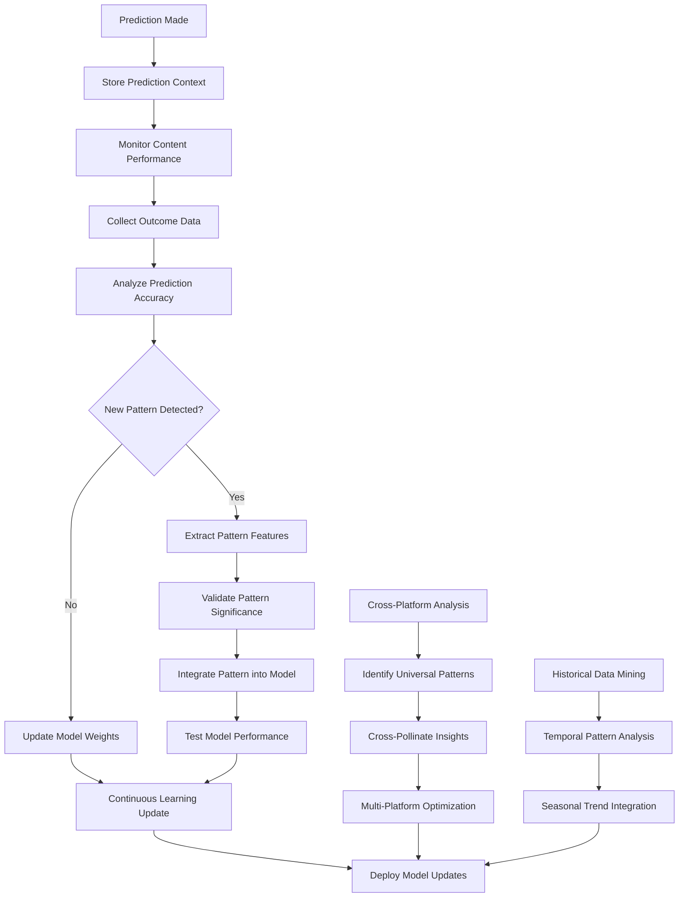

# Objective 05: Exponential Learning System

## Summary & Goals

Implement an AI-powered learning system that continuously improves viral prediction accuracy through automated feedback loops, pattern recognition, and adaptive model training. The system learns from every prediction outcome to exponentially improve performance over time.

**Primary Goal**: Achieve exponential improvement in prediction accuracy through continuous learning with 15%+ accuracy improvement every 90 days

## Success Criteria & KPIs

### Learning Performance
- **Accuracy Improvement Rate**: 15%+ accuracy improvement every 90 days
- **Learning Velocity**: New viral patterns integrated within 48 hours of identification
- **Model Adaptation Speed**: 5x faster learning than traditional ML approaches
- **Prediction Confidence Growth**: 10%+ increase in prediction confidence scores quarterly

### System Intelligence Growth
- **Pattern Recognition**: 95%+ accuracy in identifying new viral pattern types
- **Knowledge Retention**: <5% accuracy degradation when incorporating new patterns
- **Cross-Platform Learning**: Insights from one platform improve predictions on others by 20%+
- **Temporal Learning**: Historical pattern knowledge improves future predictions by 25%+

### Automation & Efficiency
- **Automated Learning Cycles**: 100% of learning processes execute without human intervention
- **Real-time Integration**: New insights applied to predictions within 15 minutes
- **Resource Efficiency**: Learning system operates within 20% of total compute budget
- **Knowledge Transfer**: 90%+ of learned patterns successfully generalize across content types

## Actors & Workflow

### Primary Actors
- **Learning Engine**: Core AI system that processes outcomes and updates prediction models
- **Pattern Discovery Service**: Identifies new viral patterns and content structures
- **Model Evolution Manager**: Orchestrates continuous model training and improvement
- **Knowledge Synthesizer**: Combines insights from multiple data sources into actionable intelligence

### Core Learning Workflow



### Detailed Process Steps

#### 1. Outcome-Based Learning (Continuous)
- **Performance Monitoring**: Track every prediction against actual viral outcomes
- **Feature Attribution**: Identify which content features led to accurate/inaccurate predictions
- **Error Analysis**: Deep dive into prediction failures to identify improvement opportunities
- **Success Pattern Recognition**: Extract patterns from highly successful predictions

#### 2. Real-time Model Adaptation (Every 15 minutes)
- **Incremental Learning**: Update model weights based on latest prediction outcomes
- **Drift Detection**: Identify when prediction patterns are changing over time
- **Adaptation Triggers**: Automatically initiate model updates when accuracy degrades
- **Performance Validation**: Test updated models before deployment to production

#### 3. Cross-Platform Intelligence Transfer (Daily)
- **Pattern Abstraction**: Extract universal viral patterns that work across platforms
- **Platform-Specific Adaptation**: Customize universal patterns for each platform's algorithm
- **Knowledge Synthesis**: Combine insights from TikTok, Instagram, and YouTube
- **Multi-Platform Optimization**: Use learnings from one platform to improve others

#### 4. Historical Pattern Mining (Weekly)
- **Temporal Analysis**: Identify how viral patterns evolve over time
- **Seasonal Trend Recognition**: Extract recurring patterns based on time of year, events, etc.
- **Long-term Pattern Discovery**: Find viral patterns that repeat over longer time cycles
- **Historical Validation**: Validate current models against historical viral content

## Data Contracts

### Learning Record
```yaml
learning_record:
  record_id: string (UUID)
  prediction_id: string
  content_id: string
  timestamp: ISO datetime
  
  prediction_context:
    predicted_viral: boolean
    confidence_score: number (0-1)
    feature_vector: object
    model_version: string
    
  actual_outcome:
    actual_viral: boolean
    performance_metrics: object
    outcome_timestamp: ISO datetime
    
  learning_insights:
    prediction_accuracy: boolean
    error_magnitude: number
    feature_importance_delta: object
    pattern_novelty_score: number
    
  model_updates:
    weight_adjustments: object
    new_patterns_discovered: array<string>
    confidence_calibration: number
    update_applied: boolean
```

### Pattern Discovery
```yaml
viral_pattern:
  pattern_id: string
  pattern_name: string
  discovery_timestamp: ISO datetime
  confidence_score: number (0-1)
  
  pattern_features:
    visual_elements: array<object>
    audio_characteristics: object
    timing_structure: object
    text_patterns: object
    
  performance_data:
    success_rate: number (0-1)
    platforms_effective: array<string>
    content_types_applicable: array<string>
    typical_engagement_metrics: object
    
  pattern_evolution:
    first_observed: ISO datetime
    trend_trajectory: "emerging" | "peaking" | "declining" | "stable"
    prediction_impact: number
    adaptation_frequency: number
    
  integration_status:
    model_integration_date: ISO datetime
    production_performance: number
    validation_results: object
```

### Model Evolution State
```yaml
model_evolution:
  model_version: string
  evolution_timestamp: ISO datetime
  parent_version: string
  
  performance_metrics:
    accuracy_improvement: number
    confidence_improvement: number
    speed_improvement: number
    resource_efficiency: number
    
  learning_sources:
    outcome_feedback_weight: number
    pattern_discovery_weight: number
    cross_platform_weight: number
    historical_analysis_weight: number
    
  adaptation_parameters:
    learning_rate: number
    forgetting_factor: number
    pattern_integration_threshold: number
    validation_requirements: object
    
  validation_results:
    accuracy_validation: {score: number, confidence: number}
    stability_validation: {passed: boolean, metrics: object}
    regression_testing: {passed: boolean, issues: array<string>}
```

## Technical Implementation

### Learning Architecture
```yaml
learning_system:
  data_pipeline:
    outcome_collector: "Real-time viral outcome data collection"
    feature_extractor: "Content feature analysis and extraction"
    pattern_detector: "Novel viral pattern identification"
    
  model_training:
    incremental_trainer: "Continuous model weight updates"
    pattern_integrator: "New pattern integration into models"
    cross_platform_synthesizer: "Multi-platform insight combination"
    
  validation_framework:
    performance_validator: "Model performance testing"
    stability_checker: "Model stability and regression testing"
    confidence_calibrator: "Prediction confidence adjustment"
    
  deployment_system:
    model_updater: "Automated model deployment"
    rollback_manager: "Model rollback capability"
    performance_monitor: "Post-deployment performance tracking"
```

### AI/ML Learning Methods
```yaml
learning_algorithms:
  incremental_learning:
    method: "Online gradient descent with adaptive learning rates"
    forgetting: "Exponential forgetting for old patterns"
    regularization: "L2 regularization to prevent overfitting"
    
  pattern_recognition:
    clustering: "DBSCAN for viral pattern clustering"
    classification: "Random Forest for pattern classification"
    novelty_detection: "One-class SVM for new pattern identification"
    
  cross_platform_transfer:
    domain_adaptation: "Adversarial domain adaptation"
    multi_task_learning: "Shared representations across platforms"
    meta_learning: "Learning to adapt quickly to new platforms"
    
  temporal_modeling:
    time_series_analysis: "LSTM for temporal pattern modeling"
    trend_detection: "Change point detection for trend shifts"
    seasonal_decomposition: "STL decomposition for seasonal patterns"
```

### Performance Optimization
```yaml
optimization_framework:
  computational_efficiency:
    batch_processing: "Efficient batch processing of learning updates"
    feature_selection: "Automated feature importance ranking"
    model_compression: "Neural network pruning and quantization"
    
  learning_acceleration:
    active_learning: "Focus learning on most informative examples"
    curriculum_learning: "Progressive learning from simple to complex"
    few_shot_learning: "Quick adaptation from limited examples"
    
  quality_assurance:
    cross_validation: "K-fold cross-validation for model selection"
    statistical_testing: "Significance testing for improvements"
    a_b_testing: "Production A/B testing for model updates"
```

## Events Emitted

### Learning Progress
- `learning.pattern_discovered`: New viral pattern identified and validated
- `learning.model_updated`: Model weights updated based on new learning
- `learning.accuracy_improved`: Measurable accuracy improvement detected
- `learning.milestone_reached`: Learning performance milestone achieved

### Pattern Evolution
- `pattern.emergence_detected`: New viral pattern beginning to emerge
- `pattern.trend_shift`: Existing pattern showing significant trend change  
- `pattern.lifecycle_transition`: Pattern moved between lifecycle stages
- `pattern.cross_platform_validation`: Pattern validated across multiple platforms

### Model Performance
- `model.performance_degradation`: Model performance declining below threshold
- `model.validation_passed`: New model version passed validation tests
- `model.deployment_successful`: Updated model successfully deployed to production
- `model.rollback_triggered`: Model rollback initiated due to performance issues

### Knowledge Transfer
- `knowledge.cross_platform_transfer`: Insights successfully transferred between platforms
- `knowledge.temporal_integration`: Historical patterns integrated into current model
- `knowledge.synthesis_completed`: Multi-source knowledge synthesis finished
- `knowledge.validation_confirmed`: Knowledge transfer effectiveness validated

## Performance & Scalability

### Learning Performance Targets
- **Learning Cycle Time**: Complete learning cycle (outcome → model update → deployment) in <15 minutes
- **Pattern Integration Speed**: New patterns integrated and production-ready within 48 hours
- **Multi-Platform Processing**: Learn from 10K+ outcomes across all platforms daily
- **Real-time Adaptation**: Apply learning insights to predictions within seconds of model update

### Scalability Architecture
- **Distributed Learning**: Learning computations distributed across GPU clusters
- **Streaming Processing**: Real-time outcome processing using stream processing frameworks
- **Model Versioning**: Efficient model versioning and rollback systems
- **Cache Optimization**: Intelligent caching of learned patterns and model states

## Error Handling & Edge Cases

### Learning Failures
- **Insufficient Data**: Handle learning when outcome data is limited or delayed
- **Conflicting Signals**: Resolve contradictory learning signals from different data sources
- **Model Instability**: Prevent learning updates that cause model instability
- **Resource Constraints**: Queue learning updates when computational resources are limited

### Pattern Recognition Issues
- **False Pattern Detection**: Filter out spurious patterns that don't generalize
- **Pattern Conflicts**: Handle situations where new patterns conflict with established ones
- **Platform-Specific Quirks**: Account for platform-specific anomalies in pattern recognition
- **Seasonal Variations**: Distinguish between seasonal patterns and genuine new discoveries

### Performance Degradation
- **Learning Regression**: Detect and prevent learning updates that decrease overall performance
- **Overfitting Prevention**: Implement safeguards against overfitting to recent data
- **Knowledge Interference**: Prevent new learning from degrading existing knowledge
- **Computational Overload**: Manage learning system load to prevent performance degradation

## Security & Privacy

### Learning Data Protection
- **Outcome Data Security**: Encrypt learning data in storage and processing
- **Model IP Protection**: Protect proprietary learning algorithms and model architectures
- **Pattern Confidentiality**: Secure discovered patterns as trade secrets
- **Access Control**: Restrict learning system access to authorized ML engineering team

### Learning Integrity
- **Data Validation**: Ensure learning data quality and prevent poisoning attacks
- **Model Verification**: Validate that learning updates improve rather than degrade performance
- **Audit Trail**: Maintain comprehensive logs of all learning decisions and model updates
- **Rollback Security**: Secure model rollback procedures to prevent unauthorized changes

## Acceptance Criteria

- [ ] Achieve 15%+ accuracy improvement every 90 days through continuous learning
- [ ] Integrate new viral patterns into production models within 48 hours
- [ ] Demonstrate 5x faster learning compared to traditional batch ML approaches
- [ ] Show 10%+ quarterly increase in prediction confidence scores
- [ ] Achieve 95%+ accuracy in identifying genuinely new viral pattern types
- [ ] Maintain <5% accuracy degradation when incorporating new patterns
- [ ] Cross-platform learning improves other platform predictions by 20%+
- [ ] Historical pattern knowledge improves future predictions by 25%+
- [ ] Execute 100% of learning processes without human intervention
- [ ] Apply new insights to predictions within 15 minutes of learning
- [ ] Operate learning system within 20% of total compute budget
- [ ] Successfully generalize 90%+ of learned patterns across content types
- [ ] Complete learning cycles (outcome → update → deployment) in <15 minutes
- [ ] Process 10K+ daily outcomes across all platforms for continuous learning
- [ ] Maintain model stability while continuously adapting to new patterns
- [ ] Implement robust error handling for learning edge cases and failures

---

*The Exponential Learning System creates a self-improving viral prediction platform that becomes more accurate and intelligent over time through continuous learning from every prediction outcome and viral pattern discovery.*