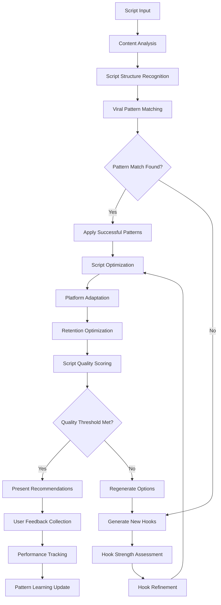

# Objective 06: Script Intelligence Integration

## Summary & Goals

Implement AI-powered script analysis and optimization that identifies viral script patterns, generates high-converting hooks, and provides real-time script improvement suggestions. This system analyzes successful viral scripts to extract replicable patterns and applies them to user content.

**Primary Goal**: Achieve >80% success rate in hook generation and script optimization recommendations with measurable engagement improvements

## Success Criteria & KPIs

### Script Analysis Performance
- **Hook Success Rate**: Generated hooks achieve >80% approval rate from creators
- **Script Pattern Recognition**: 95%+ accuracy in identifying viral script structures
- **Engagement Improvement**: Script optimizations increase content engagement by 25%+ on average
- **Processing Speed**: Complete script analysis and recommendations within 30 seconds

### Content Quality Metrics
- **Viral Hook Strength**: Generated hooks score >70/100 on viral potential assessment
- **Script Coherence**: Optimized scripts maintain >90% narrative coherence scores
- **Platform Optimization**: Scripts optimized for each platform's specific algorithm preferences
- **Retention Improvement**: Script optimizations improve video retention rates by 15%+

### User Experience & Adoption
- **Feature Usage Rate**: >70% of creators use script intelligence features regularly
- **Recommendation Acceptance**: >65% of script suggestions accepted and implemented by users
- **Time to Hook**: Generate compelling hooks within 15 seconds of content theme input
- **Iteration Efficiency**: Users reach satisfactory script quality 3x faster with AI assistance

## Actors & Workflow

### Primary Actors
- **Script Analyzer**: AI system that analyzes and scores script content for viral potential
- **Hook Generator**: Specialized AI for creating compelling opening hooks and attention grabbers
- **Pattern Extractor**: System that identifies successful script patterns from viral content
- **Optimization Engine**: Algorithm that suggests specific script improvements and variations

### Core Script Intelligence Workflow



### Detailed Process Steps

#### 1. Script Pattern Analysis (Real-time)
- **Structure Recognition**: Identify script components (hook, build, climax, payoff, CTA)
- **Viral Pattern Matching**: Compare against database of successful viral script patterns
- **Engagement Prediction**: Score potential engagement based on script structure and content
- **Platform-Specific Analysis**: Adjust analysis for TikTok, Instagram, or YouTube algorithms

#### 2. Hook Generation & Optimization (15-30 seconds)
- **Theme Analysis**: Extract core content themes and messaging goals
- **Hook Generation**: Create 5+ hook variations using AI language models
- **Strength Scoring**: Rate each hook for attention-grabbing potential and retention
- **A/B Suggestion**: Provide multiple hook options for creator testing

#### 3. Script Enhancement Recommendations (30-60 seconds)
- **Gap Analysis**: Identify weak points in current script structure
- **Improvement Suggestions**: Provide specific recommendations for script enhancement
- **Timing Optimization**: Suggest optimal pacing and beat timing for script delivery
- **Call-to-Action Optimization**: Enhance CTAs for maximum conversion and engagement

#### 4. Performance Validation & Learning (Ongoing)
- **Outcome Tracking**: Monitor performance of content using script recommendations
- **Success Pattern Extraction**: Identify which script patterns lead to viral success
- **Model Refinement**: Update AI models based on real-world performance data
- **Creator Feedback Integration**: Incorporate user feedback to improve recommendations

## Data Contracts

### Script Analysis Input
```yaml
script_input:
  script_id: string
  user_id: string
  content_theme: string
  target_platform: "tiktok" | "instagram" | "youtube"
  
  script_content:
    raw_text: string
    intended_duration: number
    content_type: string
    target_audience: object
    
  analysis_parameters:
    analysis_depth: "quick" | "comprehensive" | "platform_specific"
    include_hook_generation: boolean
    optimization_focus: array<string>
    
  context:
    niche: string
    creator_experience_level: "beginner" | "intermediate" | "advanced"
    previous_performance_data: object (optional)
```

### Script Intelligence Output
```yaml
script_analysis:
  analysis_id: string
  script_id: string
  analysis_timestamp: ISO datetime
  processing_time_ms: number
  
  script_structure:
    detected_components:
      - component: "hook" | "build" | "climax" | "payoff" | "cta"
        start_position: number
        length: number
        strength_score: number (0-100)
        
  viral_assessment:
    overall_viral_score: number (0-100)
    hook_strength: number (0-100)
    retention_prediction: number (0-1)
    engagement_potential: number (0-100)
    
  generated_hooks:
    - hook_id: string
      hook_text: string
      strength_score: number (0-100)
      viral_potential: number (0-1)
      platform_optimized: boolean
      delivery_notes: string
      
  optimization_recommendations:
    - recommendation_type: "hook" | "pacing" | "structure" | "cta"
      priority: "high" | "medium" | "low"
      description: string
      expected_improvement: number
      implementation_difficulty: "easy" | "medium" | "hard"
      
  pattern_matches:
    - pattern_id: string
      pattern_name: string
      match_confidence: number (0-1)
      success_rate: number (0-1)
      adaptation_suggestions: array<string>
```

### Performance Tracking
```yaml
script_performance:
  script_id: string
  content_id: string
  implementation_date: ISO datetime
  
  recommendations_applied:
    - recommendation_id: string
      applied: boolean
      application_fidelity: number (0-1)
      
  performance_outcomes:
    engagement_metrics: object
    retention_rate: number
    viral_achieved: boolean
    performance_vs_prediction: number
    
  user_feedback:
    recommendation_satisfaction: number (1-5)
    hook_effectiveness_rating: number (1-5)
    ease_of_implementation: number (1-5)
    would_use_again: boolean
    
  learning_insights:
    successful_patterns: array<string>
    failed_recommendations: array<string>
    improvement_opportunities: array<string>
```

## Technical Implementation

### Script Intelligence Architecture
```yaml
script_intelligence_system:
  analysis_pipeline:
    text_processor: "NLP pipeline for script content analysis"
    structure_detector: "Script component identification and classification"
    pattern_matcher: "Viral pattern recognition and matching"
    
  generation_engines:
    hook_generator: "GPT-4 fine-tuned for viral hook creation"
    optimization_engine: "Rule-based + AI hybrid optimization system"
    platform_adapter: "Platform-specific content optimization"
    
  scoring_systems:
    viral_scorer: "Multi-factor viral potential assessment"
    retention_predictor: "Video retention rate prediction model"
    engagement_estimator: "Expected engagement metrics calculator"
    
  learning_components:
    pattern_learner: "Continuous learning from successful scripts"
    feedback_integrator: "User feedback processing and integration"
    performance_correlator: "Script recommendations to outcomes correlation"
```

### AI/ML Models
```yaml
ai_models:
  script_analyzer:
    base_model: "BERT-based sequence classification"
    specialization: "Viral content structure recognition"
    training_data: "50K+ viral scripts with performance data"
    
  hook_generator:
    base_model: "GPT-4 fine-tuned on viral hooks"
    optimization: "Reinforcement learning from human feedback"
    specialization: "Platform-specific hook generation"
    
  pattern_extractor:
    model_type: "Unsupervised clustering + classification"
    algorithms: ["DBSCAN", "Random Forest", "Neural Networks"]
    function: "Extract replicable viral script patterns"
    
  optimization_recommender:
    model_type: "Multi-armed bandit + collaborative filtering"
    function: "Personalized script improvement recommendations"
    learning: "Continuous optimization based on outcomes"
```

### Real-time Processing Pipeline
```yaml
processing_pipeline:
  ingestion:
    input_validation: "Script content validation and sanitization"
    preprocessing: "Text cleaning and standardization"
    feature_extraction: "Script feature vectorization"
    
  analysis:
    parallel_processing: "Concurrent analysis across multiple models"
    structure_recognition: "Real-time script component identification"
    pattern_matching: "Fast similarity search against viral patterns"
    
  generation:
    hook_generation: "Parallel generation of multiple hook options"
    optimization_calculation: "Real-time improvement recommendation generation"
    scoring: "Multi-dimensional script quality assessment"
    
  output:
    result_compilation: "Aggregate analysis results and recommendations"
    formatting: "Format results for API consumption"
    caching: "Cache results for similar script patterns"
```

## Events Emitted

### Analysis Events
- `script.analysis_requested`: Script analysis initiated by user
- `script.analysis_completed`: Script analysis finished successfully
- `script.pattern_matched`: Viral script pattern successfully matched
- `script.optimization_generated`: Script optimization recommendations created

### Hook Generation Events
- `hook.generation_requested`: Hook generation initiated
- `hook.options_generated`: Multiple hook options created
- `hook.selection_made`: User selected specific hook option
- `hook.performance_tracked`: Hook performance outcome measured

### Performance Events
- `performance.improvement_measured`: Script optimization showed measurable improvement
- `performance.recommendation_validated`: Recommendation effectiveness confirmed
- `performance.pattern_success_confirmed`: Script pattern led to viral success
- `performance.user_satisfaction_recorded`: User provided feedback on recommendations

### Learning Events
- `learning.pattern_discovered`: New viral script pattern identified
- `learning.model_updated`: Script intelligence model improved based on outcomes
- `learning.feedback_integrated`: User feedback incorporated into models
- `learning.recommendation_refined`: Recommendation algorithms improved

## Performance & Scalability

### Processing Performance
- **Analysis Speed**: Complete script analysis within 30 seconds for standard requests
- **Hook Generation Speed**: Generate 5 hook options within 15 seconds
- **Concurrent Processing**: Handle 100+ simultaneous script analysis requests
- **API Response Time**: <3 seconds for script analysis API responses

### Quality & Accuracy Targets
- **Hook Success Rate**: >80% of generated hooks approved by creators
- **Recommendation Acceptance**: >65% of script suggestions implemented by users
- **Performance Improvement**: 25%+ average engagement increase from optimized scripts
- **Pattern Recognition Accuracy**: >95% accuracy in identifying viral script structures

### Scalability Architecture
- **Microservices**: Modular architecture for independent scaling of analysis components
- **Caching Strategy**: Intelligent caching of analysis results for similar script patterns
- **GPU Acceleration**: GPU-optimized processing for AI model inference
- **Load Balancing**: Distributed processing across multiple analysis servers

## Error Handling & Edge Cases

### Analysis Failures
- **Incomplete Scripts**: Handle partial or fragmented script content gracefully
- **Language Detection**: Support multiple languages and handle code-switching
- **Content Ambiguity**: Provide recommendations when script intent is unclear
- **Platform Misalignment**: Handle requests for unsupported platform combinations

### Generation Issues
- **Hook Generation Failures**: Fallback to template-based hooks when AI generation fails
- **Quality Filtering**: Filter out inappropriate or low-quality generated content
- **Repetitive Output**: Ensure diversity in generated hooks and recommendations
- **Brand Voice Misalignment**: Detect and prevent recommendations that conflict with brand voice

### Performance Edge Cases
- **Low-Quality Scripts**: Provide constructive feedback for scripts with fundamental issues
- **Niche Content**: Handle analysis of highly specialized or niche content types
- **Trending Pattern Shifts**: Adapt quickly when viral script patterns change rapidly
- **Creator Skill Variations**: Adjust recommendations based on creator experience level

## Security & Privacy

### Content Security
- **Script Privacy**: Protect user script content and prevent unauthorized access
- **IP Protection**: Ensure generated recommendations don't infringe on existing content
- **Content Safety**: Filter out recommendations that could lead to policy violations
- **Data Sanitization**: Remove personally identifiable information from script analysis

### Model Security
- **Model Protection**: Prevent reverse engineering of script analysis algorithms
- **Training Data Security**: Protect proprietary viral script datasets
- **API Security**: Secure script intelligence API endpoints against abuse
- **Audit Logging**: Comprehensive logging of script analysis and recommendation activities

## Acceptance Criteria

- [ ] Generate hooks with >80% creator approval rate within 15 seconds
- [ ] Achieve >95% accuracy in identifying viral script structure components
- [ ] Demonstrate 25%+ average engagement improvement from script optimizations
- [ ] Complete comprehensive script analysis within 30 seconds
- [ ] Maintain >90% narrative coherence in optimized scripts
- [ ] Optimize scripts specifically for TikTok, Instagram, and YouTube algorithms
- [ ] Improve video retention rates by 15%+ through script recommendations
- [ ] Achieve >70% regular usage rate among creators
- [ ] Maintain >65% recommendation acceptance and implementation rate
- [ ] Process 100+ concurrent script analysis requests without degradation
- [ ] Generate 5+ diverse hook options for each content theme
- [ ] Track and validate script recommendation performance outcomes
- [ ] Integrate user feedback to continuously improve recommendations
- [ ] Support multiple languages and content types in script analysis
- [ ] Maintain comprehensive security controls for script content protection
- [ ] Implement robust error handling for analysis edge cases and failures

---

*Script Intelligence Integration provides AI-powered script analysis, hook generation, and optimization recommendations that help creators produce more engaging and viral content through data-driven script improvements.*