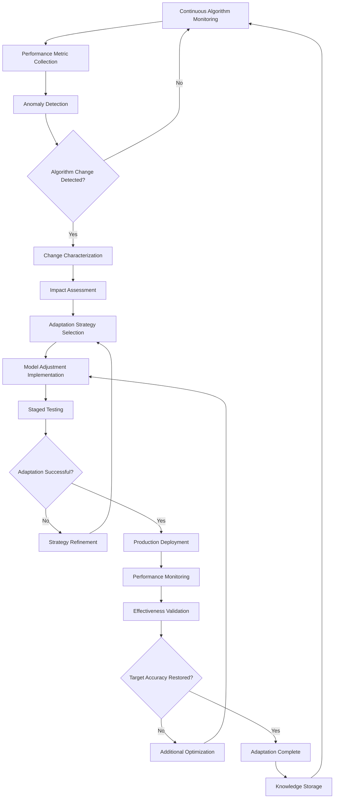

# Objective 07: Algorithm Adaptation Engine

## Summary & Goals

Implement a dynamic system that continuously monitors and adapts to changes in social media platform algorithms, automatically adjusting viral prediction models and content recommendations to maintain high accuracy as platforms evolve their content distribution systems.

**Primary Goal**: Maintain >85% prediction accuracy despite platform algorithm changes with <48 hour adaptation time to major algorithm updates

## Success Criteria & KPIs

### Algorithm Tracking Performance
- **Detection Latency**: Identify major platform algorithm changes within 24 hours
- **Adaptation Speed**: Adjust prediction models within 48 hours of algorithm changes
- **Accuracy Maintenance**: Maintain >85% prediction accuracy through algorithm transitions
- **Platform Coverage**: Monitor and adapt to algorithm changes across TikTok, Instagram, and YouTube

### Adaptation Effectiveness
- **Recovery Time**: Restore pre-change accuracy levels within 72 hours of adaptation
- **Prediction Stability**: <10% prediction accuracy variance during algorithm transitions
- **Cross-Platform Intelligence**: Algorithm insights from one platform improve others by 15%+
- **Proactive Adaptation**: Anticipate algorithm changes 30%+ of the time before they occur

### System Intelligence & Learning
- **Pattern Recognition**: 90%+ accuracy in identifying algorithm change patterns
- **Trend Prediction**: Successfully predict algorithm trend directions 70%+ of the time
- **Historical Analysis**: Leverage historical algorithm changes to improve future adaptations
- **Automated Response**: 95%+ of algorithm adaptations execute without human intervention

## Actors & Workflow

### Primary Actors
- **Algorithm Monitor**: System that continuously tracks platform algorithm behavior changes
- **Change Detector**: AI system that identifies when algorithm changes have occurred
- **Adaptation Engine**: Core system that modifies prediction models based on algorithm changes
- **Performance Validator**: System that validates adaptation effectiveness and accuracy recovery

### Core Adaptation Workflow



### Detailed Process Steps

#### 1. Algorithm Change Detection (Real-time)
- **Performance Monitoring**: Track prediction accuracy across platforms in real-time
- **Engagement Pattern Analysis**: Monitor changes in content engagement patterns
- **Distribution Anomaly Detection**: Identify unusual changes in content reach and visibility
- **Community Signal Analysis**: Monitor creator communities for algorithm change discussions

#### 2. Change Characterization & Impact Assessment (2-6 hours)
- **Change Classification**: Categorize algorithm changes by type and severity
- **Impact Quantification**: Measure how changes affect prediction accuracy
- **Affected Features Identification**: Determine which content features are most impacted
- **Platform Comparison**: Analyze if similar changes are occurring across platforms

#### 3. Adaptation Strategy Development (4-12 hours)
- **Historical Pattern Matching**: Compare current changes to historical algorithm updates
- **Strategy Selection**: Choose optimal adaptation approach based on change type
- **Model Architecture Adjustment**: Modify prediction models to account for algorithm changes
- **Feature Weight Rebalancing**: Adjust importance of different content features

#### 4. Implementation & Validation (12-36 hours)
- **Staged Deployment**: Roll out adaptations gradually with A/B testing
- **Performance Validation**: Verify that adaptations improve prediction accuracy
- **Rollback Capability**: Maintain ability to revert changes if adaptations fail
- **Knowledge Integration**: Integrate successful adaptations into permanent model improvements

## Data Contracts

### Algorithm Monitoring Data
```yaml
algorithm_monitoring:
  monitoring_id: string
  platform: "tiktok" | "instagram" | "youtube"
  timestamp: ISO datetime
  
  performance_metrics:
    prediction_accuracy: number (0-1)
    engagement_correlation: number (-1-1)
    reach_distribution: object
    viral_threshold_effectiveness: number (0-1)
    
  content_performance_patterns:
    engagement_trends: array<object>
    viral_pattern_changes: array<object>
    content_type_performance_shifts: object
    creator_performance_variations: object
    
  anomaly_indicators:
    accuracy_deviation: number
    engagement_pattern_shifts: array<object>
    distribution_anomalies: array<object>
    community_signals: array<string>
    
  change_detection_status:
    anomaly_score: number (0-1)
    change_probability: number (0-1)
    change_type_prediction: string
    confidence_level: number (0-1)
```

### Algorithm Change Event
```yaml
algorithm_change:
  change_id: string
  platform: string
  detection_timestamp: ISO datetime
  confirmed_timestamp: ISO datetime (optional)
  
  change_characteristics:
    change_type: "ranking" | "engagement" | "distribution" | "content_policy" | "feature_update"
    severity: "minor" | "moderate" | "major" | "critical"
    scope: "global" | "regional" | "feature_specific" | "creator_tier_specific"
    
  impact_assessment:
    accuracy_impact: number (-1-1)
    affected_content_types: array<string>
    affected_features: array<string>
    estimated_recovery_time: number (hours)
    
  detection_source:
    performance_anomaly: boolean
    community_reports: boolean
    official_announcement: boolean
    competitive_analysis: boolean
    
  confidence_metrics:
    detection_confidence: number (0-1)
    impact_confidence: number (0-1)
    classification_confidence: number (0-1)
```

### Adaptation Strategy
```yaml
adaptation_strategy:
  strategy_id: string
  change_id: string
  created_timestamp: ISO datetime
  
  strategy_details:
    adaptation_type: "model_retraining" | "feature_reweighting" | "threshold_adjustment" | "architecture_change"
    target_metrics: array<string>
    expected_improvement: number
    implementation_complexity: "low" | "medium" | "high"
    
  implementation_plan:
    phases: array<{
      phase_name: string,
      duration_hours: number,
      activities: array<string>,
      success_criteria: object
    }>
    
  risk_assessment:
    potential_accuracy_loss: number
    rollback_complexity: "easy" | "moderate" | "difficult"
    resource_requirements: object
    
  validation_plan:
    testing_methodology: string
    success_thresholds: object
    monitoring_duration_hours: number
    rollback_triggers: array<string>
```

## Technical Implementation

### Algorithm Monitoring Architecture
```yaml
monitoring_system:
  data_collection:
    platform_apis: "Official API data collection where available"
    web_scraping: "Automated content performance data collection"
    creator_feedback: "Community-sourced algorithm change reports"
    
  analysis_pipeline:
    time_series_analysis: "Statistical analysis of performance trends"
    anomaly_detection: "ML-based anomaly detection in platform behavior"
    pattern_recognition: "Identify recurring algorithm change patterns"
    
  change_detection:
    statistical_testing: "Hypothesis testing for performance changes"
    machine_learning: "ML models trained on historical algorithm changes"
    ensemble_methods: "Combine multiple detection approaches"
    
  alert_system:
    threshold_monitoring: "Real-time threshold breach detection"
    notification_routing: "Alert appropriate teams based on severity"
    escalation_procedures: "Automated escalation for critical changes"
```

### Adaptation Engine Components
```yaml
adaptation_engine:
  strategy_selector:
    rule_based_engine: "Decision rules based on change type and severity"
    historical_matching: "Match current changes to historical patterns"
    optimization_framework: "Multi-objective optimization for strategy selection"
    
  model_adaptation:
    parameter_adjustment: "Automated hyperparameter tuning"
    feature_engineering: "Dynamic feature importance rebalancing"
    architecture_modification: "Neural network architecture adjustments"
    
  validation_framework:
    a_b_testing: "Compare adapted models against baseline"
    statistical_validation: "Statistical significance testing of improvements"
    production_monitoring: "Real-time monitoring of adaptation effectiveness"
    
  learning_system:
    adaptation_success_tracking: "Track effectiveness of different adaptation strategies"
    pattern_learning: "Learn patterns from successful adaptations"
    strategy_optimization: "Continuously improve adaptation strategy selection"
```

### Real-time Processing Pipeline
```yaml
processing_pipeline:
  streaming_ingestion:
    platform_data_streams: "Real-time platform performance data"
    prediction_outcome_streams: "Continuous prediction accuracy monitoring"
    community_signal_streams: "Social media algorithm change discussions"
    
  real_time_analysis:
    stream_processing: "Apache Kafka + Apache Flink for stream processing"
    online_learning: "Real-time model updates based on streaming data"
    anomaly_detection: "Real-time anomaly detection on streaming metrics"
    
  adaptation_execution:
    automated_deployment: "Automated model deployment pipeline"
    gradual_rollout: "Staged deployment with automatic rollback"
    performance_monitoring: "Real-time monitoring of adaptation effectiveness"
```

## Events Emitted

### Algorithm Change Detection
- `algorithm.change_detected`: Algorithm change identified through monitoring
- `algorithm.change_confirmed`: Algorithm change validated and confirmed
- `algorithm.impact_assessed`: Algorithm change impact quantified
- `algorithm.official_announcement`: Platform officially announces algorithm update

### Adaptation Process
- `adaptation.strategy_selected`: Adaptation strategy chosen for algorithm change
- `adaptation.implementation_started`: Adaptation implementation began
- `adaptation.testing_initiated`: Adaptation A/B testing started
- `adaptation.deployment_successful`: Adaptation successfully deployed to production

### Performance & Validation
- `performance.accuracy_recovered`: Prediction accuracy restored post-adaptation
- `performance.adaptation_validated`: Adaptation effectiveness confirmed
- `performance.rollback_triggered`: Adaptation rolled back due to performance issues
- `performance.improvement_measured`: Measurable improvement from adaptation

### Learning & Intelligence
- `learning.pattern_identified`: New algorithm change pattern identified
- `learning.strategy_optimized`: Adaptation strategy improved based on outcomes
- `learning.cross_platform_insight`: Algorithm insight applied across platforms
- `learning.predictive_model_updated`: Proactive algorithm change prediction improved

## Performance & Scalability

### Detection & Response Performance
- **Detection Latency**: Identify algorithm changes within 24 hours of occurrence
- **Analysis Speed**: Complete change impact assessment within 6 hours
- **Adaptation Implementation**: Deploy model adaptations within 48 hours
- **Accuracy Recovery**: Restore >85% accuracy within 72 hours post-adaptation

### Scalability Requirements
- **Multi-Platform Monitoring**: Simultaneously monitor TikTok, Instagram, and YouTube
- **Real-time Processing**: Process 1M+ content performance data points daily
- **Concurrent Adaptations**: Handle simultaneous algorithm changes across platforms
- **Historical Analysis**: Analyze 2+ years of algorithm change patterns for learning

### System Performance Targets
- **Monitoring Uptime**: >99.9% uptime for algorithm monitoring systems
- **Processing Latency**: <5 minutes from data collection to anomaly detection
- **Adaptation Accuracy**: >90% success rate in adaptation strategy selection
- **Resource Efficiency**: Algorithm monitoring within 15% of total compute budget

## Error Handling & Edge Cases

### Detection Failures
- **False Positive Changes**: Handle spurious algorithm change detections gracefully
- **Missed Algorithm Changes**: Recovery procedures when changes go undetected
- **Partial Data Availability**: Adapt to situations with incomplete platform data
- **Conflicting Signals**: Resolve conflicting indicators of algorithm changes

### Adaptation Challenges
- **Unsuccessful Adaptations**: Rollback and alternative strategy procedures
- **Multiple Simultaneous Changes**: Handle concurrent algorithm changes across platforms
- **Rapid Change Cycles**: Adapt to frequent algorithm updates
- **Insufficient Historical Data**: Handle novel algorithm change types

### Performance Edge Cases
- **Extreme Algorithm Changes**: Handle major platform algorithm overhauls
- **Platform API Limitations**: Adapt when platform data access is restricted
- **Seasonal Variation Confusion**: Distinguish algorithm changes from seasonal patterns
- **Creator Behavior Changes**: Separate algorithm effects from creator behavior shifts

## Security & Privacy

### Monitoring Data Security
- **Platform Data Protection**: Secure collection and storage of platform performance data
- **Creator Privacy**: Anonymize creator data used in algorithm change detection
- **Competitive Intelligence**: Protect proprietary algorithm change detection methods
- **API Security**: Secure platform API access and prevent unauthorized data collection

### Adaptation Security
- **Model Protection**: Prevent unauthorized access to adaptation algorithms
- **Strategy Confidentiality**: Protect proprietary adaptation strategies as trade secrets
- **Rollback Security**: Secure rollback procedures to prevent unauthorized model changes
- **Audit Trail**: Comprehensive logging of all algorithm adaptations and decisions

## Acceptance Criteria

- [ ] Detect major platform algorithm changes within 24 hours of occurrence
- [ ] Implement model adaptations within 48 hours of algorithm change detection
- [ ] Maintain >85% prediction accuracy through algorithm transitions
- [ ] Monitor algorithm changes across TikTok, Instagram, and YouTube simultaneously
- [ ] Restore pre-change accuracy levels within 72 hours of adaptation
- [ ] Achieve <10% prediction accuracy variance during algorithm transitions
- [ ] Apply cross-platform algorithm insights to improve predictions by 15%+
- [ ] Successfully anticipate algorithm changes 30%+ of the time
- [ ] Maintain 90%+ accuracy in identifying algorithm change patterns
- [ ] Execute 95%+ of algorithm adaptations without human intervention
- [ ] Demonstrate 70%+ success rate in predicting algorithm trend directions
- [ ] Process 1M+ content performance data points daily for monitoring
- [ ] Achieve >99.9% uptime for algorithm monitoring systems
- [ ] Maintain >90% success rate in adaptation strategy selection
- [ ] Implement comprehensive security controls for monitoring and adaptation data
- [ ] Handle edge cases including false positives, missed changes, and rapid change cycles

---

*The Algorithm Adaptation Engine ensures the viral prediction platform remains accurate and relevant by automatically detecting and adapting to social media platform algorithm changes, maintaining competitive advantage through continuous evolution.*