# Objective 08: Cross-Platform Intelligence

## Summary & Goals

Implement intelligent cross-platform viral prediction that leverages insights from TikTok, Instagram, and YouTube to create superior predictions through platform-specific optimization and universal viral pattern recognition. The system identifies patterns that work across platforms and adapts content strategies for maximum multi-platform success.

**Primary Goal**: Achieve >20% improvement in viral prediction accuracy through cross-platform intelligence with content optimization for each platform's unique algorithm

## Success Criteria & KPIs

### Cross-Platform Prediction Performance
- **Multi-Platform Accuracy**: >90% viral prediction accuracy across TikTok, Instagram, and YouTube
- **Cross-Platform Improvement**: 20%+ accuracy improvement vs single-platform predictions
- **Universal Pattern Recognition**: Identify viral patterns that work across 2+ platforms with 85%+ success
- **Platform-Specific Optimization**: Content adaptations improve platform performance by 30%+ each

### Intelligence Transfer Effectiveness
- **Pattern Transfer Success**: 75%+ of viral patterns successfully adapt to other platforms
- **Learning Acceleration**: New platform insights reduce learning time by 60%+ for other platforms
- **Trend Propagation Prediction**: 80%+ accuracy in predicting cross-platform trend spread
- **Algorithm Insight Sharing**: Platform algorithm insights improve others by 25%+

### Content Optimization Results
- **Multi-Platform Success Rate**: 40%+ of optimized content achieves viral status on 2+ platforms
- **Engagement Optimization**: Platform-specific adaptations increase engagement by 35%+ each
- **Reach Amplification**: Cross-platform strategy increases total reach by 50%+ vs single platform
- **ROI Improvement**: Multi-platform approach achieves 3x better ROI than single-platform strategies

## Actors & Workflow

### Primary Actors
- **Cross-Platform Analyzer**: System that identifies patterns working across multiple platforms
- **Platform Optimizer**: Specialized AI for adapting content to each platform's unique requirements
- **Trend Propagation Tracker**: Monitor how viral trends spread between platforms
- **Universal Pattern Extractor**: Extract viral patterns that transcend platform boundaries

### Core Cross-Platform Workflow

```mermaid
flowchart TD
    A[Content Analysis Request] --> B[Multi-Platform Data Collection]
    B --> C[Platform-Specific Analysis]
    C --> D[Universal Pattern Recognition]
    
    D --> E{Universal Pattern Found?}
    E -->|Yes| F[Cross-Platform Optimization]
    E -->|No| G[Platform-Specific Strategy]
    
    F --> H[TikTok Adaptation]
    F --> I[Instagram Adaptation] 
    F --> J[YouTube Adaptation]
    
    G --> K[Single Platform Focus]
    K --> L[Platform-Optimized Content]
    
    H --> M[Multi-Platform Strategy Assembly]
    I --> M
    J --> M
    L --> N[Single Platform Strategy]
    
    M --> O[Cross-Platform Performance Prediction]
    N --> P[Single Platform Prediction]
    
    O --> Q[Trend Propagation Analysis]
    Q --> R[Multi-Platform Recommendations]
    P --> S[Platform-Specific Recommendations]
    
    R --> T[Performance Tracking & Learning]
    S --> T
```



### Detailed Process Steps

#### 1. Multi-Platform Data Integration (Real-time)
- **Data Harmonization**: Standardize metrics and content features across platforms
- **Cross-Platform Content Mapping**: Link related content across TikTok, Instagram, and YouTube
- **Algorithm Insight Integration**: Combine platform-specific algorithm intelligence
- **Performance Correlation Analysis**: Identify relationships between platform performance

#### 2. Universal Pattern Recognition (30-60 minutes)
- **Pattern Abstraction**: Extract viral elements that transcend platform specifics
- **Cross-Platform Validation**: Verify patterns work across multiple platforms
- **Adaptation Requirements**: Identify how universal patterns need platform-specific tweaks
- **Success Rate Calculation**: Measure universal pattern effectiveness across platforms

#### 3. Platform-Specific Optimization (15-45 minutes per platform)
- **Algorithm Alignment**: Adapt content for each platform's recommendation algorithm
- **Format Optimization**: Adjust content format, duration, and presentation for platform norms
- **Audience Targeting**: Customize content for each platform's unique audience characteristics
- **Engagement Optimization**: Optimize for platform-specific engagement patterns

#### 4. Trend Propagation Prediction (Ongoing)
- **Cross-Platform Monitoring**: Track how trends move between platforms
- **Timing Analysis**: Predict optimal timing for multi-platform content rollouts
- **Platform Sequencing**: Determine best order for multi-platform content release
- **Momentum Analysis**: Identify how success on one platform affects others

## Data Contracts

### Cross-Platform Content Analysis
```yaml
cross_platform_analysis:
  analysis_id: string
  content_id: string
  analysis_timestamp: ISO datetime
  
  platform_data:
    tiktok:
      performance_metrics: object
      algorithm_signals: object
      audience_engagement: object
      trend_alignment: number (0-1)
      
    instagram:
      reels_performance: object
      story_performance: object
      feed_performance: object
      algorithm_compatibility: number (0-1)
      
    youtube:
      shorts_metrics: object
      long_form_metrics: object
      algorithm_favorability: number (0-1)
      retention_patterns: object
      
  universal_patterns:
    - pattern_id: string
      pattern_type: string
      cross_platform_effectiveness: number (0-1)
      adaptation_requirements: object
      success_probability: number (0-1)
      
  optimization_recommendations:
    tiktok_adaptations: array<object>
    instagram_adaptations: array<object>
    youtube_adaptations: array<object>
    multi_platform_strategy: object
    
  performance_predictions:
    individual_platform_predictions: object
    cross_platform_synergy_effect: number
    total_reach_estimate: number
    viral_probability_combined: number (0-1)
```

### Platform Intelligence State
```yaml
platform_intelligence:
  platform: "tiktok" | "instagram" | "youtube"
  last_updated: ISO datetime
  intelligence_version: string
  
  algorithm_insights:
    ranking_factors: object
    engagement_weights: object
    content_preferences: object
    timing_optimization: object
    
  viral_patterns:
    - pattern_id: string
      effectiveness_score: number (0-1)
      trend_status: "emerging" | "peak" | "declining"
      adaptation_difficulty: "easy" | "medium" | "hard"
      
  audience_characteristics:
    demographics: object
    behavior_patterns: object
    content_preferences: object
    engagement_timing: object
    
  cross_platform_transferability:
    pattern_transfer_success_rates: object
    adaptation_requirements: object
    timing_considerations: object
    audience_overlap_insights: object
```

### Multi-Platform Strategy
```yaml
multi_platform_strategy:
  strategy_id: string
  content_id: string
  created_timestamp: ISO datetime
  
  platform_sequence:
    - platform: string
      launch_timing: ISO datetime
      content_adaptations: object
      success_metrics: object
      
  cross_platform_elements:
    universal_viral_patterns: array<string>
    consistent_branding: object
    hashtag_strategy: object
    cross_promotion_plan: object
    
  performance_optimization:
    platform_specific_tweaks: object
    audience_targeting: object
    timing_optimization: object
    engagement_maximization: object
    
  success_projections:
    individual_platform_reach: object
    cross_platform_amplification: number
    total_engagement_estimate: number
    viral_cascade_probability: number (0-1)
```

## Technical Implementation

### Cross-Platform Intelligence Architecture
```yaml
intelligence_system:
  data_integration:
    platform_apis: "Unified API layer for TikTok, Instagram, YouTube data"
    data_normalization: "Standardize metrics and features across platforms"
    real_time_sync: "Real-time data synchronization across platforms"
    
  pattern_recognition:
    universal_pattern_extractor: "ML models for cross-platform pattern identification"
    platform_specific_analyzer: "Individual platform optimization engines"
    trend_propagation_tracker: "Monitor trend movement between platforms"
    
  optimization_engine:
    multi_objective_optimizer: "Optimize for multiple platform objectives simultaneously"
    platform_adapter: "Adapt content for each platform's requirements"
    timing_optimizer: "Optimize multi-platform content release timing"
    
  intelligence_sharing:
    knowledge_graph: "Cross-platform relationship and insight mapping"
    insight_propagation: "Share algorithm insights across platforms"
    pattern_transfer: "Transfer successful patterns between platforms"
```

### AI/ML Models for Cross-Platform Intelligence
```yaml
ml_models:
  universal_pattern_detector:
    model_type: "Multi-task neural network"
    training_data: "Viral content from all platforms"
    objective: "Identify patterns that work across platforms"
    
  platform_optimizer:
    tiktok_specialist: "Model optimized for TikTok algorithm"
    instagram_specialist: "Model optimized for Instagram algorithm"
    youtube_specialist: "Model optimized for YouTube algorithm"
    
  trend_propagation_predictor:
    model_type: "Time series forecasting + graph neural network"
    function: "Predict how trends spread between platforms"
    features: ["platform_user_overlap", "content_similarity", "timing_patterns"]
    
  cross_platform_ranker:
    model_type: "Learning-to-rank ensemble"
    function: "Rank content optimization strategies by effectiveness"
    optimization_target: "Multi-platform viral probability"
```

### Real-time Processing Pipeline
```yaml
processing_architecture:
  data_ingestion:
    platform_connectors: "Real-time data feeds from each platform"
    stream_processing: "Apache Kafka for real-time data streaming"
    data_quality: "Real-time data validation and cleaning"
    
  analysis_pipeline:
    parallel_platform_analysis: "Concurrent analysis across all platforms"
    pattern_matching: "Real-time pattern recognition and matching"
    optimization_calculation: "Multi-platform optimization computation"
    
  intelligence_synthesis:
    cross_platform_correlation: "Real-time correlation analysis"
    insight_aggregation: "Combine insights from all platforms"
    strategy_generation: "Generate multi-platform strategies"
    
  deployment:
    strategy_distribution: "Deploy strategies to platform-specific systems"
    performance_monitoring: "Real-time cross-platform performance tracking"
    feedback_integration: "Integrate performance feedback for learning"
```

## Events Emitted

### Cross-Platform Analysis
- `cross_platform.analysis_initiated`: Multi-platform analysis started
- `cross_platform.universal_pattern_detected`: Cross-platform viral pattern identified
- `cross_platform.optimization_completed`: Platform-specific optimizations generated
- `cross_platform.strategy_created`: Multi-platform content strategy developed

### Intelligence Transfer
- `intelligence.pattern_transferred`: Viral pattern successfully adapted to new platform
- `intelligence.algorithm_insight_shared`: Algorithm insight applied across platforms
- `intelligence.learning_accelerated`: Cross-platform learning improved single-platform performance
- `intelligence.trend_propagation_predicted`: Cross-platform trend spread predicted

### Performance & Validation
- `performance.cross_platform_success`: Content achieved viral status on multiple platforms
- `performance.synergy_effect_measured`: Cross-platform amplification effect quantified
- `performance.platform_optimization_validated`: Platform-specific optimizations proved effective
- `performance.universal_pattern_confirmed`: Universal pattern effectiveness validated

### System Intelligence
- `system.intelligence_updated`: Cross-platform intelligence models improved
- `system.pattern_library_expanded`: New universal patterns added to library
- `system.platform_insights_integrated`: New platform algorithm insights incorporated
- `system.prediction_accuracy_improved`: Cross-platform predictions became more accurate

## Performance & Scalability

### Processing Performance
- **Multi-Platform Analysis Time**: Complete cross-platform analysis within 60 minutes
- **Real-time Data Processing**: Process 100K+ content updates per hour across platforms
- **Strategy Generation Speed**: Generate multi-platform strategies within 45 minutes
- **Pattern Recognition Latency**: Identify universal patterns within 30 minutes

### Scalability Architecture
- **Platform Scaling**: Seamlessly add new platforms to cross-platform intelligence
- **Geographic Scaling**: Support regional platform variations and preferences
- **Content Volume Scaling**: Handle millions of pieces of content across all platforms
- **Real-time Scaling**: Maintain performance with 24/7 real-time data processing

### Quality & Accuracy Targets
- **Cross-Platform Prediction Accuracy**: >90% accuracy for multi-platform viral predictions
- **Universal Pattern Success Rate**: >85% success rate for cross-platform patterns
- **Optimization Effectiveness**: >30% improvement per platform through specific optimizations
- **Trend Prediction Accuracy**: >80% accuracy in predicting cross-platform trend propagation

## Error Handling & Edge Cases

### Platform Integration Issues
- **API Failures**: Graceful handling when individual platform APIs are unavailable
- **Data Inconsistencies**: Resolve conflicts between platform data sources
- **Rate Limiting**: Manage API rate limits across multiple platforms efficiently
- **Platform Policy Changes**: Adapt to changes in platform data access policies

### Pattern Recognition Challenges
- **Platform-Specific Anomalies**: Handle patterns that don't transfer between platforms
- **Cultural Differences**: Account for regional differences in viral patterns
- **Temporal Misalignment**: Handle timing differences in cross-platform trend adoption
- **Algorithm Conflicts**: Resolve conflicts when platforms have contradictory requirements

### Performance Edge Cases
- **Single Platform Dominance**: Handle content that only works on one specific platform
- **Cross-Platform Interference**: Prevent optimization for one platform from harming others
- **Trend Saturation**: Identify when trends become oversaturated across platforms
- **Audience Fatigue**: Detect when cross-platform strategies lead to audience exhaustion

## Security & Privacy

### Cross-Platform Data Security
- **Multi-Platform API Security**: Secure API connections across all platforms
- **Data Isolation**: Prevent cross-contamination of platform-specific data
- **Unified Privacy Controls**: Consistent privacy protection across all platforms
- **Cross-Platform Audit Trails**: Comprehensive logging of all cross-platform activities

### Intelligence Protection
- **Cross-Platform IP Protection**: Protect proprietary cross-platform algorithms
- **Pattern Confidentiality**: Secure universal viral patterns as competitive advantages
- **Algorithm Insight Security**: Protect platform-specific algorithm intelligence
- **Strategy Protection**: Secure multi-platform content strategies

## Acceptance Criteria

- [ ] Achieve >90% viral prediction accuracy across TikTok, Instagram, and YouTube
- [ ] Demonstrate 20%+ accuracy improvement vs single-platform predictions
- [ ] Identify universal viral patterns working across 2+ platforms with 85%+ success
- [ ] Show 30%+ performance improvement through platform-specific content adaptations
- [ ] Successfully transfer 75%+ of viral patterns to other platforms
- [ ] Reduce learning time for new platforms by 60%+ through cross-platform insights
- [ ] Predict cross-platform trend propagation with 80%+ accuracy
- [ ] Improve platform performance by 25%+ through shared algorithm insights
- [ ] Achieve 40%+ multi-platform viral success rate for optimized content
- [ ] Increase engagement by 35%+ per platform through specific adaptations
- [ ] Amplify total reach by 50%+ vs single-platform approaches
- [ ] Deliver 3x better ROI through multi-platform strategies vs single-platform
- [ ] Complete cross-platform analysis within 60 minutes
- [ ] Process 100K+ content updates per hour across all platforms
- [ ] Maintain real-time data synchronization across platforms
- [ ] Implement comprehensive security controls for cross-platform data and intelligence

---

*Cross-Platform Intelligence creates superior viral predictions by leveraging insights from TikTok, Instagram, and YouTube, optimizing content for each platform while identifying universal patterns that maximize multi-platform success.*