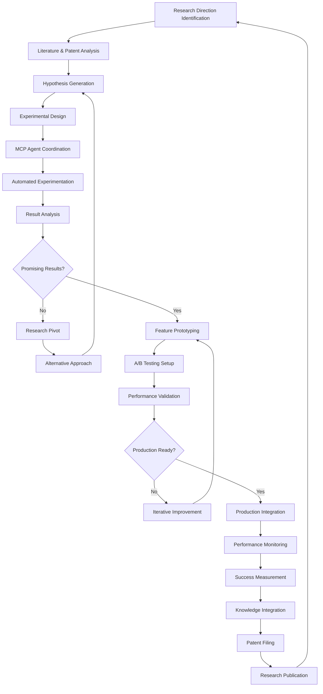

# Objective 09: AI-Powered R&D Layer (MCP)

## Summary & Goals

Implement an AI-powered Research & Development layer using Model Context Protocol (MCP) that continuously explores new viral prediction methodologies, tests experimental features, and advances the platform's AI capabilities through automated research, experimentation, and innovation discovery.

**Primary Goal**: Achieve 25%+ improvement in prediction capabilities annually through automated AI research and experimental feature development

## Success Criteria & KPIs

### Research Innovation Performance
- **Annual Capability Improvement**: 25%+ improvement in core prediction capabilities per year
- **Experimental Success Rate**: 30%+ of experimental features graduate to production
- **Research Automation**: 90%+ of research processes execute without human intervention
- **Innovation Discovery Rate**: Identify 12+ promising research directions per quarter

### AI/ML Research Advancement
- **Model Architecture Innovation**: Develop 2+ novel neural network architectures annually
- **Algorithm Breakthrough Rate**: Achieve 1+ significant algorithm improvement per quarter
- **Research Paper Quality**: Produce research insights worthy of top-tier AI conferences
- **Patent Generation**: Generate 4+ patentable AI innovations annually

### Experimental Platform Performance
- **Feature Testing Velocity**: Test 50+ experimental features per quarter
- **A/B Testing Efficiency**: Complete experimental validation 60% faster than manual methods
- **Research Hypothesis Generation**: Generate 100+ testable hypotheses per month
- **Cross-Domain Learning**: Apply insights from adjacent AI domains 40% of the time

## Actors & Workflow

### Primary Actors
- **AI Research Engine**: Autonomous AI system that explores new research directions
- **Experimental Feature Generator**: System that creates and tests new platform capabilities
- **MCP Orchestrator**: Manages Model Context Protocol integrations and AI agent coordination
- **Innovation Validator**: Validates research outcomes and experimental feature effectiveness

### Core R&D Workflow



### Detailed Process Steps

#### 1. Automated Research Discovery (Continuous)
- **Literature Monitoring**: AI-powered monitoring of latest AI/ML research papers
- **Patent Landscape Analysis**: Automated analysis of AI patent filings and opportunities
- **Competitive Intelligence**: Monitor competitor research directions and breakthroughs
- **Adjacent Domain Exploration**: Explore AI applications in related fields for inspiration

#### 2. Hypothesis Generation & Validation (Daily)
- **Research Question Formulation**: AI generates testable research hypotheses
- **Feasibility Assessment**: Evaluate technical feasibility and resource requirements
- **Impact Estimation**: Predict potential impact of research directions on platform performance
- **Priority Ranking**: Rank research opportunities by potential value and probability of success

#### 3. MCP-Powered Experimentation (Real-time)
- **Multi-Agent Coordination**: Orchestrate specialized AI agents for different research tasks
- **Distributed Computing**: Leverage MCP for distributed AI research across compute resources
- **Parallel Experimentation**: Run multiple research experiments simultaneously
- **Cross-Domain Knowledge Transfer**: Apply insights from one domain to improve others

#### 4. Innovation Integration & Commercialization (Ongoing)
- **Feature Development**: Transform successful research into platform features
- **IP Protection**: File patents on breakthrough innovations and methodologies
- **Knowledge Publication**: Publish research insights to build platform credibility
- **Technology Transfer**: Integrate successful innovations into production systems

## Data Contracts

### Research Project State
```yaml
research_project:
  project_id: string
  project_name: string
  created_date: ISO date
  status: "active" | "paused" | "completed" | "cancelled"
  
  research_scope:
    domain: "viral_prediction" | "content_analysis" | "user_behavior" | "platform_algorithms"
    objective: string
    hypothesis: string
    success_metrics: array<string>
    
  methodology:
    approach: "experimental" | "theoretical" | "applied_research" | "comparative_analysis"
    techniques: array<string>
    resources_required: object
    timeline_estimate: string
    
  mcp_integration:
    agents_involved: array<string>
    model_configurations: object
    compute_resources: object
    data_requirements: object
    
  progress_tracking:
    milestones: array<object>
    current_phase: string
    completion_percentage: number (0-100)
    key_findings: array<string>
    
  outcomes:
    success_metrics_achieved: object
    innovations_discovered: array<string>
    patent_opportunities: array<string>
    production_candidates: array<string>
```

### Experimental Feature
```yaml
experimental_feature:
  feature_id: string
  feature_name: string
  research_project_id: string
  development_stage: "prototype" | "alpha" | "beta" | "production_ready"
  
  feature_specification:
    description: string
    technical_requirements: object
    user_interface_changes: object
    api_modifications: object
    
  experimentation_plan:
    hypothesis: string
    test_methodology: string
    success_criteria: object
    sample_size_requirements: number
    
  ab_testing_configuration:
    control_group_percentage: number
    test_group_percentage: number
    feature_flags: object
    monitoring_metrics: array<string>
    
  performance_results:
    user_engagement_impact: number
    prediction_accuracy_impact: number
    system_performance_impact: object
    user_satisfaction_change: number
    
  commercialization_assessment:
    production_readiness: number (0-1)
    business_value_estimate: number
    development_cost_estimate: number
    maintenance_complexity: "low" | "medium" | "high"
```

### AI Research Agent Configuration
```yaml
research_agent:
  agent_id: string
  agent_type: "literature_analyzer" | "experiment_designer" | "feature_generator" | "validator"
  specialization: string
  
  mcp_configuration:
    model_endpoint: string
    context_parameters: object
    capability_profile: object
    resource_limits: object
    
  research_capabilities:
    domain_expertise: array<string>
    methodology_strengths: array<string>
    tool_integrations: array<string>
    collaboration_protocols: object
    
  performance_metrics:
    research_output_quality: number (0-1)
    hypothesis_success_rate: number (0-1)
    innovation_generation_rate: number
    collaboration_effectiveness: number (0-1)
    
  learning_configuration:
    feedback_integration: boolean
    knowledge_retention: boolean
    cross_domain_learning: boolean
    performance_optimization: boolean
```

## Technical Implementation

### MCP-Powered Research Architecture
```yaml
research_platform:
  mcp_orchestration:
    agent_coordination: "Central coordination of specialized AI research agents"
    model_context_management: "Manage context and knowledge sharing between agents"
    resource_allocation: "Dynamic allocation of compute resources to research projects"
    
  research_infrastructure:
    experimental_sandbox: "Isolated environment for testing experimental features"
    distributed_computing: "Leverage cloud computing for large-scale experiments"
    data_pipeline: "Research data collection, processing, and analysis pipeline"
    
  automation_systems:
    literature_monitoring: "Automated monitoring of AI research publications"
    patent_analysis: "AI-powered patent landscape analysis and opportunity identification"
    competitive_intelligence: "Automated competitive research and trend analysis"
    
  integration_framework:
    production_integration: "Seamless integration of successful research into production"
    feature_flag_management: "Dynamic feature flag system for experimental features"
    monitoring_systems: "Comprehensive monitoring of experimental feature performance"
```

### AI Research Methodology
```yaml
research_methodology:
  hypothesis_generation:
    literature_synthesis: "AI-powered synthesis of research literature"
    gap_analysis: "Identify research gaps and opportunities"
    cross_domain_inspiration: "Apply insights from adjacent AI domains"
    
  experimental_design:
    methodology_selection: "AI-powered selection of optimal research methodologies"
    sample_size_calculation: "Statistical power analysis for experiment design"
    control_variable_identification: "Identify confounding variables and controls"
    
  validation_framework:
    statistical_significance: "Rigorous statistical validation of research results"
    reproducibility_testing: "Ensure research results are reproducible"
    peer_review_simulation: "AI-powered peer review of research methodology and results"
    
  knowledge_integration:
    insight_synthesis: "Combine insights from multiple research projects"
    pattern_recognition: "Identify patterns across research outcomes"
    knowledge_graph_building: "Build comprehensive knowledge graphs of research insights"
```

### Experimental Platform
```yaml
experimentation_platform:
  feature_development:
    rapid_prototyping: "Automated generation of feature prototypes"
    code_generation: "AI-powered code generation for experimental features"
    testing_automation: "Automated testing of experimental feature implementations"
    
  ab_testing_framework:
    automated_test_design: "AI-powered A/B test design and configuration"
    dynamic_allocation: "Dynamic traffic allocation based on experimental results"
    statistical_analysis: "Automated statistical analysis of A/B test results"
    
  performance_monitoring:
    real_time_metrics: "Real-time monitoring of experimental feature performance"
    anomaly_detection: "AI-powered detection of experimental anomalies"
    impact_assessment: "Automated assessment of experimental feature impact"
```

## Events Emitted

### Research Discovery
- `research.project_initiated`: New research project started
- `research.hypothesis_generated`: AI generated new testable hypothesis
- `research.breakthrough_discovered`: Significant research breakthrough achieved
- `research.patent_opportunity_identified`: Patentable innovation discovered

### Experimental Development
- `experiment.feature_prototyped`: New experimental feature prototype created
- `experiment.ab_test_launched`: A/B test for experimental feature launched
- `experiment.validation_completed`: Experimental feature validation completed
- `experiment.production_graduation`: Experimental feature promoted to production

### MCP Coordination
- `mcp.agents_coordinated`: Multiple AI agents successfully coordinated for research
- `mcp.context_shared`: Research context successfully shared between agents
- `mcp.resource_allocated`: Compute resources allocated to research project
- `mcp.knowledge_synthesized`: Knowledge successfully synthesized across agents

### Innovation Outcomes
- `innovation.capability_improved`: Platform capability measurably improved
- `innovation.algorithm_breakthrough`: New algorithm breakthrough achieved
- `innovation.patent_filed`: Patent application filed for research innovation
- `innovation.publication_submitted`: Research paper submitted for publication

## Performance & Scalability

### Research Performance Targets
- **Research Project Velocity**: Launch 4+ new research projects monthly
- **Hypothesis Testing Speed**: Test 25+ hypotheses per week
- **Feature Development Cycle**: Prototype → production in <90 days for successful features
- **Innovation Discovery Rate**: Identify 12+ promising innovations per quarter

### MCP Performance Requirements
- **Agent Coordination Latency**: <10 seconds to coordinate multiple AI agents
- **Context Sharing Efficiency**: Share research context between agents within 5 seconds
- **Resource Allocation Speed**: Allocate compute resources to research within 2 minutes
- **Knowledge Synthesis Time**: Synthesize insights across projects within 30 minutes

### Scalability Architecture
- **Distributed Research**: Scale research across multiple cloud regions and providers
- **Parallel Experimentation**: Run 50+ experiments simultaneously without interference
- **Dynamic Resource Scaling**: Auto-scale compute resources based on research demand
- **Global Knowledge Sharing**: Share insights across geographically distributed teams

## Error Handling & Edge Cases

### Research Failures
- **Hypothesis Invalidation**: Handle systematic invalidation of research hypotheses gracefully
- **Experimental Failures**: Learn from failed experiments and adjust research directions
- **Resource Exhaustion**: Manage research projects when compute resources are constrained
- **Methodology Limitations**: Adapt when research methodologies prove inadequate

### MCP Integration Issues
- **Agent Coordination Failures**: Handle failures in multi-agent coordination
- **Context Loss**: Prevent loss of research context during agent handoffs
- **Model Performance Degradation**: Detect and handle AI model performance issues
- **Resource Contention**: Resolve conflicts when multiple research projects compete for resources

### Innovation Challenges
- **Patent Conflicts**: Handle situations where innovations conflict with existing patents
- **Technical Feasibility**: Manage innovations that prove technically infeasible
- **Market Relevance**: Adjust research when innovations lack market applicability
- **Integration Complexity**: Handle innovations that are difficult to integrate into production

## Security & Privacy

### Research Data Security
- **Intellectual Property Protection**: Protect proprietary research data and methodologies
- **Research Confidentiality**: Ensure research projects remain confidential until publication
- **Data Access Controls**: Restrict access to sensitive research data and insights
- **Audit Trail**: Comprehensive logging of all research activities and decisions

### MCP Security
- **Agent Authentication**: Secure authentication and authorization for AI research agents
- **Context Protection**: Protect sensitive research context from unauthorized access
- **Model Security**: Prevent unauthorized access to proprietary AI models and configurations
- **Resource Security**: Secure compute resources used for research experiments

## Acceptance Criteria

- [ ] Achieve 25%+ annual improvement in core prediction capabilities through R&D
- [ ] Graduate 30%+ of experimental features to production successfully
- [ ] Execute 90%+ of research processes without human intervention
- [ ] Identify 12+ promising research directions per quarter
- [ ] Develop 2+ novel neural network architectures annually
- [ ] Achieve 1+ significant algorithm improvement per quarter
- [ ] Generate 4+ patentable AI innovations annually
- [ ] Test 50+ experimental features per quarter
- [ ] Complete experimental validation 60% faster than manual methods
- [ ] Generate 100+ testable hypotheses per month
- [ ] Apply insights from adjacent AI domains 40% of the time
- [ ] Launch 4+ new research projects monthly
- [ ] Coordinate multiple AI agents for research within 10 seconds
- [ ] Run 50+ parallel experiments without interference
- [ ] Maintain comprehensive security controls for research IP and data
- [ ] Handle research failures and edge cases gracefully
- [ ] Integrate successful innovations into production within 90 days

---

*The AI-Powered R&D Layer (MCP) creates a self-improving viral prediction platform through continuous automated research, experimentation, and innovation discovery using advanced AI coordination and Model Context Protocol integration.*