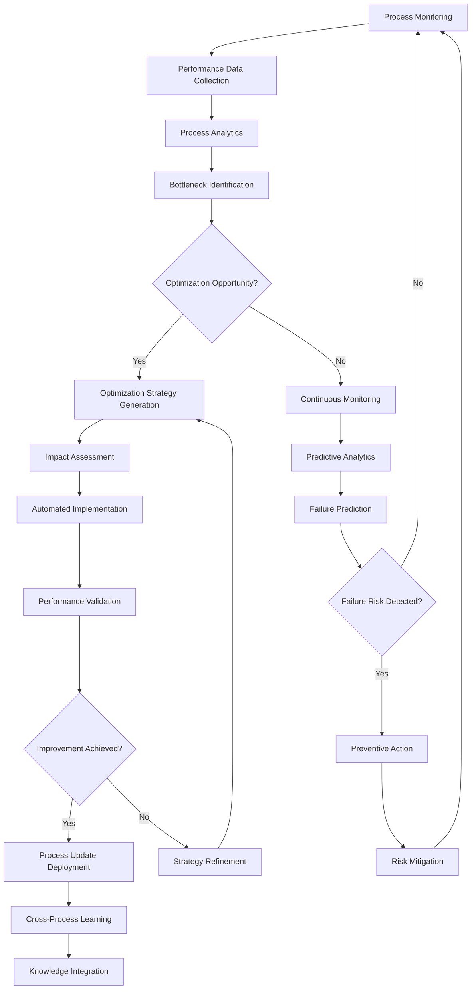

# Objective 10: Process Intelligence Layer

## Summary & Goals

Implement an intelligent process orchestration system that optimizes workflows, automates decision-making, and continuously improves operational efficiency across all platform processes. This system monitors, analyzes, and optimizes every aspect of the viral prediction platform's operations.

**Primary Goal**: Achieve 40%+ operational efficiency improvement through intelligent process automation and optimization

## Success Criteria & KPIs

### Process Optimization Performance
- **Operational Efficiency Gain**: 40%+ improvement in overall operational efficiency
- **Workflow Automation**: 85%+ of routine processes fully automated
- **Decision Automation**: 70%+ of operational decisions made by AI without human intervention
- **Process Cycle Time Reduction**: 50%+ reduction in average process completion times

### Intelligence & Learning Metrics
- **Process Improvement Rate**: 15%+ quarterly improvement in process efficiency
- **Bottleneck Detection Accuracy**: >90% accuracy in identifying process bottlenecks
- **Predictive Process Analytics**: 80%+ accuracy in predicting process failures before they occur
- **Cross-Process Learning**: Insights from one process improve others by 25%+

### System Reliability & Performance
- **Process Uptime**: >99.5% uptime for critical process orchestration
- **Error Reduction**: 60%+ reduction in process errors through intelligent automation
- **Resource Optimization**: 30%+ improvement in compute and human resource utilization
- **SLA Compliance**: >95% compliance with all internal and external process SLAs

## Actors & Workflow

### Primary Actors
- **Process Orchestrator**: Central system that coordinates and manages all platform processes
- **Intelligence Analyzer**: AI system that analyzes process performance and identifies optimization opportunities
- **Decision Engine**: Automated decision-making system for routine operational choices
- **Workflow Optimizer**: System that continuously improves process workflows and efficiency

### Core Process Intelligence Workflow



### Detailed Process Steps

#### 1. Comprehensive Process Monitoring (Real-time)
- **End-to-End Visibility**: Monitor all processes from initiation to completion
- **Performance Metrics Collection**: Gather detailed metrics on process execution times, resource usage, and outcomes
- **Real-time Anomaly Detection**: Identify deviations from normal process behavior immediately
- **Cross-Process Correlation**: Analyze relationships and dependencies between different processes

#### 2. Intelligent Process Analysis (Continuous)
- **Bottleneck Identification**: Use AI to identify process bottlenecks and inefficiencies
- **Root Cause Analysis**: Automatically investigate and identify causes of process issues
- **Pattern Recognition**: Identify recurring patterns in process performance and failures
- **Optimization Opportunity Discovery**: Find areas where processes can be improved or automated

#### 3. Automated Process Optimization (Dynamic)
- **Workflow Redesign**: Automatically redesign workflows for maximum efficiency
- **Resource Reallocation**: Dynamically reallocate resources based on process demands
- **Decision Point Automation**: Identify decision points that can be automated
- **Performance Threshold Adjustment**: Automatically adjust process parameters for optimal performance

#### 4. Predictive Process Intelligence (Proactive)
- **Failure Prediction**: Predict process failures before they occur
- **Capacity Planning**: Predict future process capacity requirements
- **Maintenance Scheduling**: Proactively schedule process maintenance and optimization
- **SLA Risk Assessment**: Predict and prevent SLA violations before they happen

## Data Contracts

### Process Execution Record
```yaml
process_execution:
  execution_id: string (UUID)
  process_name: string
  process_version: string
  start_time: ISO datetime
  end_time: ISO datetime
  status: "running" | "completed" | "failed" | "cancelled"
  
  process_context:
    triggering_event: string
    input_parameters: object
    user_context: object
    system_state: object
    
  performance_metrics:
    execution_time_ms: number
    cpu_usage: number
    memory_usage: number
    api_calls_made: number
    database_queries: number
    
  process_steps:
    - step_id: string
      step_name: string
      start_time: ISO datetime
      end_time: ISO datetime
      status: string
      resource_usage: object
      
  optimization_data:
    bottlenecks_identified: array<string>
    optimization_opportunities: array<string>
    efficiency_score: number (0-100)
    
  outcomes:
    success_metrics: object
    error_details: object (if failed)
    user_satisfaction: number (optional)
    business_impact: object
```

### Process Intelligence Analysis
```yaml
process_intelligence:
  analysis_id: string
  process_name: string
  analysis_timestamp: ISO datetime
  analysis_period: string
  
  performance_summary:
    total_executions: number
    average_execution_time: number
    success_rate: number (0-1)
    error_rate: number (0-1)
    
  efficiency_analysis:
    current_efficiency_score: number (0-100)
    efficiency_trend: "improving" | "stable" | "declining"
    benchmark_comparison: number
    optimization_potential: number (0-100)
    
  bottleneck_analysis:
    identified_bottlenecks:
      - bottleneck_id: string
        location: string
        impact_severity: "low" | "medium" | "high" | "critical"
        frequency: number
        estimated_time_impact: number
        
  optimization_recommendations:
    - recommendation_id: string
      optimization_type: "automation" | "workflow_redesign" | "resource_reallocation" | "parameter_tuning"
      description: string
      expected_improvement: number
      implementation_effort: "low" | "medium" | "high"
      
  predictive_insights:
    failure_risk_score: number (0-1)
    capacity_requirements: object
    maintenance_recommendations: array<string>
    sla_risk_assessment: object
```

### Process Optimization Strategy
```yaml
optimization_strategy:
  strategy_id: string
  process_name: string
  created_timestamp: ISO datetime
  strategy_type: "workflow_optimization" | "automation_enhancement" | "resource_optimization" | "predictive_maintenance"
  
  optimization_plan:
    current_state_assessment: object
    target_state_definition: object
    implementation_steps: array<object>
    success_metrics: array<string>
    
  implementation_details:
    automation_changes: object
    workflow_modifications: object
    resource_adjustments: object
    monitoring_enhancements: object
    
  validation_plan:
    testing_methodology: string
    success_criteria: object
    rollback_plan: object
    monitoring_requirements: object
    
  expected_outcomes:
    efficiency_improvement: number
    cost_reduction: number
    error_reduction: number
    user_experience_impact: number
```

## Technical Implementation

### Process Intelligence Architecture
```yaml
intelligence_platform:
  monitoring_layer:
    process_trackers: "Distributed process monitoring agents"
    metrics_collectors: "Real-time performance metrics collection"
    event_streamers: "Event streaming for process state changes"
    
  analytics_engine:
    performance_analyzer: "AI-powered process performance analysis"
    bottleneck_detector: "Machine learning bottleneck identification"
    pattern_recognizer: "Process pattern recognition and classification"
    
  optimization_engine:
    workflow_optimizer: "AI-powered workflow optimization"
    resource_allocator: "Dynamic resource allocation optimization"
    decision_automator: "Automated decision-making for routine choices"
    
  prediction_system:
    failure_predictor: "ML models for process failure prediction"
    capacity_forecaster: "Capacity planning and demand forecasting"
    maintenance_scheduler: "Predictive maintenance scheduling"
```

### AI/ML Models for Process Intelligence
```yaml
ml_models:
  process_performance_predictor:
    model_type: "Time series forecasting + regression ensemble"
    features: ["historical_performance", "resource_usage", "system_load", "external_factors"]
    objective: "Predict process execution times and resource requirements"
    
  bottleneck_classifier:
    model_type: "Multi-class classification with feature importance"
    training_data: "Historical process execution traces"
    objective: "Classify and prioritize process bottlenecks"
    
  optimization_recommender:
    model_type: "Reinforcement learning + multi-armed bandit"
    objective: "Recommend optimal process improvements"
    reward_function: "Process efficiency improvement"
    
  failure_predictor:
    model_type: "Anomaly detection + binary classification"
    features: ["process_metrics", "system_health", "historical_patterns"]
    objective: "Predict process failures before they occur"
```

### Real-time Process Orchestration
```yaml
orchestration_system:
  workflow_engine:
    process_definition: "BPMN-based process definition and execution"
    state_management: "Distributed process state management"
    error_handling: "Comprehensive error handling and recovery"
    
  intelligent_routing:
    load_balancing: "Intelligent load balancing based on process requirements"
    resource_matching: "Match processes to optimal compute resources"
    priority_management: "Dynamic priority management for process execution"
    
  automation_framework:
    decision_automation: "Automated decision-making for routine process choices"
    action_automation: "Automated execution of routine process actions"
    escalation_handling: "Automated escalation for exceptional situations"
```

## Events Emitted

### Process Execution
- `process.execution_started`: Process execution initiated
- `process.execution_completed`: Process execution completed successfully
- `process.execution_failed`: Process execution failed
- `process.bottleneck_detected`: Process bottleneck identified

### Process Intelligence
- `intelligence.optimization_opportunity_detected`: Process optimization opportunity identified
- `intelligence.performance_improvement_measured`: Process performance improvement achieved
- `intelligence.pattern_discovered`: New process pattern discovered
- `intelligence.cross_process_insight_applied`: Insight from one process applied to another

### Predictive Analytics
- `prediction.failure_risk_detected`: Process failure risk identified
- `prediction.capacity_threshold_approaching`: Process capacity limit approaching
- `prediction.maintenance_required`: Predictive maintenance recommended
- `prediction.sla_risk_identified`: SLA violation risk detected

### System Optimization
- `optimization.strategy_implemented`: Process optimization strategy deployed
- `optimization.automation_enhanced`: Process automation improved
- `optimization.efficiency_improved`: Process efficiency measurably improved
- `optimization.resource_utilization_optimized`: Resource utilization optimized

## Performance & Scalability

### Processing Performance
- **Real-time Monitoring**: Monitor 10,000+ concurrent processes with <100ms latency
- **Analysis Speed**: Complete process analysis within 5 minutes for most processes
- **Optimization Implementation**: Deploy process optimizations within 30 minutes
- **Predictive Analytics**: Generate predictions within 10 seconds of data availability

### Scalability Architecture
- **Distributed Processing**: Scale monitoring and analysis across multiple data centers
- **Elastic Scaling**: Automatically scale based on process volume and complexity
- **Global Deployment**: Support process intelligence across multiple geographic regions
- **Multi-Tenant Architecture**: Support process intelligence for multiple business units

### Performance Targets
- **Process Efficiency Improvement**: 40%+ improvement in operational efficiency
- **Automation Coverage**: 85%+ of routine processes fully automated
- **Error Reduction**: 60%+ reduction in process errors through intelligent automation
- **Resource Utilization**: 30%+ improvement in compute and human resource utilization

## Error Handling & Edge Cases

### Process Monitoring Failures
- **Monitoring System Outage**: Continue process execution when monitoring systems fail
- **Data Collection Failures**: Handle gaps in process performance data gracefully
- **Network Partitions**: Maintain process intelligence during network connectivity issues
- **Storage Failures**: Ensure process continuity during data storage failures

### Optimization Challenges
- **Conflicting Optimizations**: Resolve conflicts when optimizations compete for resources
- **Optimization Failures**: Roll back optimizations that don't achieve expected improvements
- **Complex Dependencies**: Handle optimizations with complex cross-process dependencies
- **Resource Constraints**: Optimize processes when system resources are limited

### Intelligence System Edge Cases
- **Insufficient Historical Data**: Provide intelligent recommendations with limited process history
- **Rapidly Changing Processes**: Adapt intelligence to processes that change frequently
- **External Dependencies**: Handle process intelligence when external systems are unavailable
- **Seasonal Variations**: Account for seasonal variations in process performance

## Security & Privacy

### Process Data Security
- **Sensitive Process Data Protection**: Encrypt and protect sensitive process execution data
- **Access Control**: Granular access controls for process intelligence data
- **Audit Logging**: Comprehensive audit trails for all process intelligence activities
- **Data Retention**: Secure retention and deletion policies for process data

### Intelligence System Security
- **AI Model Protection**: Protect proprietary process intelligence algorithms
- **Decision Audit Trail**: Maintain audit trails for all automated decisions
- **Optimization Security**: Secure process optimization recommendations and implementations
- **System Integrity**: Ensure process intelligence systems cannot be compromised

## Acceptance Criteria

- [ ] Achieve 40%+ operational efficiency improvement through process intelligence
- [ ] Fully automate 85%+ of routine processes with intelligent orchestration
- [ ] Make 70%+ of operational decisions automatically without human intervention
- [ ] Reduce average process completion times by 50%+ through optimization
- [ ] Achieve 15%+ quarterly improvement in process efficiency
- [ ] Maintain >90% accuracy in identifying process bottlenecks
- [ ] Predict process failures with 80%+ accuracy before they occur
- [ ] Apply cross-process learning to improve other processes by 25%+
- [ ] Maintain >99.5% uptime for critical process orchestration
- [ ] Reduce process errors by 60%+ through intelligent automation
- [ ] Improve resource utilization by 30%+ through optimization
- [ ] Achieve >95% compliance with all process SLAs
- [ ] Monitor 10,000+ concurrent processes with <100ms latency
- [ ] Complete process analysis within 5 minutes for most processes
- [ ] Deploy process optimizations within 30 minutes of identification
- [ ] Implement comprehensive security controls for process intelligence data

---

*The Process Intelligence Layer creates an intelligent, self-optimizing operational platform that continuously improves efficiency, automates decisions, and predicts issues before they impact user experience or business operations.*