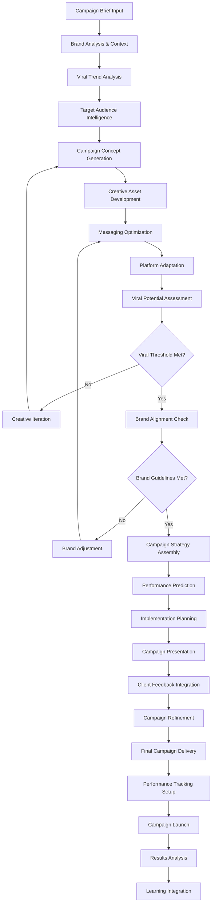

# Objective 11: Marketing Inception

## Summary & Goals

Implement AI-powered marketing campaign generation that creates viral marketing concepts, content strategies, and campaign frameworks optimized for viral potential. This system generates innovative marketing campaigns that leverage viral prediction intelligence to maximize reach and engagement.

**Primary Goal**: Generate viral marketing campaigns with >75% approval rate and measurable viral success through AI-powered campaign inception

## Success Criteria & KPIs

### Campaign Generation Performance
- **Campaign Approval Rate**: >75% of generated campaigns approved by marketing professionals
- **Viral Success Rate**: >60% of launched campaigns achieve viral metrics on target platforms
- **Generation Speed**: Complete campaign concept generation within 60 seconds
- **Creative Uniqueness**: >90% of generated campaigns show meaningful differentiation from existing approaches

### Marketing Intelligence & Effectiveness
- **Engagement Improvement**: Generated campaigns achieve 40%+ higher engagement than baseline
- **Reach Amplification**: AI-generated campaigns achieve 3x greater reach than traditional approaches
- **ROI Performance**: Generated campaigns deliver 2.5x better ROI than manually created campaigns
- **Brand Alignment**: >95% of generated campaigns align with brand guidelines and values

### System Learning & Adaptation
- **Campaign Learning Rate**: Improve campaign success rate by 10%+ quarterly through AI learning
- **Trend Integration**: Incorporate latest viral trends into campaigns within 24 hours of identification
- **Cross-Industry Insights**: Apply insights from one industry to improve campaigns in others by 25%+
- **Personalization Effectiveness**: Personalized campaigns perform 50%+ better than generic approaches

## Actors & Workflow

### Primary Actors
- **Campaign Generator**: AI system that creates comprehensive marketing campaign concepts
- **Creative Intelligence Engine**: Generates creative assets, messaging, and content strategies
- **Viral Optimization System**: Optimizes campaigns for maximum viral potential
- **Brand Alignment Validator**: Ensures generated campaigns align with brand requirements

### Core Marketing Inception Workflow



### Detailed Process Steps

#### 1. Campaign Intelligence Gathering (15-30 seconds)
- **Brand Profiling**: Analyze brand identity, values, and communication style
- **Competitive Analysis**: Review competitor campaigns and identify differentiation opportunities
- **Viral Trend Integration**: Incorporate latest viral trends and patterns into campaign strategy
- **Audience Intelligence**: Deep analysis of target audience preferences and behavior patterns

#### 2. Creative Concept Generation (30-45 seconds)
- **Campaign Theme Development**: Generate overarching campaign themes and narratives
- **Hook Creation**: Develop attention-grabbing hooks and creative concepts
- **Content Strategy Formation**: Create comprehensive content strategies across multiple touchpoints
- **Multi-Channel Integration**: Develop integrated campaigns across social, digital, and traditional media

#### 3. Viral Optimization & Platform Adaptation (15-30 seconds)
- **Viral Element Integration**: Incorporate proven viral elements and triggers
- **Platform Customization**: Adapt campaigns for TikTok, Instagram, YouTube, and other platforms
- **Timing Optimization**: Determine optimal campaign timing and content release schedules
- **Engagement Maximization**: Optimize for maximum user engagement and participation

#### 4. Brand Validation & Quality Assurance (10-20 seconds)
- **Brand Guidelines Compliance**: Ensure campaigns meet brand standards and guidelines
- **Content Safety Review**: Validate campaigns for appropriateness and brand safety
- **Legal Compliance Check**: Verify campaigns comply with advertising regulations and standards
- **Performance Prediction**: Predict campaign performance and viral potential

## Data Contracts

### Campaign Generation Request
```yaml
campaign_request:
  request_id: string
  client_id: string
  timestamp: ISO datetime
  
  campaign_parameters:
    campaign_type: "product_launch" | "brand_awareness" | "engagement" | "conversion"
    target_audience: object
    budget_range: string
    timeline: string
    
  brand_context:
    brand_name: string
    brand_values: array<string>
    brand_guidelines: object
    previous_campaigns: array<object>
    
  campaign_goals:
    primary_objective: string
    secondary_objectives: array<string>
    success_metrics: array<string>
    target_kpis: object
    
  platform_requirements:
    primary_platforms: array<string>
    secondary_platforms: array<string>
    platform_specific_requirements: object
    
  creative_preferences:
    tone: "professional" | "casual" | "humorous" | "inspirational" | "edgy"
    style: "minimalist" | "bold" | "storytelling" | "lifestyle" | "product_focused"
    content_types: array<string>
    creative_constraints: array<string>
```

### Generated Campaign Concept
```yaml
campaign_concept:
  concept_id: string
  campaign_name: string
  generated_timestamp: ISO datetime
  viral_potential_score: number (0-100)
  
  campaign_overview:
    core_concept: string
    key_message: string
    unique_value_proposition: string
    campaign_narrative: string
    
  creative_strategy:
    visual_identity: object
    messaging_framework: object
    content_themes: array<string>
    creative_assets_plan: object
    
  viral_elements:
    hook_strategies: array<string>
    engagement_triggers: array<string>
    shareability_factors: array<string>
    viral_mechanisms: array<string>
    
  platform_adaptations:
    tiktok_strategy: object
    instagram_strategy: object
    youtube_strategy: object
    twitter_strategy: object
    
  implementation_plan:
    campaign_phases: array<object>
    content_calendar: object
    resource_requirements: object
    timeline_milestones: object
    
  performance_predictions:
    expected_reach: number
    projected_engagement: number
    viral_probability: number (0-1)
    roi_estimate: number
    
  brand_alignment:
    guideline_compliance: boolean
    brand_safety_score: number (0-100)
    message_consistency: number (0-100)
    value_alignment: number (0-100)
```

### Campaign Performance Tracking
```yaml
campaign_performance:
  concept_id: string
  campaign_id: string
  launch_date: ISO date
  tracking_period: string
  
  engagement_metrics:
    total_reach: number
    total_impressions: number
    engagement_rate: number
    share_count: number
    comment_count: number
    
  viral_metrics:
    viral_coefficient: number
    viral_timeline: object
    peak_virality_date: ISO date
    platform_viral_success: object
    
  business_impact:
    leads_generated: number
    conversions: number
    revenue_attributed: number
    brand_awareness_lift: number
    
  performance_vs_prediction:
    reach_accuracy: number
    engagement_accuracy: number
    viral_prediction_accuracy: number
    roi_accuracy: number
    
  learning_insights:
    successful_elements: array<string>
    underperforming_elements: array<string>
    unexpected_outcomes: array<string>
    optimization_opportunities: array<string>
```

## Technical Implementation

### AI Campaign Generation Architecture
```yaml
generation_system:
  creative_intelligence:
    concept_generator: "GPT-4 fine-tuned on successful marketing campaigns"
    visual_strategy_ai: "AI system for visual identity and creative direction"
    messaging_optimizer: "NLP system for message optimization and testing"
    
  viral_optimization:
    viral_pattern_integrator: "System to incorporate proven viral elements"
    trend_analyzer: "Real-time viral trend analysis and integration"
    platform_optimizer: "Platform-specific campaign optimization"
    
  brand_alignment:
    brand_analyzer: "AI system for brand guideline compliance"
    safety_validator: "Content safety and appropriateness checking"
    legal_compliance: "Automated legal and regulatory compliance checking"
    
  performance_prediction:
    engagement_predictor: "ML model for engagement prediction"
    viral_potential_scorer: "AI system for viral potential assessment"
    roi_calculator: "ROI prediction and optimization"
```

### Creative AI Models
```yaml
creative_models:
  campaign_concept_generator:
    base_model: "GPT-4 fine-tuned on 50K+ successful campaigns"
    specializations: ["brand_voice_adaptation", "industry_specific_knowledge", "viral_pattern_integration"]
    training_data: "Successful viral campaigns across industries"
    
  creative_asset_generator:
    visual_ai: "DALL-E 3 + custom fine-tuning for brand consistency"
    copy_generator: "Claude-3 optimized for marketing copy generation"
    video_concept_ai: "Specialized AI for video campaign concepts"
    
  viral_optimization_engine:
    pattern_matcher: "Neural network trained on viral content patterns"
    trend_integrator: "Real-time trend analysis and integration system"
    platform_adapter: "Multi-platform optimization neural network"
    
  performance_predictor:
    engagement_forecaster: "Time series + neural network ensemble"
    viral_classifier: "Binary classification for viral potential"
    roi_predictor: "Regression model for ROI estimation"
```

### Real-time Campaign Processing
```yaml
processing_pipeline:
  input_analysis:
    brand_profiling: "Real-time brand analysis and context extraction"
    audience_intelligence: "Dynamic audience analysis and segmentation"
    competitive_analysis: "Automated competitor campaign analysis"
    
  creative_generation:
    parallel_concept_generation: "Generate multiple campaign concepts simultaneously"
    rapid_iteration: "Real-time refinement based on performance predictions"
    multi_modal_creation: "Generate text, visual, and video concepts together"
    
  optimization_processing:
    viral_enhancement: "Real-time viral element integration"
    platform_adaptation: "Simultaneous optimization for multiple platforms"
    performance_forecasting: "Real-time performance prediction and optimization"
    
  quality_assurance:
    automated_validation: "Real-time brand compliance and safety checking"
    human_review_routing: "Intelligent routing for human review when needed"
    final_optimization: "Last-mile optimization before delivery"
```

## Events Emitted

### Campaign Generation
- `inception.generation_requested`: Campaign generation initiated by user
- `inception.concept_created`: New campaign concept generated
- `inception.viral_optimization_completed`: Viral optimization applied to campaign
- `inception.brand_validation_passed`: Campaign passed brand alignment validation

### Creative Development
- `creative.concept_refined`: Campaign concept iteratively improved
- `creative.asset_generated`: Creative assets generated for campaign
- `creative.messaging_optimized`: Campaign messaging optimized for target audience
- `creative.platform_adapted`: Campaign adapted for specific platforms

### Performance & Learning
- `performance.prediction_generated`: Campaign performance prediction created
- `performance.actual_results_measured`: Real campaign performance measured
- `performance.prediction_validated`: Prediction accuracy validated against actual results
- `learning.insights_integrated`: Campaign learnings integrated into AI models

### Quality & Compliance
- `quality.brand_compliance_verified`: Campaign brand compliance confirmed
- `quality.safety_validation_passed`: Campaign safety validation completed
- `quality.legal_compliance_checked`: Legal compliance verification completed
- `quality.client_approval_received`: Client approved generated campaign

## Performance & Scalability

### Generation Performance
- **Campaign Generation Speed**: Complete campaign concepts within 60 seconds
- **Concurrent Generations**: Support 50+ simultaneous campaign generation requests
- **Creative Asset Generation**: Generate visual and copy assets within 120 seconds
- **Platform Optimization**: Adapt campaigns for all major platforms within 30 seconds

### Quality & Success Metrics
- **Campaign Approval Rate**: >75% approval rate from marketing professionals
- **Viral Success Rate**: >60% of launched campaigns achieve viral status
- **Engagement Improvement**: 40%+ higher engagement than baseline campaigns
- **ROI Performance**: 2.5x better ROI than manually created campaigns

### Scalability Architecture
- **Global Deployment**: Support campaign generation across multiple regions and languages
- **Industry Scaling**: Adapt to campaigns across all major industries and verticals
- **Volume Scaling**: Handle 1000+ campaign generation requests daily
- **Model Scaling**: Continuously improve models with data from successful campaigns

## Error Handling & Edge Cases

### Generation Failures
- **Creative Block**: Handle situations where AI cannot generate satisfactory concepts
- **Brand Conflict**: Resolve conflicts between viral optimization and brand guidelines
- **Platform Limitations**: Adapt when campaign concepts don't work for specific platforms
- **Resource Constraints**: Generate campaigns when computational resources are limited

### Quality Issues
- **Brand Misalignment**: Detect and correct campaigns that don't align with brand values
- **Content Appropriateness**: Filter out inappropriate or potentially harmful content
- **Legal Compliance**: Handle legal issues in campaign generation across different jurisdictions
- **Competitive Similarity**: Prevent generation of campaigns too similar to competitors

### Performance Challenges
- **Prediction Inaccuracy**: Handle situations where performance predictions are significantly off
- **Market Changes**: Adapt campaigns when market conditions change rapidly
- **Audience Shifts**: Adjust campaigns when target audience preferences evolve
- **Platform Algorithm Changes**: Adapt campaigns when social platform algorithms change

## Security & Privacy

### Campaign IP Security
- **Creative IP Protection**: Protect proprietary campaign concepts and strategies
- **Client Confidentiality**: Ensure client campaign information remains confidential
- **Competitive Intelligence**: Secure competitive analysis data and insights
- **Model Protection**: Prevent reverse engineering of campaign generation algorithms

### Data Security
- **Brand Data Protection**: Secure brand guidelines and sensitive brand information
- **Campaign Performance Data**: Protect campaign performance and analytics data
- **User Behavior Data**: Secure user behavior data used for audience intelligence
- **Regulatory Compliance**: Ensure compliance with marketing and privacy regulations

## Acceptance Criteria

- [ ] Achieve >75% approval rate for generated campaigns from marketing professionals
- [ ] Deliver >60% viral success rate for launched AI-generated campaigns
- [ ] Generate complete campaign concepts within 60 seconds
- [ ] Demonstrate >90% creative uniqueness in generated campaigns vs existing approaches
- [ ] Show 40%+ higher engagement rates compared to baseline campaigns
- [ ] Achieve 3x greater reach than traditional campaign approaches
- [ ] Deliver 2.5x better ROI than manually created campaigns
- [ ] Maintain >95% brand guideline alignment in generated campaigns
- [ ] Improve campaign success rate by 10%+ quarterly through AI learning
- [ ] Incorporate viral trends into campaigns within 24 hours of identification
- [ ] Apply cross-industry insights to improve campaigns by 25%+
- [ ] Achieve 50%+ better performance through campaign personalization
- [ ] Support 50+ concurrent campaign generation requests
- [ ] Generate campaigns adapted for all major social media platforms
- [ ] Implement comprehensive security controls for campaign IP and client data
- [ ] Handle edge cases including generation failures, brand conflicts, and platform limitations

---

*Marketing Inception creates AI-powered viral marketing campaigns that leverage advanced creative intelligence and viral prediction capabilities to deliver superior engagement, reach, and ROI through innovative campaign generation and optimization.*