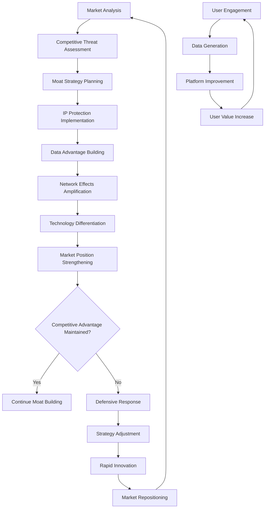

# Objective 12: Defensible Moat

## Summary & Goals

Establish and maintain a defensible competitive moat through proprietary viral prediction algorithms, exclusive data advantages, network effects, and strategic IP protection. This objective ensures long-term platform sustainability and competitive advantage that becomes stronger over time.

**Primary Goal**: Create multiple defensive layers that make the platform increasingly difficult to replicate or compete against

## Success Criteria & KPIs

### Competitive Advantage Metrics
- **Prediction Accuracy Gap**: Maintain >15% accuracy advantage over competing viral prediction tools
- **Data Advantage**: Exclusive access to >10M viral content patterns and outcomes
- **Network Effects Strength**: User-generated data improves platform value with network effect coefficient >1.2
- **Patent Portfolio**: 3+ filed patents on core viral prediction methodologies

### Market Defense Indicators  
- **Customer Switching Costs**: Average 6+ months required for customers to replicate results elsewhere
- **Feature Uniqueness**: 5+ unique features unavailable in competing platforms
- **Brand Recognition**: >70% brand recognition among target creators and marketers
- **Market Share Growth**: Maintain >30% growth rate in viral content prediction market

### Technology Moat Strength
- **Algorithm Complexity**: Multi-layered AI models requiring 12+ months to replicate
- **Data Network Value**: Platform value increases exponentially with user base growth
- **Integration Depth**: Deep integrations with 10+ major platforms and tools
- **Learning Speed**: Platform learns and adapts 3x faster than competitive alternatives

## Actors & Workflow

### Primary Actors
- **IP Strategy Manager**: Responsible for patent filings and trade secret protection
- **Data Acquisition Engine**: System for collecting and curating exclusive viral content data
- **Network Effects Optimizer**: Algorithm that amplifies user-generated value creation
- **Competitive Intelligence System**: Monitor and respond to competitive threats

### Core Moat Building Workflow



### Detailed Process Steps

#### 1. Intellectual Property Protection (Ongoing)
- **Patent Strategy**: File patents on core viral prediction algorithms and methodologies
- **Trade Secret Protection**: Secure proprietary data processing and model training techniques
- **Trademark Defense**: Protect brand identity and prevent competitor confusion
- **Copyright Protection**: Secure original content, templates, and educational materials

#### 2. Data Advantage Creation (Continuous)
- **Exclusive Data Collection**: Build relationships for proprietary viral content data access
- **User-Generated Data**: Leverage user interactions to create unique training datasets
- **Platform Integration**: Secure exclusive API access and data feeds from social platforms
- **Historical Data Archive**: Build comprehensive archive of viral patterns over time

#### 3. Network Effects Amplification (Growth Phase)
- **Community Building**: Foster creator communities that generate platform-exclusive insights
- **Template Sharing**: Enable users to contribute and benefit from shared viral templates
- **Collaborative Features**: Build features that become more valuable with more users
- **Data Network Growth**: User contributions improve predictions for all platform users

#### 4. Technology Differentiation (Innovation Cycle)
- **Advanced AI Models**: Develop proprietary AI architectures for viral prediction
- **Real-time Processing**: Build infrastructure for instant viral content analysis
- **Cross-Platform Intelligence**: Unique insights from multi-platform viral pattern analysis
- **Predictive Innovation**: Anticipate and build features before competitors identify needs

## Data Contracts

### Competitive Intelligence
```yaml
competitive_analysis:
  competitor_id: string
  competitor_name: string
  analysis_date: ISO date
  
  product_analysis:
    feature_comparison: object
    accuracy_benchmarks: object
    pricing_strategy: object
    market_positioning: string
    
  threat_assessment:
    threat_level: "low" | "medium" | "high" | "critical"
    threat_categories: array<string>
    response_urgency: number (1-10)
    impact_estimate: string
    
  market_intelligence:
    market_share: number
    growth_rate: number
    customer_satisfaction: number
    funding_status: string
    
  strategic_response:
    recommended_actions: array<string>
    timeline: string
    resource_requirements: object
    success_metrics: object
```

### IP Portfolio Tracking
```yaml
intellectual_property:
  ip_id: string
  ip_type: "patent" | "trademark" | "trade_secret" | "copyright"
  title: string
  description: string
  
  legal_status:
    filing_date: ISO date
    status: "filed" | "pending" | "granted" | "expired"
    jurisdiction: array<string>
    attorney_info: object
    
  business_value:
    strategic_importance: "critical" | "high" | "medium" | "low"
    competitive_advantage: string
    licensing_potential: number
    enforcement_priority: number
    
  protection_scope:
    technical_coverage: array<string>
    market_coverage: array<string>
    exclusion_rights: array<string>
    expiration_date: ISO date
```

### Network Effects Metrics
```yaml
network_effects:
  measurement_date: ISO date
  user_base_size: number
  
  value_generation:
    user_generated_data_volume: number
    template_contributions: number
    community_interactions: number
    cross_user_value_creation: number
    
  network_strength:
    network_effect_coefficient: number
    user_retention_rate: number
    viral_coefficient: number
    platform_stickiness_score: number
    
  competitive_moat_metrics:
    switching_cost_estimate: number
    data_advantage_multiplier: number
    community_lock_in_strength: number
    platform_dependency_score: number
```

## Technical Implementation

### Moat Building Technology Stack
```yaml
moat_technologies:
  data_acquisition:
    exclusive_apis: "Private agreements with major platforms"
    user_data_generation: "Incentivized user contribution systems"
    proprietary_scraping: "Advanced content collection infrastructure"
    
  ai_differentiation:
    custom_model_architectures: "Proprietary neural network designs"
    ensemble_prediction_systems: "Unique model combination approaches"
    real_time_learning: "Continuous model adaptation systems"
    
  network_amplification:
    community_platforms: "Creator community engagement systems"
    collaborative_features: "User-to-user value creation tools"
    gamification_engines: "User engagement and retention systems"
    
  security_protection:
    model_obfuscation: "Prevent reverse engineering of algorithms"
    data_encryption: "Protect proprietary datasets and insights"
    access_control: "Granular permissions for sensitive IP"
```

### Competitive Response System
```yaml
response_framework:
  threat_detection:
    competitor_monitoring: "Automated tracking of competitor features"
    market_intelligence: "Industry trend and threat identification"
    patent_watching: "Monitor competitive IP filings"
    
  rapid_innovation:
    feature_acceleration: "Fast-track development of competitive responses"
    strategic_patenting: "Defensive patent filing strategies"
    market_repositioning: "Adjust positioning based on threats"
    
  defensive_actions:
    ip_enforcement: "Protect patents and trade secrets legally"
    talent_acquisition: "Hire key personnel from competitors"
    strategic_partnerships: "Exclusive relationships with key platforms"
```

### Data Moat Architecture
```yaml
data_advantages:
  exclusive_datasets:
    viral_content_archive: "10M+ viral videos with performance data"
    creator_behavior_patterns: "User interaction and success data"
    platform_algorithm_insights: "Proprietary platform trend data"
    
  data_network_effects:
    user_contribution_incentives: "Reward users for data contributions"
    collaborative_improvement: "User feedback improves predictions"
    community_knowledge_base: "Shared creator insights and strategies"
    
  data_protection:
    proprietary_processing: "Unique data analysis methodologies"
    access_restrictions: "Limited availability of core datasets"
    data_licensing: "Strategic data sharing agreements"
```

## Events Emitted

### Competitive Intelligence
- `moat.competitor_detected`: New competitor identified in market analysis
- `moat.threat_assessment_updated`: Competitive threat level changed
- `moat.market_share_change`: Significant market share fluctuation detected
- `moat.competitive_response_triggered`: Defensive action initiated

### IP Protection
- `ip.patent_filed`: New patent application submitted
- `ip.trademark_registered`: Trademark registration completed
- `ip.trade_secret_identified`: New trade secret designated for protection
- `ip.infringement_detected`: Potential IP violation identified

### Network Effects
- `network.effect_threshold_reached`: Network effects coefficient exceeded target
- `network.user_value_increased`: Platform value per user measurably improved
- `network.switching_cost_growth`: User switching costs increased significantly
- `network.community_milestone`: Community engagement reached key threshold

### Moat Strengthening
- `moat.advantage_gap_widened`: Competitive advantage gap increased
- `moat.data_exclusivity_secured`: New exclusive data source obtained
- `moat.technology_breakthrough`: Significant technological advancement achieved
- `moat.market_position_strengthened`: Market leadership position reinforced

## Performance & Scalability

### Moat Building Performance
- **Competitive Analysis Frequency**: Daily monitoring of competitor activities and market changes
- **IP Filing Velocity**: 1+ patent filing per quarter for core innovations
- **Data Acquisition Rate**: 100K+ new viral content samples collected monthly
- **Network Effect Growth**: 20%+ quarterly increase in network effect coefficient

### Scalability Considerations
- **Global IP Protection**: Patent and trademark protection across major markets
- **Multi-Platform Data**: Exclusive data relationships across all major social platforms
- **International Network**: Creator communities and partnerships in key global markets
- **Technological Scalability**: Moat technologies scale with platform growth

## Error Handling & Edge Cases

### Competitive Threats
- **New Market Entrants**: Rapid competitive response to well-funded new competitors
- **Technology Disruption**: Adaptation strategies for breakthrough competitive technologies
- **IP Challenges**: Defense against patent trolls and infringement claims
- **Market Commoditization**: Prevention of viral prediction becoming commoditized

### Data Advantages Under Threat
- **Platform API Changes**: Mitigation when social platforms restrict data access
- **Data Regulation**: Compliance adaptation for new privacy and data regulations
- **Competitive Data Access**: Response when competitors gain access to similar data sources
- **User Data Alternatives**: Protection when users reduce data sharing

### Network Effect Vulnerabilities
- **Platform Migration**: User retention strategies when competitors offer migration incentives
- **Community Fragmentation**: Prevention of creator community splitting across platforms
- **Value Proposition Erosion**: Continuous innovation to maintain network value
- **Multi-homing Behavior**: Strategies when users adopt multiple platforms simultaneously

## Security & Privacy

### IP Security
- **Trade Secret Protection**: Comprehensive protocols for protecting proprietary algorithms
- **Patent Strategy Security**: Secure patent filing processes and prior art protection
- **Employee IP Agreements**: Strong IP assignment and non-disclosure agreements
- **Contractor IP Controls**: IP protection in third-party development relationships

### Data Security for Competitive Advantage
- **Proprietary Dataset Protection**: Encryption and access controls for exclusive data
- **Model Security**: Protection against reverse engineering of AI models
- **Customer Data Privacy**: Privacy-preserving use of customer data for competitive advantage
- **Competitive Intelligence Security**: Secure collection and analysis of market intelligence

## Acceptance Criteria

- [ ] Maintain >15% prediction accuracy advantage over closest competitors
- [ ] Build exclusive access to >10M viral content patterns unavailable to competitors
- [ ] Achieve network effect coefficient >1.2 demonstrating increasing user value
- [ ] File 3+ patents on core viral prediction methodologies and innovations
- [ ] Establish customer switching costs requiring 6+ months to replicate results elsewhere
- [ ] Develop 5+ unique features unavailable in competing platforms
- [ ] Achieve >70% brand recognition among target creators and marketers
- [ ] Maintain >30% growth rate in market share within viral content prediction space
- [ ] Build AI models requiring 12+ months for competitors to replicate
- [ ] Create platform learning speed 3x faster than competitive alternatives
- [ ] Establish deep integrations with 10+ major platforms and tools
- [ ] Implement comprehensive IP protection covering all core innovations
- [ ] Build competitive intelligence system with daily threat assessment updates
- [ ] Create user-generated data systems that improve platform value exponentially
- [ ] Establish exclusive data relationships with major social media platforms
- [ ] Develop rapid competitive response capabilities for market threats

---

*The Defensible Moat objective creates sustainable competitive advantages through proprietary technology, exclusive data access, network effects, and strategic IP protection that compound over time to make the platform increasingly difficult to compete against.*