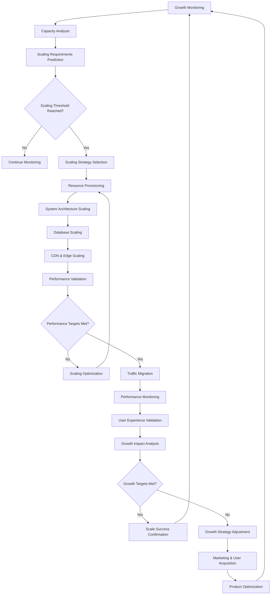

# Objective 13: Scale from Zero

## Summary & Goals

Implement a comprehensive scaling strategy that enables the viral prediction platform to grow from zero users to millions of users while maintaining performance, accuracy, and user experience. This objective ensures the platform can handle exponential growth in users, content, and predictions.

**Primary Goal**: Scale platform to support 10M+ users and 1B+ predictions annually while maintaining >90% accuracy and <3 second response times

## Success Criteria & KPIs

### Scale Performance Targets
- **User Scaling**: Support 10M+ registered users with 1M+ daily active users
- **Prediction Volume**: Process 1B+ predictions annually (3M+ daily predictions at peak)
- **Content Processing**: Analyze 10M+ pieces of content monthly across all platforms
- **Global Reach**: Support users across 50+ countries with localized experiences

### Performance Under Scale
- **Response Time Consistency**: Maintain <3 second API response times at all scale levels
- **Prediction Accuracy**: Maintain >90% accuracy even with 100x user growth
- **System Availability**: >99.9% uptime during peak usage periods
- **Concurrent Users**: Support 100K+ concurrent users without degradation

### Growth Metrics & Business Impact
- **User Growth Rate**: Achieve >100% annual user growth rate
- **Revenue Scaling**: Revenue scales proportionally with user growth (>90% correlation)
- **Market Penetration**: Capture >20% market share in viral content prediction
- **Platform Network Effects**: User value increases exponentially with platform growth

## Actors & Workflow

### Primary Actors
- **Scale Orchestrator**: System that manages platform scaling across all dimensions
- **Performance Monitor**: Real-time monitoring of platform performance at scale
- **Capacity Planner**: AI system that predicts and provisions scaling requirements
- **Growth Analytics Engine**: Tracks growth metrics and optimizes scaling strategies

### Core Scaling Workflow



### Detailed Process Steps

#### 1. Growth Pattern Analysis & Prediction (Continuous)
- **User Growth Tracking**: Monitor user registration, activation, and engagement patterns
- **Usage Pattern Analysis**: Analyze how user behavior changes with platform growth
- **Capacity Demand Forecasting**: Predict infrastructure needs based on growth projections
- **Bottleneck Identification**: Identify potential bottlenecks before they impact users

#### 2. Infrastructure Scaling (Automated)
- **Horizontal Scaling**: Automatically scale compute resources based on demand
- **Database Scaling**: Implement database sharding and read replicas for data scaling
- **CDN Optimization**: Global content delivery network optimization for performance
- **Microservices Scaling**: Scale individual services based on specific demand patterns

#### 3. Performance Optimization at Scale (Ongoing)
- **Algorithm Optimization**: Optimize AI models for faster inference at scale
- **Caching Strategies**: Implement intelligent caching to reduce computational load
- **Load Balancing**: Dynamic load balancing across global infrastructure
- **Edge Computing**: Deploy edge computing for regional performance optimization

#### 4. User Experience Scaling (Continuous)
- **Personalization at Scale**: Maintain personalized experiences for millions of users
- **Localization**: Support multiple languages and regional preferences
- **Feature Scaling**: Ensure all features work effectively with large user bases
- **Support Scaling**: Scale customer support and user assistance capabilities

## Data Contracts

### Scale Metrics Dashboard
```yaml
scale_metrics:
  timestamp: ISO datetime
  measurement_period: string
  
  user_metrics:
    total_registered_users: number
    daily_active_users: number
    monthly_active_users: number
    user_growth_rate: number
    user_retention_rate: number
    
  usage_metrics:
    daily_predictions: number
    monthly_content_analyzed: number
    api_requests_per_second: number
    concurrent_users_peak: number
    
  performance_metrics:
    average_response_time_ms: number
    p95_response_time_ms: number
    p99_response_time_ms: number
    system_availability_percentage: number
    error_rate_percentage: number
    
  infrastructure_metrics:
    server_count: number
    database_size_gb: number
    cdn_traffic_gb: number
    compute_utilization_percentage: number
    
  business_metrics:
    monthly_recurring_revenue: number
    customer_acquisition_cost: number
    lifetime_value: number
    churn_rate_percentage: number
```

### Scaling Event Record
```yaml
scaling_event:
  event_id: string
  event_type: "auto_scale_up" | "auto_scale_down" | "manual_scale" | "emergency_scale"
  timestamp: ISO datetime
  trigger_reason: string
  
  before_state:
    infrastructure_capacity: object
    performance_metrics: object
    user_load: object
    
  scaling_actions:
    - action_type: "server_addition" | "database_scaling" | "cdn_expansion" | "service_scaling"
      action_details: object
      execution_time: ISO datetime
      completion_time: ISO datetime
      
  after_state:
    infrastructure_capacity: object
    performance_metrics: object
    capacity_improvement: object
    
  validation_results:
    performance_improvement: object
    cost_impact: number
    user_experience_impact: object
    success_criteria_met: boolean
    
  lessons_learned:
    optimization_opportunities: array<string>
    future_recommendations: array<string>
    scaling_effectiveness: number (0-1)
```

### Growth Strategy State
```yaml
growth_strategy:
  strategy_id: string
  strategy_name: string
  active_period: {start: ISO date, end: ISO date}
  
  growth_targets:
    user_growth_target: number
    revenue_growth_target: number
    market_share_target: number
    geographic_expansion: array<string>
    
  scaling_approach:
    infrastructure_strategy: string
    technology_investments: array<string>
    team_scaling_plan: object
    market_entry_strategy: object
    
  success_metrics:
    primary_kpis: array<string>
    secondary_kpis: array<string>
    milestone_targets: array<object>
    
  risk_mitigation:
    identified_risks: array<string>
    mitigation_strategies: array<string>
    contingency_plans: array<object>
    
  progress_tracking:
    current_performance: object
    milestone_completion: array<boolean>
    strategy_adjustments: array<object>
```

## Technical Implementation

### Scalable Architecture Design
```yaml
scaling_architecture:
  microservices:
    prediction_service: "Horizontally scalable prediction processing"
    content_analysis: "Auto-scaling content analysis pipeline"
    user_management: "Scalable user authentication and management"
    data_processing: "Distributed data processing and analytics"
    
  data_layer:
    distributed_databases: "Sharded databases with automatic scaling"
    caching_layer: "Multi-tier caching with Redis clusters"
    data_warehousing: "Scalable analytics data warehouse"
    search_infrastructure: "Elasticsearch clusters for content search"
    
  infrastructure:
    kubernetes_orchestration: "Container orchestration for automatic scaling"
    cloud_native_deployment: "Multi-cloud deployment for resilience"
    edge_computing: "Global edge nodes for performance"
    cdn_integration: "Global CDN for content delivery"
    
  monitoring_observability:
    real_time_monitoring: "Comprehensive system monitoring"
    alerting_system: "Proactive alerting for scaling needs"
    performance_analytics: "Deep performance analysis and optimization"
```

### Auto-Scaling Systems
```yaml
auto_scaling:
  horizontal_scaling:
    compute_scaling: "Automatic server provisioning based on CPU/memory usage"
    database_scaling: "Read replica scaling and connection pooling"
    service_scaling: "Individual microservice scaling based on demand"
    
  vertical_scaling:
    resource_optimization: "Dynamic resource allocation within servers"
    performance_tuning: "Automatic performance optimization"
    capacity_optimization: "Optimize resource utilization efficiency"
    
  predictive_scaling:
    demand_forecasting: "ML-based demand prediction for proactive scaling"
    seasonal_scaling: "Automatic scaling for seasonal traffic patterns"
    event_based_scaling: "Scale in anticipation of marketing events"
    
  cost_optimization:
    resource_rightsizing: "Optimize resource allocation for cost efficiency"
    spot_instance_usage: "Leverage spot instances for cost reduction"
    reserved_capacity: "Optimize reserved capacity utilization"
```

### Global Distribution Strategy
```yaml
global_distribution:
  geographic_deployment:
    multi_region_architecture: "Deploy across multiple AWS/GCP/Azure regions"
    regional_data_sovereignty: "Comply with regional data requirements"
    latency_optimization: "Minimize latency through geographic distribution"
    
  content_delivery:
    global_cdn: "CloudFlare/AWS CloudFront for global content delivery"
    edge_caching: "Cache prediction results at edge locations"
    intelligent_routing: "Route users to optimal data centers"
    
  localization:
    multi_language_support: "Support 20+ languages"
    regional_customization: "Adapt platform for regional preferences"
    local_compliance: "Meet local regulatory requirements"
```

## Events Emitted

### Growth & Scale Events
- `scale.growth_threshold_reached`: User growth reached scaling threshold
- `scale.capacity_limit_approaching`: Infrastructure capacity approaching limits
- `scale.scaling_initiated`: Automatic scaling process initiated
- `scale.scaling_completed`: Scaling operation completed successfully

### Performance Events
- `performance.degradation_detected`: Performance degradation detected under load
- `performance.sla_violation`: Performance SLA violation detected
- `performance.optimization_applied`: Performance optimization successfully applied
- `performance.target_achieved`: Performance targets achieved at new scale

### Infrastructure Events
- `infrastructure.resource_provisioned`: New infrastructure resources provisioned
- `infrastructure.database_scaled`: Database scaling operation completed
- `infrastructure.cdn_optimized`: CDN configuration optimized for performance
- `infrastructure.global_deployment_completed`: New region deployment completed

### Business Impact Events
- `business.growth_milestone_achieved`: Business growth milestone reached
- `business.market_expansion_successful`: Successful expansion into new market
- `business.revenue_scaling_validated`: Revenue scaling aligned with user growth
- `business.network_effect_measured`: Platform network effects quantified

## Performance & Scalability

### Scale Performance Targets
- **User Onboarding**: Support 10K+ new user registrations per day
- **Prediction Throughput**: Process 3M+ predictions per day at peak load
- **Content Analysis**: Analyze 500K+ pieces of content daily
- **API Performance**: Maintain <3 second response times with 100K+ concurrent users

### Infrastructure Scaling Capabilities
- **Auto-Scaling Response Time**: Scale infrastructure within 5 minutes of demand spikes
- **Geographic Expansion**: Deploy to new regions within 24 hours
- **Database Scaling**: Handle 10x data growth without performance degradation
- **CDN Performance**: Achieve <100ms content delivery globally

### Business Growth Targets
- **Annual User Growth**: >100% year-over-year user growth
- **Revenue Correlation**: >90% correlation between user growth and revenue growth
- **Market Share**: Achieve >20% market share in viral prediction space
- **Global Presence**: Active users in 50+ countries within 2 years

## Error Handling & Edge Cases

### Scaling Challenges
- **Rapid Growth Spikes**: Handle viral platform adoption and sudden user influxes
- **Regional Demand Variations**: Manage uneven growth across geographic regions
- **Feature Usage Patterns**: Scale different platform features based on usage patterns
- **Seasonal Traffic**: Handle predictable and unpredictable traffic variations

### Performance Under Load
- **Database Bottlenecks**: Prevent database performance degradation during scale events
- **API Rate Limiting**: Implement intelligent rate limiting that scales with platform growth
- **Memory Leaks**: Detect and prevent memory leaks that compound at scale
- **Cache Invalidation**: Manage cache invalidation across distributed systems

### Business Scaling Challenges
- **Customer Support Scaling**: Scale support capabilities with user growth
- **Content Moderation**: Scale content moderation for increased user-generated content
- **Fraud Prevention**: Maintain fraud prevention effectiveness at scale
- **Regulatory Compliance**: Ensure compliance across all operational regions

## Security & Privacy

### Security at Scale
- **Authentication Scaling**: Secure authentication for millions of users
- **Data Encryption**: Maintain encryption performance at scale
- **Access Control**: Granular access controls that scale with user growth
- **Audit Logging**: Comprehensive audit trails for all user activities

### Privacy Compliance
- **GDPR Compliance**: GDPR compliance for European users at any scale
- **CCPA Compliance**: California privacy compliance for US users
- **Data Residency**: Meet data residency requirements across all regions
- **Privacy by Design**: Maintain privacy protection as core platform principle

## Acceptance Criteria

- [ ] Support 10M+ registered users with 1M+ daily active users
- [ ] Process 1B+ predictions annually (3M+ daily at peak) without degradation
- [ ] Analyze 10M+ pieces of content monthly across all platforms
- [ ] Support users across 50+ countries with localized experiences
- [ ] Maintain <3 second API response times at all scale levels
- [ ] Preserve >90% prediction accuracy with 100x user growth
- [ ] Achieve >99.9% uptime during peak usage periods
- [ ] Support 100K+ concurrent users without performance degradation
- [ ] Achieve >100% annual user growth rate consistently
- [ ] Maintain >90% correlation between user growth and revenue scaling
- [ ] Capture >20% market share in viral content prediction space
- [ ] Demonstrate exponential user value increase with platform growth
- [ ] Scale infrastructure automatically within 5 minutes of demand spikes
- [ ] Deploy to new regions within 24 hours when needed
- [ ] Handle 10x data growth without performance impact
- [ ] Maintain global content delivery <100ms latency
- [ ] Implement comprehensive security and privacy controls at scale
- [ ] Handle edge cases including rapid growth spikes and regional variations

---

*Scale from Zero enables the viral prediction platform to grow from startup to global platform while maintaining performance, accuracy, and user experience through intelligent scaling strategies, robust infrastructure, and automated growth management.*