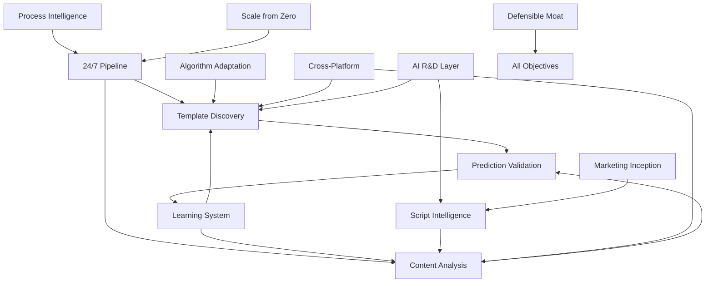

# Core Product Objectives Overview

## Business Context

The Trendzo viral prediction platform executes on 13 core product objectives that deliver the fundamental value proposition: AI-powered viral content prediction and creation. These objectives represent the minimum viable features for POC success and market differentiation.

## Complete Core Objectives List

| ID | Objective | Primary Workflow | Success Criteria | Priority |
|---|-----------|------------------|------------------|----------|
| 01 | **24/7 Pipeline** | Continuous discovery & analysis | System uptime >99.5%, real-time template updates | P0 |
| 02 | **Automated Viral Template Discovery** | Template classification system | New templates identified within 24hrs of viral emergence | P0 |
| 03 | **Instant Content Analysis Engine** | Video analysis & scoring | Analysis completion <30 seconds, >80% accuracy | P0 |
| 04 | **Prediction Validation (≥90% Accuracy)** | Accuracy tracking & calibration | Viral prediction accuracy >90% within 6 months | P0 |
| 05 | **Exponential Learning System** | ML model improvement | Model accuracy improves >5% monthly from user feedback | P1 |
| 06 | **Script Intelligence Integration** | Script pattern recognition | Script analysis identifies viral patterns with >85% precision | P1 |
| 07 | **Algorithm Adaptation Engine** | Template optimization | Templates auto-adapt to platform algorithm changes <48hrs | P1 |
| 08 | **Cross-Platform Intelligence** | Multi-platform optimization | Templates optimized for TikTok, Instagram, YouTube simultaneously | P1 |
| 09 | **AI-Powered R&D Layer (MCP)** | Research & development automation | New viral patterns discovered and tested automatically | P2 |
| 10 | **Process Intelligence Layer** | Workflow optimization | User completion rates >80%, time-to-viral <15 minutes | P2 |
| 11 | **Marketing Inception** | Campaign generation | AI generates viral marketing concepts with >70% approval rate | P2 |
| 12 | **Defensible Moat** | Proprietary data & algorithms | Unique viral prediction capabilities, IP protection | P0 |
| 13 | **Scale from Zero** | Growth infrastructure | System handles 10x user growth without performance degradation | P1 |

## Objective Categories

### P0 (Critical): Core Value Delivery
**Objectives 1, 2, 3, 4, 12** - Essential viral prediction capabilities
- **24/7 Pipeline**: Continuous system operation for real-time viral discovery
- **Template Discovery**: Automated identification of viral patterns
- **Content Analysis**: Instant viral scoring and recommendations  
- **Prediction Validation**: Accuracy measurement and improvement
- **Defensible Moat**: Proprietary algorithms and data competitive advantage

### P1 (High): Platform Intelligence
**Objectives 5, 6, 7, 8, 13** - Advanced AI capabilities and scalability
- **Learning System**: Exponential improvement from user feedback
- **Script Intelligence**: Pattern recognition in viral content scripts
- **Algorithm Adaptation**: Auto-response to platform algorithm changes
- **Cross-Platform**: Multi-platform optimization simultaneously
- **Scale from Zero**: Infrastructure handling exponential growth

### P2 (Important): Advanced Features
**Objectives 9, 10, 11** - Competitive differentiation and automation
- **AI R&D Layer**: Automated research and pattern discovery
- **Process Intelligence**: Workflow optimization and user experience
- **Marketing Inception**: AI-generated viral campaign concepts

## Cross-Objective Dependencies

### Core System Dependencies


### Critical Path Analysis
- **Foundation Layer**: 24/7 Pipeline → Template Discovery → Content Analysis
- **Intelligence Layer**: Prediction Validation → Learning System → Algorithm Adaptation  
- **Enhancement Layer**: Script Intelligence → Cross-Platform → AI R&D Layer
- **Business Layer**: Process Intelligence → Marketing Inception → Defensible Moat

## Success Measurement Framework

### Objective Health Dashboard
Each objective contributes to overall platform health:

```yaml
health_calculation:
  critical_objectives: [01, 02, 07]    # Weight: 40%
  high_objectives: [03, 04, 05, 08, 09] # Weight: 50%  
  important_objectives: [06, 10]        # Weight: 10%
  
overall_health: weighted_average(all_objectives)
```

### Alert Escalation Matrix
| Health Score | Action | Notification | Response Time |
|--------------|--------|-------------|---------------|
| 95-100% | Green | None | - |
| 85-94% | Yellow | Slack notification | 2 hours |
| 70-84% | Orange | Email + Slack | 1 hour |
| <70% | Red | PagerDuty + all channels | Immediate |

## Implementation Roadmap

### Phase 1: Foundation (Weeks 1-2)
**Focus**: P0 objectives operational
- Objectives 01, 02, 07 fully implemented
- Basic monitoring and alerting active
- Manual escalation procedures documented

### Phase 2: User Experience (Weeks 3-5)  
**Focus**: P1 objectives implemented
- Objectives 03, 04, 05, 08, 09 operational
- Automated workflows and SLO monitoring
- User-facing features complete

### Phase 3: Business Optimization (Weeks 6-8)
**Focus**: P2 objectives and optimization
- Objectives 06, 10 implemented
- Cross-objective automation complete
- Advanced analytics and optimization active

## Quality Gates Per Phase

### Phase 1 Gates
- [ ] Support incident response time <4 hours average
- [ ] Bug SLA tracking automated with P1/P2 classification
- [ ] Growth analytics capturing core metrics (activation, retention)
- [ ] All P0 objectives show "Green" health status

### Phase 2 Gates  
- [ ] NPS collection automated with >30% response rate
- [ ] Documentation search functional with usage analytics
- [ ] Zapier/Make integrations tested with 99%+ delivery success
- [ ] Data warehouse exports running daily without failures
- [ ] Release process includes automated post-release validation

### Phase 3 Gates
- [ ] Affiliate tracking and payouts fully automated
- [ ] Loop automations handle 90%+ of routine tasks
- [ ] Cross-objective dependencies optimized for performance
- [ ] Overall platform health consistently >90%

---

*For detailed specifications of each objective, see individual objective files (objective_01_support.md through objective_10_automations.md).*

## Integration with Viral Recipe Book

### Objectives Supporting Recipe Book Functionality
- **Objective 07 (Growth Analytics)**: Tracks template usage and viral success rates
- **Objective 02 (Bug SLA)**: Ensures template analysis reliability
- **Objective 03 (Feedback)**: Captures creator satisfaction with templates
- **Objective 05 (Integrations)**: Enables template sharing to external platforms
- **Objective 08 (Warehouse)**: Provides template performance historical data

### Recipe Book Supporting Other Objectives  
- Template success drives **Growth Analytics** activation metrics
- Viral predictions reduce **Support** burden through better user outcomes
- Creator success stories feed **Docs & Tutorials** content
- Template performance data enriches **Warehouse Export** insights