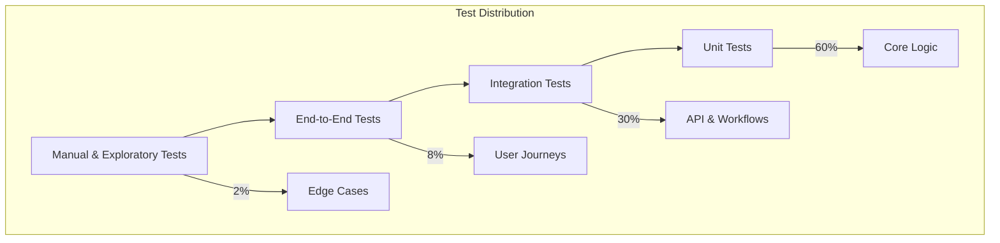

# Test Plan & Quality Assurance Strategy

## Testing Philosophy

The Trendzo platform requires comprehensive testing across viral prediction accuracy, user experience flows, system reliability, and business logic. Testing follows the testing pyramid with emphasis on integration testing for AI/ML components.

## Test Pyramid Structure



## Unit Testing Strategy

### Core Business Logic
**Target Coverage**: 90%+ for business logic, 70%+ overall

#### Template System
```yaml
template_validation:
  test_files: 
    - "template_schema.test.ts"
    - "template_matching.test.ts" 
    - "viral_score_calculation.test.ts"
  
  test_scenarios:
    - Schema validation (required fields, data types, constraints)
    - Status determination logic (HOT/COOLING/NEW/ARCHIVED)
    - Success rate calculations and confidence intervals
    - Template matching algorithm accuracy
    - Credit cost calculations
```

#### Viral Analysis Engine  
```yaml
analysis_engine:
  test_files:
    - "feature_extraction.test.ts"
    - "viral_prediction.test.ts"
    - "optimization_suggestions.test.ts"
  
  test_scenarios:
    - Feature extraction from video content
    - Viral score calculation with confidence bounds
    - Recommendation generation and ranking
    - Edge cases (corrupted files, unsupported formats)
    - Performance benchmarks (analysis <30 seconds)
```

#### Quick Win Pipeline
```yaml
pipeline_logic:
  test_files:
    - "hook_generation.test.ts"
    - "beat_timing.test.ts"
    - "audio_sync.test.ts"
    
  test_scenarios:
    - Hook generation with quality scoring
    - Beat structure validation and timing
    - Audio sync alignment algorithms
    - State machine transitions
    - Draft persistence and recovery
```

## Integration Testing Strategy

### API Integration Tests
**Target Coverage**: All critical user paths, error scenarios

#### Templates API
```yaml
templates_api:
  test_scenarios:
    happy_path:
      - GET /api/templates returns paginated results
      - Template filtering by platform, niche, status works
      - Template detail includes all required fields
      - Starter pack selection returns appropriate templates
      
    error_scenarios:
      - Invalid template ID returns 404
      - Malformed query parameters return 400 with details
      - Unauthenticated requests return 401
      - Rate limiting returns 429 with retry headers
      
    performance:
      - Template list loads within 2 seconds
      - Search with filters completes within 1 second
      - Concurrent requests handle properly (no race conditions)
```

#### Analysis API
```yaml
analysis_api:
  test_scenarios:
    happy_path:
      - Video upload analysis completes successfully
      - URL analysis fetches and processes content
      - Batch analysis handles multiple files
      - Results include viral score and suggestions
      
    error_scenarios:
      - Unsupported file formats rejected with clear message
      - File size limits enforced (100MB max)
      - Processing timeouts handled gracefully  
      - Invalid URLs return descriptive errors
      
    edge_cases:
      - Very short videos (<5 seconds) processed
      - Very long videos (>5 minutes) handled appropriately
      - Network interruptions during upload resume correctly
      - Corrupted files detected and reported
```

#### Quick Win Pipeline API
```yaml
quickwin_api:
  test_scenarios:
    full_pipeline:
      - Initialize session with template selection
      - Generate hooks with quality scores
      - Structure beats with timing validation  
      - Select and sync audio successfully
      - Generate preview and calculate viral score
      - Apply optimizations and recalculate
      - Schedule publishing with optimal timing
      - Complete pipeline within 15-minute target
      
    error_recovery:
      - Pipeline resume after browser refresh
      - Recovery from API timeouts at each stage
      - Validation errors handled with clear guidance
      - Credit insufficient scenarios managed properly
      
    state_management:
      - Draft auto-save every 30 seconds
      - State persistence across browser sessions
      - Concurrent access by same user handled
      - Abandoned drafts cleaned up after 7 days
```

## End-to-End Testing Strategy

### User Journey Tests (Playwright)

#### Admin Viral Recipe Book Journey
```typescript
// Test file: admin_viral_recipe_book.e2e.spec.ts
describe('Admin Viral Recipe Book', () => {
  test('Complete template discovery and analysis workflow', async ({ page }) => {
    // Navigate to Recipe Book
    await page.goto('/admin/viral-recipe-book')
    
    // Verify templates load
    await expect(page.locator('[data-testid="hot-list"]')).toBeVisible()
    await expect(page.locator('[data-testid="template-leaderboard"]')).toBeVisible()
    
    // Apply filters
    await page.selectOption('[data-testid="time-filter"]', '7d')
    await page.fill('[data-testid="niche-filter"]', 'lifestyle')
    await page.click('[data-testid="btn-refresh"]')
    
    // Select template
    await page.click('[data-testid="tpl-card-hot_01"]')
    
    // Switch to Analyzer tab
    await page.click('[data-testid="tab-trigger-analyzer"]')
    
    // Upload test video
    const fileInput = page.locator('[data-testid="file-browse"]')
    await fileInput.setInputFiles('./test-fixtures/sample-viral-video.mp4')
    
    // Wait for analysis
    await expect(page.locator('[data-testid="viral-score"]')).toBeVisible({ timeout: 45000 })
    
    // Verify results
    const score = await page.locator('[data-testid="viral-score"]').textContent()
    expect(Number(score)).toBeGreaterThan(0)
  })
})
```

#### Quick Win Pipeline Journey
```typescript
// Test file: quick_win_pipeline.e2e.spec.ts  
describe('Quick Win Pipeline', () => {
  test('Complete 15-minute viral content creation flow', async ({ page }) => {
    // Start pipeline
    await page.goto('/workflows/quick-win')
    await page.click('[data-testid="start-pipeline"]')
    
    // Stage 1: Template Selection
    await expect(page.locator('[data-testid="starter-templates"]')).toBeVisible()
    await page.click('[data-testid="qw-tpl-hot_01"]')
    await page.click('[data-testid="btn-next"]')
    
    // Stage 2: Hook Generation
    await page.fill('[data-testid="hook-input"]', 'fitness transformation')
    await page.click('[data-testid="generate-hooks"]')
    await expect(page.locator('[data-testid="hook-list"]')).toBeVisible()
    await page.click('[data-testid="select-hook-1"]')
    
    // Continue through all stages...
    // (Abbreviated for space - full implementation would test each stage)
    
    // Verify completion
    await expect(page.locator('[data-testid="complete-pipeline"]')).toBeVisible()
    const finalScore = await page.locator('[data-testid="final-viral-score"]').textContent()
    expect(Number(finalScore)).toBeGreaterThan(70) // Minimum viable viral score
  })
})
```

## Performance Testing Strategy

### Load Testing Requirements

#### API Performance SLOs
| Endpoint | P50 Response Time | P95 Response Time | Throughput |
|----------|-------------------|-------------------|------------|
| GET /api/templates | <500ms | <1000ms | 100 req/sec |
| POST /api/analyze | <15s | <30s | 10 req/sec |
| Quick Win Pipeline | <200ms | <500ms | 50 req/sec |
| Template Search | <300ms | <800ms | 75 req/sec |

#### Frontend Performance SLOs  
| Metric | Target | Measurement |
|---------|--------|-------------|
| First Contentful Paint | <1.5s | Lighthouse CI |
| Time to Interactive | <3s | Lighthouse CI |
| Largest Contentful Paint | <2.5s | Lighthouse CI |
| Cumulative Layout Shift | <0.1 | Lighthouse CI |

### Stress Testing Scenarios
```yaml
stress_tests:
  viral_analysis_burst:
    scenario: "100 users upload videos simultaneously"
    duration: "5 minutes"
    success_criteria: "90% complete within SLO, no 5xx errors"
    
  template_discovery_peak:
    scenario: "500 concurrent users browsing templates" 
    duration: "10 minutes"
    success_criteria: "Response times <2x normal, <1% error rate"
    
  quick_win_graduation:
    scenario: "50 users complete full Quick Win pipeline concurrently"
    duration: "15 minutes"  
    success_criteria: "All pipelines complete, no data loss"
```

## AI/ML Testing Strategy

### Prediction Accuracy Testing
```yaml
ai_testing:
  template_matching:
    test_data: "1000 labeled viral videos with known templates"
    success_criteria: ">85% classification accuracy"
    test_frequency: "Weekly regression"
    
  viral_score_accuracy:
    test_data: "500 videos with actual viral performance data"
    success_criteria: "Prediction accuracy within 15% MAPE"
    validation_method: "Hold-out test set, time series validation"
    
  hook_generation_quality:
    test_data: "Generated hooks vs. human-written hooks A/B test"
    success_criteria: "AI hooks perform within 10% of human hooks"
    evaluation_metric: "Engagement rate, retention rate"
```

### A/B Testing Framework
```yaml
ab_testing:
  template_variants:
    test_setup: "Split traffic 50/50 between template versions"
    success_metric: "Viral success rate improvement >5%"
    statistical_power: "80% power to detect 5% difference"
    minimum_sample_size: "1000 users per variant"
    
  algorithm_improvements:
    test_setup: "Champion/challenger model deployment"
    success_metric: "Prediction accuracy improvement >2%"  
    rollback_criteria: "Accuracy degrades >1% or errors increase"
```

## Test Data Management

### Test Fixtures
```yaml
test_data:
  viral_videos:
    path: "./test-fixtures/videos/"
    types: ["high_viral", "medium_viral", "low_viral", "non_viral"]
    formats: ["mp4", "mov", "avi"]
    sizes: ["small_5mb", "medium_25mb", "large_95mb"]
    
  template_examples:
    path: "./test-fixtures/templates/"
    categories: ["HOT", "COOLING", "NEW", "ARCHIVED"]
    niches: ["lifestyle", "business", "education", "entertainment"]
    
  user_profiles:
    path: "./test-fixtures/users/"
    types: ["free_user", "paid_user", "admin_user"]
    preferences: ["various_niches", "platform_preferences"]
```

### Synthetic Data Generation
```yaml
data_generation:
  template_performance:
    script: "scripts/generate-template-metrics.js"
    output: "Random but realistic performance data"
    refresh_frequency: "Before each test run"
    
  user_behavior:
    script: "scripts/generate-user-sessions.js" 
    output: "User interaction patterns for testing"
    scenarios: ["power_user", "casual_user", "first_time_user"]
```

## Test Environment Strategy

### Environment Tiers
```yaml
environments:
  unit_tests:
    description: "Individual developer machines"
    data: "Mocked services, test fixtures"
    ci_trigger: "Every commit"
    
  integration:
    description: "Shared integration environment"
    data: "Real APIs with test database"
    ci_trigger: "Every merge to develop"
    
  staging:
    description: "Production-like environment"  
    data: "Sanitized production data subset"
    ci_trigger: "Every merge to main"
    
  production:
    description: "Live platform"
    monitoring: "Real user monitoring, error tracking"
    testing: "Smoke tests only"
```

## Quality Gates

### Pre-Deployment Gates
- [ ] All unit tests pass (90%+ coverage)
- [ ] Integration tests pass (100% critical paths)
- [ ] Performance benchmarks meet SLOs
- [ ] Security scans show no high/critical vulnerabilities
- [ ] AI model accuracy within acceptable bounds
- [ ] Accessibility tests pass (WCAG 2.1 AA)

### Post-Deployment Validation
- [ ] Smoke tests pass in production
- [ ] Real user monitoring shows healthy metrics
- [ ] Error rates within baseline (<0.1%)
- [ ] Performance metrics within SLOs
- [ ] AI prediction accuracy maintained

---

*This test plan evolves with the platform. All new features require corresponding test coverage before deployment.*