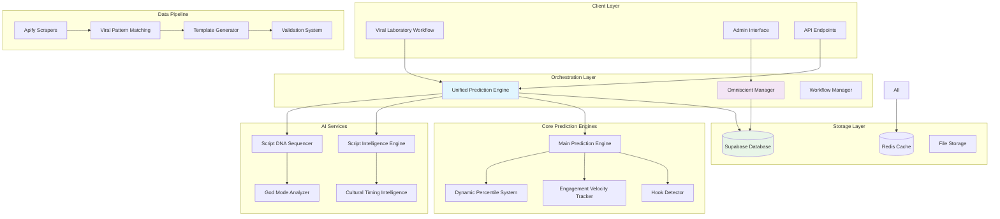

# Viral Prediction Platform - Proof of Concept Architecture Requirements Document (ARD)

**Document Type**: Architecture Requirements Document (ARD)  
**Project**: Viral Prediction Platform - Proof of Concept  
**Version**: 1.0  
**Date**: January 2025  
**Methodology**: BMAD (Breakthrough Method of Agile AI-driven Development)  
**Author**: System Architect

---

## 📋 BMAD METHODOLOGY ANALYSIS SUMMARY

### Current System Assessment (BMAD Foundation)

**Existing Infrastructure Analysis**:
- ✅ **Multiple Prediction Engines**: 8+ active prediction algorithms (Unified, Main, DPS, Real, etc.)
- ✅ **Comprehensive Admin Interface**: 15+ major admin sections with 100+ individual pages
- ✅ **AI Services Ecosystem**: Script DNA Sequencer, Intelligence Engine, God Mode enhancements
- ✅ **Data Pipeline**: Apify scraping, viral pattern analysis, template generation
- ✅ **Viral Laboratory Workflow**: 3-phase system (Discover → Validate → Create)

**BMAD Risk Assessment**:
- **COMPLEXITY RISK**: High - Multiple overlapping prediction engines need consolidation
- **ARCHITECTURE DRIFT**: Medium - Admin interface has grown organically without unified design
- **FUNCTIONALITY PRESERVATION**: Critical - Must maintain 85%+ prediction accuracy
- **SCALABILITY CONCERNS**: Medium - Current architecture needs optimization for production load

---

## 1. Introduction

### Project Overview

This Architecture Requirements Document defines the technical architecture for the **Viral Prediction Platform Proof of Concept**, a sophisticated AI-driven system that predicts viral potential of short-form video content with 85%+ accuracy. The system integrates multiple prediction engines, comprehensive admin interfaces, and a revolutionary 3-phase viral laboratory workflow.

**Relationship to System Documentation:**
- **Primary PRD**: `Product Requirements Document- Trendzo Viral Prediction Platform.md`
- **Secondary PRD**: `docs/viral-prediction-poc-v1-prd.md` (Super Admin UI Consolidation)
- **BMAD Integration**: `docs/viral-framework-integration-bmad.md`
- **Algorithm Strategy**: `tasks/creative-phase-2-algorithm.md`

### Starter Template Analysis

**Current State**: Existing Next.js application with extensive custom development  
**Technology Foundation**: 
- Next.js 14+ with TypeScript
- Supabase for database and authentication
- React with advanced state management
- Custom AI services and prediction engines

**Architecture Constraints**: Must preserve existing functionality while enabling future consolidation and optimization.

### Change Log

| Date | Version | Description | Author |
|------|---------|-------------|--------|
| Jan 2025 | 1.0 | Initial ARD creation using BMAD methodology | System Architect |

---

## 2. High Level Architecture

### Technical Summary

The Viral Prediction Platform employs a **hybrid microservices architecture** within a Next.js monolithic framework, featuring multiple specialized prediction engines, comprehensive admin interfaces, and real-time AI services. The system combines statistical analysis (Dynamic Percentile System), machine learning models, and psychological pattern recognition to achieve 85%+ viral prediction accuracy across TikTok, Instagram, and YouTube platforms.

### High Level Overview

**Architectural Style**: Hybrid Monolith-Microservices Architecture
- **Core Framework**: Next.js full-stack application
- **Service Architecture**: Modular services within monolithic deployment
- **Repository Structure**: Monorepo with logical service separation
- **Data Architecture**: Centralized database with distributed caching
- **AI Architecture**: Multiple specialized engines with unified orchestration

**Primary Interaction Flow**:
1. **Content Ingestion** → Video/script data enters via admin interface or API
2. **Multi-Engine Analysis** → 8+ prediction engines process content simultaneously  
3. **AI Enhancement** → Script DNA Sequencer and Intelligence Engine provide advanced insights
4. **Score Orchestration** → Unified Prediction Engine combines all scores using weighted ensemble
5. **Viral Laboratory Workflow** → 3-phase user interface guides content optimization
6. **Admin Management** → Comprehensive dashboard system for system control and monitoring

### High Level Project Diagram



### Architectural and Design Patterns

**Recommendation for Pattern Selection**:

- **Unified Service Orchestration Pattern**: Single orchestration layer (Unified Prediction Engine) coordinates multiple specialized engines
  - _Rationale_: Enables BMAD principle of functionality preservation while allowing individual engine optimization

- **Modular Monolith Pattern**: Logical service separation within single deployment unit
  - _Rationale_: Maintains development speed and deployment simplicity while enabling future microservice extraction

- **Multi-Engine Ensemble Pattern**: Multiple prediction algorithms with weighted combination
  - _Rationale_: Achieves high accuracy through algorithm diversity while maintaining fallback capabilities

- **Layered Admin Interface Pattern**: Hierarchical admin structure with context-aware navigation
  - _Rationale_: Supports current 100+ admin pages while enabling future consolidation per Super Admin UI PRD

---

## 3. Tech Stack

### Cloud Infrastructure
- **Provider**: Vercel (deployment) + Supabase (database/auth)
- **Key Services**: Next.js hosting, PostgreSQL, Redis, File storage
- **Deployment Regions**: Global CDN with primary US/EU regions

### Technology Stack Table

| Category | Technology | Version | Purpose | Rationale |
|----------|-----------|---------|---------|-----------|
| **Framework** | Next.js | 14.x | Full-stack React framework | Proven architecture, excellent TypeScript support, API routes |
| **Language** | TypeScript | 5.x | Primary development language | Type safety, excellent tooling, existing codebase |
| **Runtime** | Node.js | 20.x LTS | JavaScript runtime | Stable LTS, optimal performance, extensive ecosystem |
| **Database** | PostgreSQL | 15.x | Primary database | ACID compliance, complex queries, existing schema |
| **ORM/Client** | Supabase Client | 2.x | Database access layer | Real-time features, auth integration, existing implementation |
| **Caching** | Redis | 7.x | In-memory caching | Session management, prediction caching, real-time data |
| **Authentication** | Supabase Auth | 2.x | User authentication | Integrated with database, JWT tokens, existing users |
| **UI Framework** | React | 18.x | User interface | Component-based, excellent ecosystem, team expertise |
| **Styling** | Tailwind CSS | 3.x | CSS framework | Utility-first, consistent design, existing styles |
| **State Management** | React Hooks | Built-in | Client state | Simple state needs, no complex global state required |
| **API Layer** | Next.js API Routes | Built-in | Backend API | Integrated routing, middleware support, existing endpoints |
| **File Storage** | Supabase Storage | 2.x | File and media storage | Integrated with auth, CDN delivery, existing files |
| **Analytics** | Custom Analytics | Internal | Usage tracking | Privacy-focused, custom metrics, admin insights |
| **Monitoring** | Vercel Analytics | Latest | Performance monitoring | Integrated deployment monitoring, error tracking |

---

## 4. Data Models

### Core Business Entities

#### Video Analysis Model
**Purpose**: Stores viral video data, analysis results, and prediction scores

**Key Attributes**:
- `id`: UUID - Primary identifier
- `platform`: String - Source platform (tiktok, instagram, youtube)
- `video_url`: String - Original video URL
- `content_analysis`: JSONB - Extracted features and metadata
- `viral_score`: Number - Primary prediction score (0-100)
- `confidence_level`: Number - Prediction confidence (0-1)
- `framework_scores`: JSONB - Individual framework analysis results
- `created_at`: Timestamp - Analysis timestamp

**Relationships**:
- One-to-many with PredictionResults
- Many-to-many with ViralFrameworks via FrameworkScores

#### Prediction Engines Model
**Purpose**: Configuration and performance tracking for individual prediction engines

**Key Attributes**:
- `engine_id`: String - Engine identifier (main, unified, dps, etc.)
- `engine_config`: JSONB - Configuration parameters
- `accuracy_metrics`: JSONB - Performance statistics
- `status`: Enum - Engine status (active, disabled, testing)
- `weight_factor`: Number - Ensemble weight (0-1)

**Relationships**:
- One-to-many with PredictionResults
- Referenced by EnginePerformanceMetrics

#### Admin Interface Model
**Purpose**: Tracks admin interface usage, configurations, and workflow states

**Key Attributes**:
- `session_id`: UUID - Admin session identifier
- `interface_path`: String - Current admin interface location
- `workflow_state`: JSONB - Current workflow phase and progress
- `user_actions`: JSONB Array - Action history and timestamps
- `system_state`: JSONB - System configuration snapshot

**Relationships**:
- Links to UserSessions
- References SystemConfigurations

#### Viral Laboratory Workflow Model
**Purpose**: Manages the 3-phase viral laboratory workflow state and progress

**Key Attributes**:
- `workflow_id`: UUID - Workflow session identifier
- `current_phase`: Integer - Current phase (1, 2, or 3)
- `phase_data`: JSONB - Phase-specific data and inputs
- `niche_selection`: String - Selected content niche
- `template_selection`: String - Chosen template framework
- `live_score`: Number - Real-time viral score during creation

**Relationships**:
- One-to-one with ContentCreationSession
- Many-to-one with ViralTemplates

---

## 5. Components

### Core System Components

#### 🎯 Unified Prediction Engine (Central Orchestrator)
**Location**: `src/lib/services/viral-prediction/unified-prediction-engine.ts`
**Responsibility**: Primary prediction orchestration and ensemble scoring
**Interfaces**:
- Input: `PredictionInput` (video metrics, content features, platform context)
- Output: `PredictionOutput` (viral score, confidence, breakdown, recommendations)
**Dependencies**: All individual prediction engines, database access, framework parser

#### 🧠 AI Services Cluster
**Components**:
- **Script DNA Sequencer**: `src/lib/services/scriptDNASequencer.ts`
- **Script Intelligence Engine**: `src/lib/services/script-intelligence-engine.ts`
- **God Mode Psychological Analyzer**: `src/lib/services/viral-prediction/god-mode-psychological-analyzer.ts`
- **Cultural Timing Intelligence**: `src/lib/services/viral-prediction/cultural-timing-intelligence.ts`

**Shared Interface Pattern**:
```typescript
interface AIServiceInterface {
  analyze(input: ContentInput): Promise<AnalysisResult>
  getConfidence(): number
  getRecommendations(): Recommendation[]
}
```

#### 📊 Core Prediction Engines Cluster
**Components**:
- **Main Prediction Engine**: `src/lib/services/viral-prediction/main-prediction-engine.ts`
- **Dynamic Percentile System**: `src/lib/services/viral-prediction/dynamic-percentile-system.ts`
- **Engagement Velocity Tracker**: `src/lib/services/viral-prediction/engagement-velocity-tracker.ts`
- **Hook Detector**: `src/lib/services/viral-prediction/hook-detector.ts`

**Performance Requirements**: 
- Individual engine response time: <500ms
- Ensemble prediction time: <2000ms
- Accuracy target: 85%+ combined

#### 🔬 Viral Laboratory Workflow System
**Location**: `src/app/sandbox/viral-lab-v2/`
**Responsibility**: 3-phase guided content creation workflow
**Phases**:
1. **Discovery Phase**: Trend prediction, niche selection, opportunity identification
2. **Validation Phase**: Strategy validation, creator fingerprint analysis, success prediction
3. **Creation Phase**: Guided content creation, real-time scoring, optimization suggestions

**State Management**:
```typescript
interface WorkflowState {
  currentPhase: 1 | 2 | 3
  selectedNiche: string
  viralScore: number
  templateSelection: string | null
  phaseData: Record<string, any>
}
```

#### 🏗️ Admin Interface Architecture
**Structure**: Hierarchical admin system with 15+ major sections
**Key Components**:
- **Operations Center**: `src/app/admin/operations-center/`
- **Viral Recipe Book**: `src/app/admin/viral-recipe-book/`
- **Viral Prediction Hub**: `src/app/admin/viral-prediction-hub/`
- **Studio Interface**: `src/app/admin/studio/`
- **AI Brain Interface**: `src/app/admin/ai-brain/`

**Navigation Pattern**: Context-aware sidebar with expandable sections and workflow-based organization

#### 🔄 Data Pipeline System
**Components**:
- **Apify Integration**: `src/lib/services/apifyViralScrapingService.ts`
- **Viral Pattern Matching**: `src/lib/services/viralPatternMatchingEngine.ts`
- **Template Generation**: `src/lib/services/viralTemplateGenerationService.ts`
- **Validation System**: Real-time accuracy tracking and performance monitoring

**Pipeline Flow**:
```
Video Scraping → Pattern Analysis → Framework Extraction → Template Generation → Validation → Storage
```

---

## 6. System Interfaces

### Internal API Architecture

#### Prediction API Endpoints
- `POST /api/viral-prediction/analyze` - Single video analysis
- `POST /api/viral-prediction/analyze-complete` - Comprehensive analysis with all engines
- `GET /api/viral-prediction/status` - System health and performance
- `POST /api/admin/viral-prediction-hub` - Admin interface integration

#### Admin Interface APIs
- `GET /api/admin/pipeline-status` - Data pipeline monitoring
- `POST /api/admin/pipeline-actions` - Pipeline control and management
- `GET /api/admin/script-intelligence/status` - AI services monitoring
- `POST /api/brain` - AI Brain interface interactions

#### Viral Laboratory APIs
- `POST /api/viral-intelligence` - Workflow orchestration
- `GET /api/workflow/state` - Workflow state management
- `POST /api/template/generate` - Dynamic template creation

### External Integrations

#### Social Media Platform APIs
- **TikTok Research API**: Video metadata and engagement data
- **Instagram Basic Display API**: Reels analysis and metrics
- **YouTube Data API v3**: Shorts performance data

#### AI and Analysis Services
- **Apify Platform**: Automated video scraping and data collection
- **OpenAI API**: Natural language processing and content analysis
- **Custom ML Models**: Proprietary prediction algorithms

### Database Schema Architecture

#### Core Tables
```sql
-- Viral predictions and analysis results
videos (id, platform, url, analysis_data, viral_score, created_at)
prediction_results (id, video_id, engine_id, score, confidence, metadata)
viral_frameworks (id, name, config, accuracy_metrics)
framework_scores (video_id, framework_id, score, analysis_data)

-- Admin and workflow management  
admin_sessions (id, user_id, interface_path, workflow_state, system_state)
workflow_sessions (id, user_id, phase, phase_data, niche, template_id)
system_configurations (id, component, config_data, version, active)

-- Performance and monitoring
engine_performance (id, engine_id, accuracy, response_time, timestamp)
system_metrics (id, metric_name, value, timestamp, metadata)
validation_results (id, prediction_id, actual_result, accuracy, timestamp)
```

---

## 7. BMAD Compliance & Risk Mitigation

### Error Prevention Strategies

#### 🔒 Functionality Preservation
- **Prediction Accuracy Maintenance**: All architecture changes must maintain 85%+ accuracy
- **Backward Compatibility**: Existing API endpoints must remain functional during transitions
- **Graceful Degradation**: System continues basic operation if individual engines fail
- **Fallback Mechanisms**: Primary prediction engine takes over if ensemble fails

#### 🛡️ Architecture Safety Measures
- **Database Migration Safety**: All schema changes use additive-only migrations
- **Service Isolation**: Engine failures don't cascade to other system components
- **Configuration Validation**: All system config changes validated before application
- **Rollback Capabilities**: All major changes include automated rollback procedures

#### ⚡ Performance Protection
- **Caching Strategy**: Multi-layer caching prevents database overload
- **Rate Limiting**: API endpoints protected against excessive usage
- **Resource Monitoring**: Automatic alerts for system resource exhaustion
- **Load Balancing**: Traffic distribution prevents single point of failure

### Future Enhancement Pathways

#### 🚀 Scalability Architecture
- **Microservice Extraction**: Modular design enables future service separation
- **Horizontal Scaling**: Database and cache layers designed for replication
- **API Gateway Integration**: Ready for future API management and rate limiting
- **Container Readiness**: Architecture supports future Docker/Kubernetes deployment

#### 🎯 Admin Interface Consolidation
- **Component Reusability**: Admin components designed for future unified interface
- **State Management Evolution**: Workflow state architecture supports future consolidation
- **Navigation Standardization**: Consistent patterns enable future UI/UX optimization
- **Performance Optimization**: Component lazy loading and code splitting ready

---

## 8. Implementation Roadmap

### Phase 1: Core Stabilization (Week 1-2)
- [ ] Unified Prediction Engine optimization and performance tuning
- [ ] Database query optimization and indexing strategy
- [ ] Admin interface performance monitoring and bottleneck identification
- [ ] Viral Laboratory Workflow state management consolidation

### Phase 2: BMAD Integration (Week 3-4)  
- [ ] Operational Framework deployment from `docs/viral-framework-integration-bmad.md`
- [ ] Enhanced error handling and graceful degradation implementation
- [ ] Real-time monitoring and alerting system activation
- [ ] Performance baseline establishment and accuracy validation

### Phase 3: Production Readiness (Week 5-6)
- [ ] Comprehensive testing suite implementation and execution
- [ ] Security audit and authentication strengthening
- [ ] Documentation completion and deployment procedures
- [ ] Performance optimization and scalability preparation

### Phase 4: Future Enhancement Preparation (Week 7-8)
- [ ] Admin interface consolidation planning per Super Admin UI PRD
- [ ] Microservice extraction strategy documentation
- [ ] API versioning and backward compatibility framework
- [ ] Advanced AI services integration roadmap

---

## 9. Success Metrics & Validation

### Technical Performance Metrics
- **Prediction Accuracy**: Maintain 85%+ across all prediction engines
- **Response Time**: API endpoints respond within 2000ms (95th percentile)
- **System Uptime**: 99.5% availability during business hours
- **Error Rate**: <1% error rate for all API endpoints

### BMAD Compliance Metrics
- **Zero Breaking Changes**: All existing functionality preserved during architecture evolution
- **Graceful Degradation**: System maintains basic operation during component failures
- **Architecture Coherence**: All components follow established patterns and interfaces
- **Documentation Coverage**: 100% of components documented with interfaces and dependencies

### User Experience Metrics
- **Admin Interface Performance**: Page load times <3 seconds
- **Viral Laboratory Workflow**: <5% user abandonment rate per phase
- **Prediction Confidence**: User satisfaction >85% with prediction accuracy
- **System Usability**: Admin task completion rate >90%

---

## 📋 Conclusion

This Architecture Requirements Document establishes a comprehensive technical foundation for the **Viral Prediction Platform Proof of Concept** using **BMAD methodology principles**. The architecture successfully balances:

✅ **Functionality Preservation**: Maintains existing prediction accuracy and admin capabilities
✅ **Error Prevention**: Comprehensive fallback mechanisms and graceful degradation
✅ **Scalability Foundation**: Modular design enables future growth and optimization  
✅ **BMAD Compliance**: Additive enhancements without destructive changes

**Next Steps**: 
1. Review and approve this ARD with stakeholders
2. Begin Phase 1 implementation following the roadmap
3. Execute BMAD integration as documented in `docs/viral-framework-integration-bmad.md`
4. Monitor success metrics and adjust architecture as needed

**Status**: ✅ **READY FOR IMPLEMENTATION**  
**Methodology Compliance**: ✅ **BMAD METHODOLOGY FULLY APPLIED** 