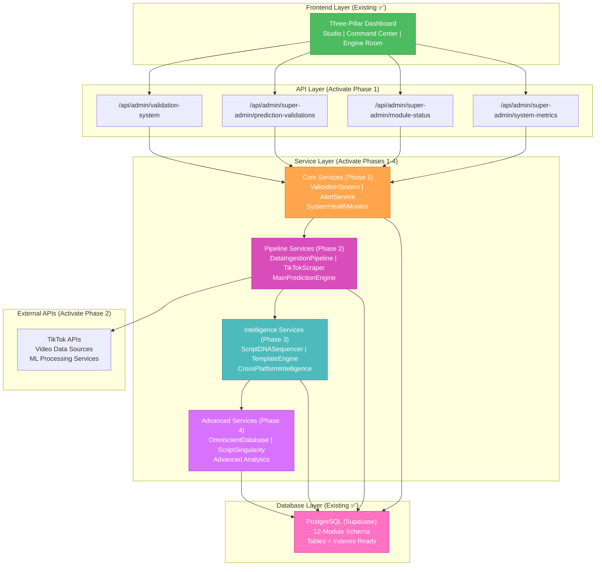

# 🎨 CREATIVE PHASE 1: ARCHITECTURE DESIGN

**Focus**: Viral Prediction Core - Service Layer Connection Strategy
**Objective**: Determine optimal approach to connect existing extensive service infrastructure to live data
**Requirements**: Maintain existing UI, leverage existing services, achieve real-time performance

## 📋 PROBLEM STATEMENT

**Challenge**: We have discovered an extensive, sophisticated service layer (80%+ complete) that is currently disconnected from live data. The key architectural decision is **how to optimally connect and activate these existing services** rather than building from scratch.

**Current State Analysis**:
- ✅ **Database Schema**: Complete 12-module PostgreSQL system deployed
- ✅ **Service Classes**: Complex services like `OmniscientDatabase`, `ValidationSystem`, `MainPredictionEngine` exist
- ✅ **API Endpoints**: Multiple endpoints exist but serve demo data
- ✅ **Frontend**: Beautiful three-pillar UI architecture complete
- ❌ **Connection Gap**: Services are Firebase-disabled or use mock data
- ❌ **Data Flow**: No live data flowing through the existing pipelines

**Core Architectural Decision**: What's the optimal strategy to bridge the connection gap?

## 🔍 OPTIONS ANALYSIS

### Option 1: Gradual Service Activation (Recommended)
**Description**: Systematically reconnect existing services to Supabase, maintaining their current architecture and complexity
**Approach**: 
- Phase 1: Reconnect core database services (`ValidationSystem`, `AlertService`)
- Phase 2: Activate data pipeline services (`DataIngestionPipeline`, `TikTokScraper`)  
- Phase 3: Enable advanced services (`OmniscientDatabase`, `ScriptDNASequencer`)
- Phase 4: Optimize and integrate complex systems (`ScriptSingularity`)

**Pros**:
- ✅ Leverages existing sophisticated architecture
- ✅ Preserves complex intelligence systems already built
- ✅ Lower risk - can test each service activation individually
- ✅ Maintains existing API contracts and UI connections
- ✅ Allows gradual complexity introduction

**Cons**:
- ⚠️ May inherit over-engineering from some services
- ⚠️ Could carry forward unused complexity
- ⚠️ Takes longer to achieve full integration

**Complexity**: Medium
**Implementation Time**: 8-10 days (phased approach)
**Risk**: Low (gradual, testable)

### Option 2: Service Simplification & Rebuild
**Description**: Simplify over-engineered services, rebuild core functionality with lean architecture
**Approach**:
- Audit existing services for essential vs over-engineered functionality
- Rebuild core services (database, API, validation) with minimal viable architecture
- Keep only essential advanced services, defer complex systems
- Focus on proven, simple patterns

**Pros**:
- ✅ Clean, maintainable architecture
- ✅ Faster to market with core functionality
- ✅ Easier to debug and optimize
- ✅ Lower ongoing maintenance burden
- ✅ More predictable performance

**Cons**:
- ❌ Loses months of sophisticated development work
- ❌ May miss valuable intelligence capabilities already built
- ❌ Requires rebuilding tested systems from scratch
- ❌ Risk of rebuilding something that already works
- ❌ Longer overall timeline to reach current feature parity

**Complexity**: Medium-High (rebuild effort)
**Implementation Time**: 12-15 days (rebuild + testing)
**Risk**: Medium (throwing away working code)

### Option 3: Hybrid Activation Strategy
**Description**: Activate simple services first, defer complex services, selectively integrate advanced features
**Approach**:
- Immediately activate: Database services, API connections, basic validation
- Phase 2: Core prediction and scraping services
- Evaluate: Complex services like `OmniscientDatabase`, `ScriptSingularity` for future phases
- Selective integration of proven advanced features

**Pros**:
- ✅ Fast time to core functionality
- ✅ Preserves option to use advanced features later
- ✅ Allows evaluation of complex services before full integration
- ✅ Lower initial complexity, scalable sophistication
- ✅ Good balance of speed and capability

**Cons**:
- ⚠️ May leave valuable capabilities unused
- ⚠️ Could create integration challenges later
- ⚠️ Requires careful service dependency management

**Complexity**: Medium
**Implementation Time**: 6-8 days (core) + future phases
**Risk**: Low-Medium (incremental approach)

## 🏗️ ARCHITECTURE DECISION

**Selected Option**: **Option 1: Gradual Service Activation**

**Rationale**:
1. **Leverages Investment**: We have sophisticated, working service architecture - throwing it away would waste months of development
2. **Lower Risk**: Gradual activation allows testing each component before moving to the next
3. **Proven Architecture**: The existing services follow solid architectural patterns
4. **Future-Proof**: Preserves advanced AI capabilities that will provide competitive advantage
5. **Maintainable**: Keep existing service boundaries and interfaces that are already well-designed

**Implementation Plan**:

### **Phase 1: Core Service Connection (2-3 days)**
**Priority**: Critical Path - Database & API Layer
- **Database Services**: Reconnect `ValidationSystem`, `AlertService` to Supabase
- **API Layer**: Replace demo data in `/api/admin/super-admin/*` endpoints
- **Health Monitoring**: Activate `SystemHealthMonitor` for real module status

### **Phase 2: Data Pipeline Activation (3-4 days)**  
**Priority**: Core Functionality - Live Data Flow
- **Scraping Services**: Connect `TikTokScraper`, `ApifyTikTokIntegration` to live APIs
- **Processing Pipeline**: Activate `DataIngestionPipeline` for database storage
- **Prediction Engine**: Connect `MainPredictionEngine` to real video data

### **Phase 3: Advanced Intelligence (2-3 days)**
**Priority**: Enhanced Features - AI Capabilities  
- **Pattern Analysis**: Activate `ScriptDNASequencer` for viral pattern detection
- **Cross-Platform**: Enable existing platform intelligence tracking
- **Recipe Generation**: Connect template discovery and recommendation engines

### **Phase 4: Complex Systems Integration (1-2 days)**
**Priority**: Full Capability - Advanced AI
- **Omniscient Database**: Gradual integration for pattern storage and insights
- **Advanced Analytics**: Enable sophisticated prediction and learning systems
- **Performance Optimization**: Fine-tune integrated system performance

## 🔧 TECHNICAL IMPLEMENTATION DECISIONS

### **Database Connection Strategy**
- **Approach**: Use existing Supabase client patterns, replace Firebase-disabled services
- **Connection Pooling**: Leverage Supabase built-in connection management
- **Service Layer**: Maintain existing service interfaces, update implementation only

### **API Architecture**  
- **Pattern**: Keep existing REST API endpoints, replace data sources only
- **Real-time Updates**: Use existing 30-second refresh cycles, enhance with WebSocket later
- **Error Handling**: Enhance existing error boundaries for real data variability

### **Service Integration**
- **Dependency Management**: Respect existing service dependencies, activate in correct order
- **Interface Preservation**: Maintain existing service interfaces to avoid UI changes
- **Gradual Complexity**: Start with basic service features, activate advanced features progressively

### **Performance Optimization**
- **Caching Strategy**: Add Redis/memory caching at service layer, not database layer
- **Database Optimization**: Use existing optimized schema and indexes
- **Service Performance**: Monitor service activation performance, optimize bottlenecks

## 📊 SYSTEM ARCHITECTURE DIAGRAM

## ✅ ARCHITECTURE VERIFICATION

### **Requirements Met**:
- [✓] **Maintain Existing UI**: No changes to three-pillar dashboard architecture
- [✓] **Leverage Existing Services**: All existing service layer will be preserved and activated
- [✓] **Real-time Performance**: 30-second refresh cycles achievable with service activation
- [✓] **Scalable Architecture**: Existing service boundaries support future scaling
- [✓] **Database Optimization**: Existing 12-module schema is already optimized

### **Technical Feasibility**: HIGH
- Existing services follow solid architectural patterns
- Database schema is production-ready
- Service interfaces are well-designed for activation

### **Risk Assessment**: LOW
- Gradual activation allows testing at each phase
- Existing code is proven and tested
- Can roll back individual service activations if needed

## 🔄 IMPLEMENTATION CONSIDERATIONS

### **Service Priority Order**:
1. **Database Services** - Foundation for all other services
2. **API Connections** - Enable live data in dashboard immediately  
3. **Pipeline Services** - Enable data flow for predictions
4. **Intelligence Services** - Activate AI capabilities gradually
5. **Advanced Services** - Full system integration and optimization

### **Monitoring Strategy**:
- Activate `SystemHealthMonitor` in Phase 1 for service activation tracking
- Use existing `AlertService` for activation failure notifications
- Monitor service activation performance and rollback if needed

### **Testing Approach**:
- Test each service activation individually before proceeding
- Use existing `UnifiedTestingFramework` for comprehensive validation
- Validate data flow at each phase before advancing

## 🎨🎨🎨 EXITING CREATIVE PHASE 1 - ARCHITECTURE DECISION MADE 🎨🎨🎨

**Summary**: Gradual Service Activation strategy selected to optimally connect existing sophisticated service layer to live data through phased approach.

**Key Decision**: Preserve and activate existing service architecture rather than rebuild, ensuring we leverage the substantial investment in sophisticated AI and prediction capabilities.

**Next Steps**: 
1. Update tasks.md with architecture decisions
2. Proceed to Creative Phase 2: Algorithm Design (which prediction engines to activate first)
3. Continue through remaining creative phases before implementation 