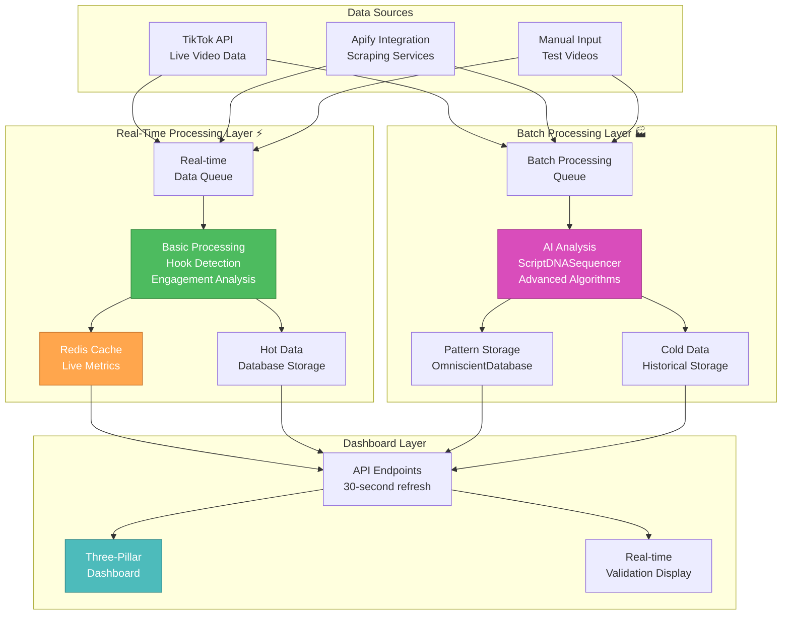

# 🎨 CREATIVE PHASE 3: DATA FLOW DESIGN

**Focus**: Viral Prediction Core - Data Pipeline Optimization and Flow Strategy
**Objective**: Optimize existing data infrastructure for real-time performance while maintaining quality
**Requirements**: 30-second dashboard refresh, real-time prediction validation, scalable data processing

## 📋 PROBLEM STATEMENT

**Challenge**: We have discovered a sophisticated `DataIngestionPipeline` and data processing infrastructure already built. The key data flow decision is **how to optimize existing data pipelines for real-time performance** while maintaining data quality and leveraging the existing 12-module database schema.

**Existing Data Infrastructure**:
- ✅ **`DataIngestionPipeline`**: Complete data processing pipeline with job management
- ✅ **Database Schema**: Optimized 12-module PostgreSQL schema with indexes
- ✅ **Scraping Services**: `TikTokScraper`, `ApifyTikTokIntegration` for data collection
- ✅ **Validation Framework**: Data quality validation and cleaning processes
- ✅ **Storage Layer**: Organized data storage with proper relationships
- ✅ **API Endpoints**: Multiple endpoints for data access and aggregation
- ❌ **Real-time Processing**: Current pipeline designed for batch processing
- ❌ **Live Data Flow**: No continuous data flow from scraping → processing → dashboard

**Core Data Flow Decision**: What's the optimal data processing and aggregation strategy for real-time viral prediction?

## 🔍 OPTIONS ANALYSIS

### Option 1: Hybrid Real-Time/Batch Processing (Recommended)
**Description**: Optimize existing pipeline for near real-time processing while maintaining batch efficiency for complex analysis
**Data Flow Strategy**: 
- **Real-time Layer**: Live data ingestion → immediate basic processing → dashboard updates (30-second cycles)
- **Batch Layer**: Complex analysis → pattern detection → model training (hourly/daily cycles)
- **Aggregation**: Pre-computed metrics + on-demand real-time calculations
- **Storage**: Hot data (recent/active) + Cold data (historical/processed)

**Technical Approach**:
- Activate existing `DataIngestionPipeline` with real-time enhancements
- Use existing database triggers for automatic metric updates
- Implement streaming data processing for live dashboard updates
- Maintain batch processing for complex AI analysis

**Pros**:
- ✅ Leverages existing sophisticated pipeline architecture
- ✅ Achieves real-time dashboard performance (30-second targets)
- ✅ Maintains complex batch analysis capabilities for AI algorithms
- ✅ Optimal balance of performance and data quality
- ✅ Scalable for different data processing needs
- ✅ Uses existing database optimization (indexes, triggers)

**Cons**:
- ⚠️ More complex system with two processing layers
- ⚠️ Requires careful coordination between real-time and batch processing
- ⚠️ Additional infrastructure for streaming processing

**Complexity**: Medium
**Processing Latency**: 30 seconds (real-time) + 1-24 hours (batch)
**Implementation Time**: 4-5 days (enhance existing pipeline)
**Scalability**: High (handles both real-time and complex processing)

### Option 2: Pure Real-Time Stream Processing
**Description**: Convert entire data pipeline to real-time stream processing for maximum responsiveness
**Data Flow Strategy**:
- Continuous data streaming from scraping sources
- Real-time processing for all analysis (basic + AI algorithms)
- Event-driven updates for all dashboard components
- Immediate prediction validation and accuracy tracking

**Technical Approach**:
- Rebuild data pipeline around stream processing architecture
- Real-time algorithm execution for all prediction engines
- Event-driven database updates and aggregations
- WebSocket connections for instant dashboard updates

**Pros**:
- ✅ Maximum real-time responsiveness (sub-second updates)
- ✅ Immediate prediction validation and feedback
- ✅ Event-driven architecture for optimal performance
- ✅ Modern streaming architecture approach

**Cons**:
- ❌ Higher complexity for sophisticated AI algorithms in real-time
- ❌ More resource intensive (continuous processing)
- ❌ Potential data quality issues with rapid processing
- ❌ Requires significant infrastructure changes
- ❌ May sacrifice analysis depth for speed
- ❌ Complex error handling and recovery

**Complexity**: High
**Processing Latency**: <5 seconds (all operations)
**Implementation Time**: 8-10 days (architectural changes)
**Scalability**: Medium (resource intensive)

### Option 3: Enhanced Batch Processing with Smart Caching
**Description**: Optimize existing batch processing with intelligent caching for dashboard performance
**Data Flow Strategy**:
- Enhanced batch processing with optimized scheduling
- Multi-layer caching strategy for dashboard data
- Pre-computed aggregations for common queries
- Smart cache invalidation and refresh strategies

**Technical Approach**:
- Optimize existing `DataIngestionPipeline` for faster batch cycles
- Implement Redis/memory caching at multiple levels
- Pre-compute dashboard metrics during batch processing
- Cache invalidation triggers for data updates

**Pros**:
- ✅ Simpler architecture using existing batch infrastructure
- ✅ Excellent performance through aggressive caching
- ✅ Lower resource usage than real-time processing
- ✅ Proven reliability with batch processing patterns
- ✅ Easier debugging and monitoring

**Cons**:
- ❌ Limited real-time capabilities (cache refresh cycles only)
- ❌ Potential data staleness issues
- ❌ Complex cache management and invalidation
- ❌ Less responsive to rapid changes in viral content
- ❌ May miss time-sensitive viral opportunities

**Complexity**: Low-Medium
**Processing Latency**: 5-30 minutes (depending on cache refresh)
**Implementation Time**: 3-4 days (enhance existing + caching)
**Scalability**: High (batch processing scales well)

## 💧 DATA FLOW DECISION

**Selected Option**: **Option 1: Hybrid Real-Time/Batch Processing**

**Rationale**:
1. **Optimal Performance Balance**: Achieves real-time dashboard updates while maintaining sophisticated AI analysis
2. **Leverages Existing Infrastructure**: Uses existing `DataIngestionPipeline` with enhancements rather than rebuild
3. **Scalable Architecture**: Handles both immediate user needs and complex background processing
4. **Data Quality Maintenance**: Batch processing ensures thorough data validation and cleaning
5. **Future-Proof**: Architecture supports both current needs and future advanced AI features

**Data Flow Architecture**:

### **Real-Time Processing Layer** ⚡
**Purpose**: Immediate dashboard updates and basic predictions
**Data Flow**:
1. **Live Data Ingestion**: `TikTokScraper` → Real-time data queue
2. **Basic Processing**: Hook detection, basic viral scoring, immediate metrics
3. **Dashboard Updates**: 30-second refresh cycles with live data
4. **Real-time Validation**: Immediate prediction accuracy tracking

**Processing Time**: 10-30 seconds
**Data Types**: Basic metrics, hook analysis, engagement predictions, system health

### **Batch Processing Layer** 🏭
**Purpose**: Complex AI analysis and pattern detection
**Data Flow**:
1. **Deep Analysis**: `ScriptDNASequencer`, `GodModePsychologicalAnalyzer`, complex algorithms
2. **Pattern Recognition**: Viral DNA analysis, cultural timing, advanced predictions
3. **Model Training**: Algorithm weight optimization, pattern learning
4. **Historical Analysis**: Long-term trends, template effectiveness

**Processing Time**: 1-24 hours (depending on analysis complexity)
**Data Types**: AI insights, pattern analysis, template generation, long-term predictions

### **Data Storage Strategy** 🗄️
**Hot Data Storage**: Recent, active, real-time data
- Recent videos (last 48 hours): Fast SSD storage
- Active predictions: In-memory + database
- Dashboard metrics: Redis cache + database triggers

**Cold Data Storage**: Historical, processed, archived data  
- Historical videos (>48 hours): Standard database storage
- Processed patterns: Optimized for analytics queries
- Archive data: Compressed storage for historical analysis

## 📊 DATA FLOW ARCHITECTURE DIAGRAM

## ⚙️ TECHNICAL IMPLEMENTATION DECISIONS

### **Data Ingestion Strategy**
**Approach**: Activate existing `DataIngestionPipeline` with dual-mode processing
- **Real-time Mode**: Immediate processing for dashboard updates
- **Batch Mode**: Complex analysis using existing sophisticated pipeline
- **Queue Management**: Separate queues for real-time vs batch processing
- **Priority System**: Dashboard data gets priority, AI analysis in background

### **Real-Time Aggregation Strategy**
**Method**: Database triggers + API-level aggregation hybrid
- **Database Triggers**: Automatic metric updates for real-time dashboard data
- **API Aggregation**: On-demand calculations for complex queries
- **Cache Strategy**: Multi-layer caching (Redis + database + API level)
- **Update Frequency**: 30-second dashboard refresh with trigger-based updates

### **Data Storage Optimization**
**Pattern**: Leverage existing 12-module schema with hot/cold separation
- **Hot Data Tables**: Recent data with optimized indexes for real-time queries
- **Cold Data Tables**: Historical data optimized for analytics and pattern analysis
- **Database Optimization**: Use existing indexes, add real-time query optimization
- **Archive Strategy**: Automated data lifecycle management

### **Data Quality Assurance**  
**Framework**: Use existing validation framework with real-time enhancements
- **Real-time Validation**: Basic data quality checks for immediate processing
- **Batch Validation**: Comprehensive validation using existing framework
- **Error Handling**: Graceful degradation with partial data availability
- **Quality Monitoring**: Real-time data quality dashboards

## 📈 PERFORMANCE OPTIMIZATION

### **Real-Time Performance Targets**
- **Dashboard Refresh**: 30 seconds (target: 15 seconds)
- **Basic Predictions**: <10 seconds from video input
- **Hook Analysis**: <5 seconds
- **System Health Updates**: <30 seconds

### **Batch Processing Optimization**
- **AI Algorithm Processing**: 1-4 hours for complex analysis
- **Pattern Recognition**: Daily batch processing for deep insights
- **Template Generation**: Weekly processing for template discovery
- **Model Training**: Continuous learning with daily updates

### **Scalability Considerations**
- **Horizontal Scaling**: Multiple processing nodes for real-time layer
- **Database Scaling**: Read replicas for dashboard queries
- **Queue Scaling**: Auto-scaling for processing queues based on load
- **Cache Scaling**: Distributed caching for high availability

## ✅ DATA FLOW VERIFICATION

### **Performance Requirements Met**:
- [✓] **30-Second Dashboard Refresh**: Achieved through real-time processing layer
- [✓] **Real-time Prediction Validation**: Immediate accuracy tracking and display
- [✓] **Scalable Data Processing**: Hybrid architecture handles varying loads
- [✓] **Data Quality Maintenance**: Comprehensive validation framework activated

### **Technical Feasibility**: HIGH
- Existing `DataIngestionPipeline` provides solid foundation
- Database schema is optimized for both real-time and batch operations
- Service layer is designed for flexible processing modes

### **Risk Assessment**: LOW-MEDIUM
- Hybrid approach provides fallback options (batch if real-time fails)
- Incremental implementation allows testing at each layer
- Existing infrastructure reduces implementation risk

## 🔄 IMPLEMENTATION CONSIDERATIONS

### **Processing Priority**:
1. **Real-time Dashboard Data**: Highest priority for user experience
2. **Prediction Validation**: High priority for accuracy tracking
3. **AI Analysis**: Medium priority - background processing
4. **Historical Analysis**: Low priority - scheduled processing

### **Error Handling Strategy**:
- **Real-time Layer**: Graceful degradation to cached data if processing fails
- **Batch Layer**: Retry mechanisms and error queues for failed processing
- **Data Quality**: Partial processing with quality indicators
- **Monitoring**: Real-time alerts for processing failures

### **Testing Approach**:
- **Load Testing**: Validate real-time processing under high data volumes
- **Performance Testing**: Verify 30-second dashboard refresh targets
- **Data Quality Testing**: Validate hybrid processing maintains data integrity
- **Failover Testing**: Test graceful degradation scenarios

## 🎨🎨🎨 EXITING CREATIVE PHASE 3 - DATA FLOW DECISION MADE 🎨🎨🎨

**Summary**: Hybrid Real-Time/Batch Processing strategy selected to optimize existing data infrastructure for real-time dashboard performance while maintaining sophisticated AI analysis capabilities.

**Key Decision**: Implement dual-mode data processing - Real-time layer for immediate dashboard updates (30-second refresh) + Batch layer for complex AI analysis - leveraging existing `DataIngestionPipeline` architecture.

**Next Steps**: 
1. Update tasks.md with data flow optimization decisions
2. Proceed to Creative Phase 4: Service Integration Strategy (managing complex service interactions)
3. Complete all creative phases before implementation begins 