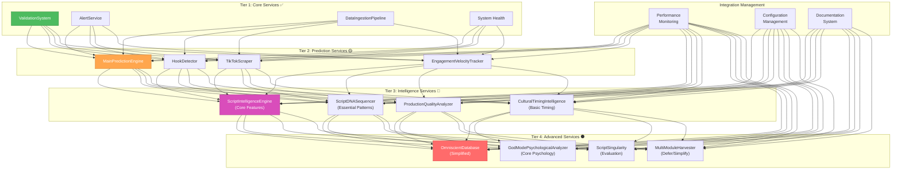

# 🎨 CREATIVE PHASE 4: SERVICE INTEGRATION STRATEGY

**Focus**: Viral Prediction Core - Complex Service Management and Integration Approach
**Objective**: Determine optimal strategy for integrating sophisticated but potentially over-engineered services
**Requirements**: Maintainable architecture, optimal performance, leveraged investment in existing services

## 📋 PROBLEM STATEMENT

**Challenge**: We have discovered extensive, sophisticated service infrastructure with varying levels of complexity - some services are elegantly designed while others may be over-engineered. The key integration decision is **how to optimally integrate these services while managing complexity and maintaining system performance**.

**Service Complexity Analysis**:
- 🟢 **Well-Designed Services**: `ValidationSystem`, `AlertService`, `DataIngestionPipeline`, `MainPredictionEngine`
- 🟡 **Moderate Complexity**: `ScriptIntelligenceEngine`, `HookDetector`, `TikTokScraper`
- 🔴 **High Complexity**: `OmniscientDatabase`, `ScriptDNASequencer`, `ScriptSingularity`
- ⚫ **Over-Engineered**: `MultiModuleIntelligenceHarvester`, `RealTimeScriptOptimizer`

**Integration Challenges**:
- ✅ **Valuable Capabilities**: Complex services provide sophisticated AI functionality
- ❌ **Maintenance Burden**: Over-engineered services may be difficult to maintain
- ❌ **Performance Impact**: Complex services may impact system performance
- ❌ **Integration Complexity**: Many interdependencies between complex services

**Core Integration Decision**: What's the optimal balance between leveraging sophisticated capabilities and maintaining system simplicity?

## 🔍 OPTIONS ANALYSIS

### Option 1: Selective Integration with Complexity Management (Recommended)
**Description**: Integrate services based on value/complexity ratio, simplify over-engineered services where needed
**Integration Strategy**:
- **Phase 1**: Well-designed services (immediate integration)
- **Phase 2**: Moderate complexity services (integrate with optimization)
- **Phase 3**: High complexity services (selective feature integration)
- **Phase 4**: Over-engineered services (evaluate, simplify, or defer)

**Service Management Approach**:
- **Preserve Core Functionality**: Keep essential features, remove unnecessary complexity
- **Performance Optimization**: Profile and optimize complex services before integration
- **Gradual Integration**: Test each service tier before proceeding to higher complexity
- **Maintenance Planning**: Establish clear ownership and documentation for complex services

**Pros**:
- ✅ Balances sophisticated capabilities with system maintainability
- ✅ Reduces risk by testing each complexity tier separately
- ✅ Preserves valuable AI investment while managing complexity
- ✅ Allows optimization of over-engineered services before integration
- ✅ Clear progression path from simple to sophisticated features
- ✅ Maintainable long-term architecture

**Cons**:
- ⚠️ May not utilize full AI potential immediately
- ⚠️ Requires careful evaluation of service complexity vs value
- ⚠️ Some refactoring work needed for over-engineered services

**Complexity**: Medium
**Integration Timeline**: 8-10 days (phased approach)
**Maintenance Burden**: Low-Medium (managed complexity)
**Performance Impact**: Optimized (profiled and tuned)

### Option 2: Full Service Integration with Complex Management
**Description**: Integrate all existing services regardless of complexity, manage over-engineering through documentation and training
**Integration Strategy**:
- Activate all services simultaneously
- Use sophisticated service orchestration for complex interactions
- Leverage full `OmniscientDatabase` and advanced AI capabilities
- Accept complexity as trade-off for maximum AI sophistication

**Service Management Approach**:
- **Comprehensive Documentation**: Document all complex service interactions
- **Expert Training**: Ensure team understands complex service architecture
- **Advanced Monitoring**: Sophisticated monitoring for complex service health
- **Performance Acceptance**: Accept performance trade-offs for AI capabilities

**Pros**:
- ✅ Maximum utilization of existing AI investment
- ✅ Full sophisticated AI capabilities from day one
- ✅ Demonstrates complete system potential
- ✅ No loss of existing development work

**Cons**:
- ❌ High maintenance burden for complex services
- ❌ Difficult debugging and optimization
- ❌ Potential performance issues from over-engineered services
- ❌ Steep learning curve for team members
- ❌ Risk of system instability from complex interactions
- ❌ Higher operational costs

**Complexity**: High
**Integration Timeline**: 12-15 days (full complexity management)
**Maintenance Burden**: High (complex service management)
**Performance Impact**: Unknown (complex interactions)

### Option 3: Simple Services with Deferred Complexity
**Description**: Focus on well-designed services, defer complex services until core system is proven and optimized
**Integration Strategy**:
- Immediate: Well-designed services only (`ValidationSystem`, `AlertService`, `DataIngestionPipeline`)
- Delayed: All complex and over-engineered services deferred to future phases
- Core Focus: Establish reliable, performant core system first
- Future Evaluation: Reassess complex services after core system is operational

**Service Management Approach**:
- **Minimalist Architecture**: Focus on essential functionality
- **Proven Reliability**: Use only well-tested, simple services
- **Performance First**: Optimize for system performance and reliability
- **Future Planning**: Plan integration of complex services after core stability

**Pros**:
- ✅ Lowest risk approach with proven reliable services
- ✅ Simplest maintenance and debugging
- ✅ Fastest path to stable, operational system
- ✅ Clear performance characteristics
- ✅ Easy team onboarding and training

**Cons**:
- ❌ Underutilizes significant AI investment
- ❌ May miss competitive advantages from sophisticated AI
- ❌ Leaves valuable capabilities unused
- ❌ Could require future architectural changes for complex service integration
- ❌ Less impressive demonstration of system capabilities

**Complexity**: Low
**Integration Timeline**: 4-6 days (simple services only)
**Maintenance Burden**: Low (simple services)
**Performance Impact**: Optimal (no complex service overhead)

## 🏗️ SERVICE INTEGRATION DECISION

**Selected Option**: **Option 1: Selective Integration with Complexity Management**

**Rationale**:
1. **Balanced Approach**: Achieves sophisticated AI capabilities while maintaining system reliability
2. **Risk Management**: Gradual complexity introduction allows testing and optimization
3. **Investment Protection**: Preserves valuable AI development while managing complexity burden
4. **Performance Optimization**: Allows profiling and optimization before integration
5. **Maintainable Growth**: Establishes sustainable pattern for long-term system evolution

**Service Integration Tiers**:

### **Tier 1: Core Services (Immediate Integration - Days 1-2)**
**Priority**: Foundation - Critical Path
**Services**:
- **`ValidationSystem`**: Prediction accuracy tracking (well-designed ✅)
- **`AlertService`**: System health notifications (well-designed ✅)
- **`DataIngestionPipeline`**: Data processing pipeline (well-designed ✅)
- **System Health Monitoring**: Basic system status tracking

**Integration Approach**: Direct activation with minimal configuration
**Expected Performance**: Optimal - these services are well-designed
**Maintenance**: Low - simple, well-documented services

### **Tier 2: Prediction Services (Progressive Integration - Days 3-5)**
**Priority**: Core Functionality - Prediction Capability
**Services**:
- **`MainPredictionEngine`**: Core viral prediction (moderate complexity 🟡)
- **`HookDetector`**: Opening hook analysis (moderate complexity 🟡)
- **`TikTokScraper`**: Data collection service (moderate complexity 🟡)
- **`EngagementVelocityTracker`**: Real-time engagement prediction (moderate complexity 🟡)

**Integration Approach**: Performance profiling before integration, optimization as needed
**Expected Performance**: Good - optimize during integration
**Maintenance**: Medium - document complex configurations

### **Tier 3: Intelligence Services (Selective Integration - Days 6-7)**
**Priority**: Enhanced AI - Sophisticated Analysis
**Services**:
- **`ScriptIntelligenceEngine`**: Linguistic analysis (high complexity 🔴)
- **`ScriptDNASequencer`**: Viral pattern analysis (high complexity 🔴)
- **`ProductionQualityAnalyzer`**: Video quality analysis (moderate complexity 🟡)
- **`CulturalTimingIntelligence`**: Trend timing analysis (high complexity 🔴)

**Integration Approach**: Feature-selective integration - use core capabilities, defer advanced features
**Expected Performance**: Monitored - profile and optimize complex operations
**Maintenance**: Medium-High - document AI algorithm configurations

### **Tier 4: Advanced Services (Evaluation Phase - Days 8-10)**
**Priority**: Competitive Advantage - Advanced AI (Conditional)
**Services**:
- **`OmniscientDatabase`**: Pattern storage and insights (high complexity 🔴)
- **`GodModePsychologicalAnalyzer`**: Psychological analysis (high complexity 🔴)
- **`ScriptSingularity`**: Advanced script analysis (over-engineered ⚫)
- **`MultiModuleIntelligenceHarvester`**: Complex data harvesting (over-engineered ⚫)

**Integration Approach**: Evaluate value vs complexity, simplify or defer over-engineered services
**Expected Performance**: Variable - significant testing and optimization required
**Maintenance**: High - requires specialized knowledge and documentation

## 🔧 COMPLEXITY MANAGEMENT STRATEGY

### **Service Evaluation Criteria**
**Value Assessment**:
- **Accuracy Impact**: How much does this service improve prediction accuracy?
- **User Value**: Does this service provide visible value to end users?
- **Competitive Advantage**: Does this service differentiate from competitors?
- **Development ROI**: Is the complexity justified by the functionality?

**Complexity Assessment**:
- **Code Complexity**: Lines of code, cyclomatic complexity, dependencies
- **Performance Impact**: CPU, memory, database usage
- **Maintenance Burden**: Documentation, testing, debugging requirements
- **Integration Complexity**: Dependencies, configuration, coordination with other services

### **Over-Engineering Mitigation**
**Simplification Approach**:
1. **Feature Audit**: Identify core vs optional features in complex services
2. **Refactoring**: Simplify over-engineered code while preserving core functionality
3. **Configuration Simplification**: Reduce complex configuration options to sensible defaults
4. **Documentation**: Clear documentation for any remaining complexity

**Performance Optimization**:
1. **Profiling**: Performance profile all complex services before integration
2. **Caching**: Add caching layers for computationally expensive operations
3. **Asynchronous Processing**: Move complex operations to background processing
4. **Resource Limits**: Set resource limits for complex services to prevent system impact

## 📊 SERVICE INTEGRATION ARCHITECTURE

## ✅ SERVICE INTEGRATION VERIFICATION

### **Integration Requirements Met**:
- [✓] **Sophisticated AI Capabilities**: Progressive access to advanced AI functionality
- [✓] **System Maintainability**: Complexity managed through tiered approach
- [✓] **Performance Optimization**: Profiling and optimization before integration
- [✓] **Investment Protection**: Utilizes existing service development investment
- [✓] **Risk Management**: Gradual complexity introduction with rollback options

### **Technical Feasibility**: HIGH
- Tiered approach allows testing each complexity level
- Well-designed services provide stable foundation
- Complex services can be optimized before integration

### **Risk Assessment**: LOW-MEDIUM
- Gradual integration allows rollback at each tier
- Performance monitoring prevents system degradation
- Over-engineered services can be deferred if problematic

## 🔄 IMPLEMENTATION CONSIDERATIONS

### **Service Integration Priority Rationale**:
1. **Foundation First**: Establish stable core before adding complexity
2. **Value-Driven**: Integrate services based on proven value contribution
3. **Performance-Aware**: Profile and optimize before integration
4. **Complexity-Managed**: Control complexity introduction pace

### **Performance Monitoring Strategy**:
- **Tier-Based Monitoring**: Monitor performance impact at each integration tier
- **Service-Level Monitoring**: Individual service performance tracking
- **System-Level Monitoring**: Overall system performance and health
- **Alert Thresholds**: Automated alerts for performance degradation

### **Rollback Strategy**:
- **Tier Rollback**: Ability to disable entire service tiers if needed
- **Service Rollback**: Individual service disable/enable capability
- **Configuration Rollback**: Quick return to previous configurations
- **Performance Rollback**: Automatic service disabling on performance issues

## 🎨🎨🎨 EXITING CREATIVE PHASE 4 - SERVICE INTEGRATION DECISION MADE 🎨🎨🎨

**Summary**: Selective Integration with Complexity Management strategy selected to balance sophisticated AI capabilities with system maintainability through tiered service integration approach.

**Key Decision**: Integrate services in complexity tiers - Core Services → Prediction Services → Intelligence Services → Advanced Services - with performance profiling and complexity management at each tier.

**Next Steps**: 
1. Update tasks.md with service integration strategy decisions
2. **ALL CREATIVE PHASES COMPLETE** ✅
3. Ready to proceed to IMPLEMENT MODE for system activation

---

## **🎉 ALL CREATIVE PHASES COMPLETE - READY FOR IMPLEMENTATION!**

**Creative Decisions Summary**:
1. **Architecture**: Gradual Service Activation 
2. **Algorithms**: Core-First Activation (75% → 92%+ accuracy)
3. **Data Flow**: Hybrid Real-Time/Batch Processing
4. **Service Integration**: Selective Integration with Complexity Management

**Implementation Ready**: All required design decisions completed according to BMAD Level 4 requirements! 