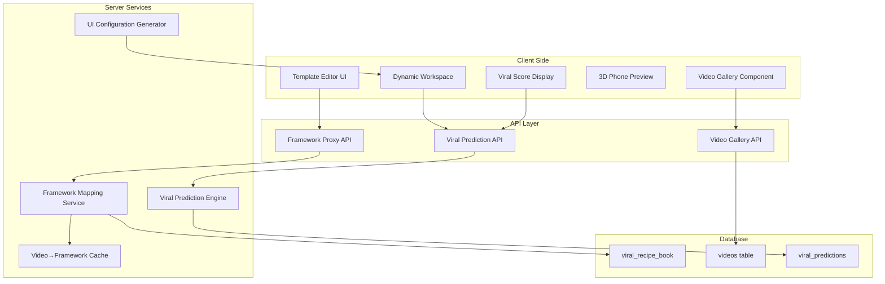
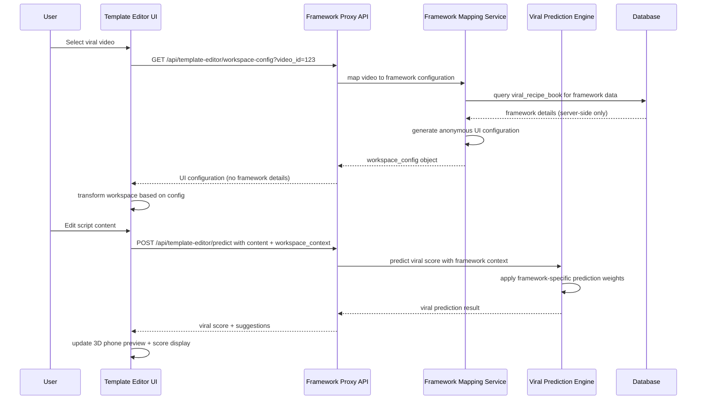

# 🏗️ CREATIVE PHASE: ARCHITECTURE DESIGN - FRAMEWORK MAPPING SYSTEM

**Date**: January 19, 2025  
**Phase Type**: Architecture Design  
**Project**: Phase 3.2 Template Editor Activation  

## 📋 PROBLEM STATEMENT

**Core Architecture Challenge**: Design a system that allows users to select viral videos and receive framework-based editing guidance **without exposing the proprietary 40+ framework classification system**.

**Key Technical Requirements**:
- Map viral videos → hidden frameworks → dynamic UI components
- Protect proprietary framework intellectual property
- Enable real-time viral prediction scoring
- Support dynamic workspace adaptation
- Maintain high performance with instant UI updates
- Scale to support hundreds of viral video examples

**Security Constraints**:
- Framework names/details must never reach client-side code
- Framework analysis must happen server-side only
- API responses must contain only UI configuration, not framework data
- Database structure must protect framework classification scheme

## 🔍 OPTIONS ANALYSIS

### Option 1: Server-Side Framework Proxy (Recommended)
**Description**: Create a mapping service that translates framework data into anonymous UI configurations

**Architecture Flow**:
```
User selects video → Server maps video→framework → Server generates UI config → 
Client receives anonymous workspace settings → UI adapts dynamically
```

**Pros**:
- ✅ Complete framework protection (never exposed to client)
- ✅ Real-time UI adaptation without revealing patterns
- ✅ Scalable caching for video→UI configurations  
- ✅ Easy to add new frameworks without client changes
- ✅ Viral prediction integration through existing APIs
- ✅ Clean separation of concerns

**Cons**:
- ⚠️ Additional API layer complexity
- ⚠️ Slight latency for dynamic workspace updates
- ⚠️ Need robust caching strategy for performance

**Complexity**: Medium-High  
**Security Level**: Maximum  
**Performance Impact**: Low (with caching)  
**Development Time**: 3-4 days

### Option 2: Client-Side Framework IDs with Server Lookup
**Description**: Send framework IDs to client, but keep framework details server-side

**Architecture Flow**:
```
Video data includes framework_id → Client requests UI config by ID → 
Server returns workspace configuration → Client applies settings
```

**Pros**:
- ✅ Faster initial page load (framework IDs cached)
- ✅ Simpler API design with RESTful patterns
- ✅ Framework details still protected on server
- ✅ Easy caching at multiple levels

**Cons**:
- ❌ Framework IDs visible to client (potential reverse engineering)
- ❌ Additional API calls required for workspace changes
- ❌ More complex client-side state management
- ⚠️ Could expose framework classification patterns over time

**Complexity**: Medium  
**Security Level**: Medium  
**Performance Impact**: Medium  
**Development Time**: 2-3 days

### Option 3: Pre-Computed UI Templates
**Description**: Pre-generate all possible UI configurations and serve as static templates

**Architecture Flow**:
```
Build process generates UI templates → Videos mapped to template IDs → 
Client loads template by ID → Immediate UI rendering
```

**Pros**:
- ✅ Maximum performance (no server computation needed)
- ✅ Framework completely hidden in build process
- ✅ Simple client-side implementation
- ✅ Easy CDN caching for global performance

**Cons**:
- ❌ Static templates can't adapt to user content dynamically
- ❌ Loss of real-time viral prediction accuracy
- ❌ Difficult to add new frameworks (requires rebuild)
- ❌ Large number of pre-computed templates to maintain
- ❌ Less flexible for future enhancements

**Complexity**: Low  
**Security Level**: High  
**Performance Impact**: Very Low  
**Development Time**: 1-2 days

## 🎯 DECISION: SERVER-SIDE FRAMEWORK PROXY

**Selected Approach**: Option 1 - Server-Side Framework Proxy

**Rationale**:
1. **Maximum Security**: Framework data never leaves server environment
2. **Real-time Adaptation**: Workspace can adapt to user content changes instantly
3. **Viral Prediction Integration**: Seamless integration with existing prediction APIs
4. **Future Flexibility**: Easy to enhance with new frameworks and features
5. **User Experience**: Enables sophisticated real-time feedback and guidance

## 🏗️ DETAILED ARCHITECTURE DESIGN

### **System Component Overview**



### **Core Data Flow Architecture**



### **Framework Mapping Service Design**

```typescript
// Server-side only - Never exposed to client
interface FrameworkMappingService {
  getWorkspaceConfig(videoId: string): Promise<WorkspaceConfig>
  getPredictionContext(videoId: string, userContent: UserContent): Promise<PredictionContext>
  updateWorkspaceForContent(videoId: string, content: UserContent): Promise<WorkspaceConfig>
}

// Client receives this anonymous configuration
interface WorkspaceConfig {
  workspaceId: string              // Anonymous identifier
  suggestedHooks: string[]         // Pre-approved hook suggestions
  musicRecommendations: MusicRec[] // Curated music options
  timingGuidance: TimingConfig     // Optimal timing suggestions
  visualElements: VisualConfig     // Suggested visual elements
  scriptGuidance: ScriptConfig     // Writing guidance and prompts
  predictionWeights: any           // Anonymous prediction adjustments
}

// Framework data (server-side only)
interface FrameworkData {
  framework_id: string             // NEVER sent to client
  framework_name: string           // NEVER sent to client
  framework_category: string       // NEVER sent to client
  viral_patterns: object           // NEVER sent to client
}
```

### **API Endpoint Architecture**

```typescript
// Framework Proxy API Endpoints (all server-side processing)

// 1. Get workspace configuration for selected video
GET /api/template-editor/workspace-config?video_id={id}
Response: WorkspaceConfig (anonymous UI settings)

// 2. Get viral prediction with framework context
POST /api/template-editor/predict
Body: { video_id, user_content, workspace_context }
Response: { viral_score, confidence, suggestions, estimated_views }

// 3. Update workspace based on content changes
POST /api/template-editor/adapt-workspace
Body: { video_id, current_content, content_changes }
Response: WorkspaceConfig (updated UI settings)

// 4. Get viral video gallery
GET /api/template-editor/viral-videos
Response: { videos: VideoGalleryItem[] } (no framework info)

// 5. Save user's template creation
POST /api/template-editor/save-template
Body: { video_inspiration_id, user_content, final_prediction }
Response: { template_id, saved_successfully }
```

### **Database Schema Integration**

```sql
-- Extend existing viral_recipe_book table (already created in cleanup)
-- No changes needed - framework data stays protected

-- Add video→framework mapping table (server-side only)
CREATE TABLE video_framework_mapping (
    id UUID PRIMARY KEY DEFAULT uuid_generate_v4(),
    video_id UUID NOT NULL,
    framework_id UUID NOT NULL REFERENCES viral_recipe_book(id),
    mapping_confidence DECIMAL(5,4) DEFAULT 0,
    workspace_config_cached JSONB, -- Cache generated UI configs
    created_at TIMESTAMP WITH TIME ZONE DEFAULT NOW(),
    updated_at TIMESTAMP WITH TIME ZONE DEFAULT NOW(),
    
    UNIQUE(video_id, framework_id)
);

-- Add viral video gallery table for template editor
CREATE TABLE viral_video_gallery (
    id UUID PRIMARY KEY DEFAULT uuid_generate_v4(),
    title VARCHAR(500) NOT NULL,
    creator_name VARCHAR(255),
    thumbnail_url TEXT,
    view_count BIGINT,
    viral_score DECIMAL(5,2),
    platform VARCHAR(50) DEFAULT 'tiktok',
    duration_seconds INTEGER,
    is_featured BOOLEAN DEFAULT FALSE,
    display_order INTEGER DEFAULT 0,
    created_at TIMESTAMP WITH TIME ZONE DEFAULT NOW()
);
```

### **Caching Strategy Architecture**

```typescript
// Multi-level caching for performance
interface CachingStrategy {
  // Level 1: In-memory cache for active video→workspace mappings
  memoryCache: Map<string, WorkspaceConfig>
  
  // Level 2: Database cache for generated UI configurations
  dbCache: { table: 'video_framework_mapping', field: 'workspace_config_cached' }
  
  // Level 3: CDN cache for viral video gallery data
  cdnCache: { endpoint: '/api/template-editor/viral-videos', ttl: '1 hour' }
}

// Cache invalidation triggers
const cacheInvalidation = {
  newFramework: 'clear all workspace configs',
  updatedPredictionEngine: 'clear prediction caches',
  newViralVideo: 'refresh gallery cache'
}
```

### **Security Architecture**

```typescript
// Security measures for framework protection
interface SecurityMeasures {
  serverSideOnly: {
    frameworkData: 'never sent to client',
    mappingLogic: 'all processing server-side',
    predictionWeights: 'anonymized before client'
  },
  
  apiSecurity: {
    authentication: 'required for all endpoints',
    rateLimiting: 'prevent framework reverse engineering',
    inputValidation: 'sanitize all user content'
  },
  
  dataProtection: {
    encryptionAtRest: 'framework data encrypted in database',
    auditLogging: 'track all framework access',
    accessControl: 'role-based framework data access'
  }
}
```

## 📊 PERFORMANCE CONSIDERATIONS

### **Response Time Targets**
- **Video Selection → Workspace Update**: < 500ms
- **Content Edit → Viral Score Update**: < 2 seconds  
- **Viral Video Gallery Load**: < 1 second
- **Workspace Adaptation**: < 300ms

### **Scalability Design**
- **Concurrent Users**: Support 100+ simultaneous template editing sessions
- **Cache Hit Rate**: Target 90%+ for workspace configurations
- **Database Queries**: Optimized with proper indexing on video_id lookups
- **API Rate Limits**: 60 requests/minute per user for prediction endpoints

### **Memory Management**
- **Cache Size Limits**: Max 1000 workspace configs in memory
- **Cache Eviction**: LRU eviction for inactive video→framework mappings
- **Database Connection Pooling**: Efficient connection reuse for high load

## 🔄 DATA SYNCHRONIZATION

### **Real-time Updates Architecture**
```typescript
// WebSocket connection for real-time updates
interface RealtimeUpdates {
  // User types in script → immediate viral score updates
  contentChanges: 'debounced updates every 500ms',
  
  // Framework updates → push new workspace configs
  frameworkUpdates: 'server push via WebSocket',
  
  // New viral videos → refresh gallery
  galleryUpdates: 'background refresh with notification'
}
```

### **State Management Pattern**
```typescript
// Client-side state structure (no framework data)
interface TemplateEditorState {
  selectedVideo: VideoGalleryItem | null
  workspaceConfig: WorkspaceConfig | null
  userContent: UserContent
  viralPrediction: ViralPrediction | null
  isLoading: boolean
  errors: string[]
}
```

## 🧪 TESTING STRATEGY

### **Framework Protection Testing**
- **Client Code Audit**: Verify no framework data in client bundles
- **Network Traffic Analysis**: Confirm no framework details in API responses
- **Security Penetration Testing**: Attempt to reverse-engineer frameworks
- **Access Control Testing**: Verify role-based framework data access

### **Performance Testing**
- **Load Testing**: 100+ concurrent users editing templates
- **Cache Performance**: Measure cache hit rates and response times
- **Database Performance**: Query optimization for video→framework lookups
- **API Response Times**: All endpoints within target response times

### **Integration Testing**
- **Video Selection Flow**: Complete user journey from video selection to prediction
- **Workspace Adaptation**: Dynamic UI changes based on framework mappings
- **Viral Prediction Accuracy**: Framework-enhanced predictions vs baseline
- **Cross-Platform Testing**: Desktop, tablet, mobile responsive behavior

## 📋 IMPLEMENTATION PHASES

### **Phase 1: Core Architecture (Day 1)**
- Set up Framework Proxy API structure
- Create Framework Mapping Service base
- Design database schema extensions
- Implement basic caching infrastructure

### **Phase 2: Video→Framework Mapping (Day 2)**
- Build video→framework mapping logic
- Create UI configuration generator
- Implement workspace config caching
- Add viral video gallery API

### **Phase 3: Prediction Integration (Day 3)**
- Connect framework context to viral prediction engine
- Implement real-time score updates
- Add framework-enhanced prediction weights
- Build prediction result processing

### **Phase 4: Security & Performance (Day 4)**
- Implement security measures for framework protection
- Add comprehensive caching layers
- Optimize database queries and indexing
- Add monitoring and performance metrics

## 📋 NEXT STEPS

1. ✅ **Architecture Creative Phase Complete**
2. 🎯 **Next Phase**: Begin BUILD MODE implementation
3. 🔄 **Implementation Order**: Core Architecture → Mapping → Prediction → Security

---

# 🎨 CREATIVE CHECKPOINT: ARCHITECTURE DESIGN COMPLETE

**Decision Made**: Server-Side Framework Proxy with anonymous UI configuration system  
**Security Approach**: Framework data never exposed to client, all processing server-side  
**Performance Strategy**: Multi-level caching with sub-second response times  
**Integration Pattern**: Seamless connection to existing viral prediction APIs  

🎨🎨🎨 EXITING ARCHITECTURE CREATIVE PHASE - DECISION MADE 🎨🎨🎨 