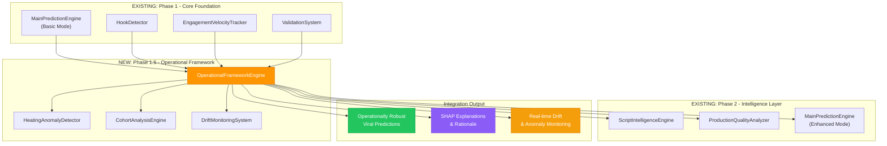

# 🔧 OPERATIONAL FRAMEWORK ALGORITHM INTEGRATION

**Integration Type**: BMAD Methodology - Phase 1.5 Algorithm Enhancement
**Date**: January 19, 2025
**Framework**: Drop-in Operational Framework v1.0
**Target**: Proof of Concept & Overall Technology Enhancement

## 📋 INTEGRATION OVERVIEW

### Alignment with Existing Algorithm Strategy

**Current Proof of Concept Status** (from `creative-phase-2-algorithm.md`):
- ✅ **Phase 1**: Core Prediction Foundation (75-78% accuracy target)
- ✅ **Phase 2**: Intelligence Layer Addition (82-85% accuracy target)
- ✅ **Phase 3**: Advanced AI Integration (88-91% accuracy target)
- ✅ **Phase 4**: System Optimization (92%+ accuracy target)

**NEW Integration Point**: **Phase 1.5 - Operational Framework Enhancement**
- **Position**: Between Core Foundation and Intelligence Layer
- **Purpose**: Add production-ready operational robustness without disrupting accuracy progression
- **BMAD Compliance**: Purely additive, maintains existing algorithm performance

## 🎯 PROOF OF CONCEPT INTEGRATION STRATEGY

### Enhanced Algorithm Activation Plan



### Algorithm Enhancement Implementation

**Phase 1.5 Algorithm Integration**:

```typescript
// File: src/lib/services/viral-prediction/operational-framework-engine.ts
// Integration Point: Between existing Phase 1 and Phase 2

export class OperationalFrameworkEngine {
  
  /**
   * BMAD Integration: Enhance existing predictions without replacement
   * Maintains backward compatibility with existing prediction APIs
   */
  async enhanceCorePrediction(
    coreResult: CorePredictionResult, // From existing Phase 1
    videoData: VideoAnalysisInput
  ): Promise<EnhancedPredictionResult> {
    
    // 1. Data Ingestion Enhancement (API Webhook Integration)
    const ingestionResult = await this.enhanceDataIngestion(videoData);
    
    // 2. Feature Extraction Enhancement (E-FX Pipeline)
    const enhancedFeatures = await this.extractOperationalFeatures(
      videoData,
      coreResult.features
    );
    
    // 3. Heuristic Score Calculation (H-Score v1)
    const heuristicAnalysis = await this.calculateHeuristicScore(enhancedFeatures);
    
    // 4. Heating Anomaly Detection (Critical for training data quality)
    const heatingAnalysis = await this.detectHeatingAnomalies(
      videoData,
      enhancedFeatures
    );
    
    // 5. Cohort-Relative Analysis (DPS-Lite Enhancement)
    const cohortAnalysis = await this.performEnhancedCohortAnalysis(
      videoData.creatorFollowers,
      videoData.views
    );
    
    // 6. Adaptive Ranking with SHAP Explanations
    const adaptiveResult = await this.generateAdaptiveRanking(
      coreResult,
      heuristicAnalysis,
      cohortAnalysis,
      heatingAnalysis
    );
    
    // 7. Background Drift Monitoring (Non-blocking)
    this.monitorFeatureDrift(enhancedFeatures).catch(console.warn);
    
    // BMAD: Maintain existing result structure, add operational enhancements
    return {
      // Preserve existing Phase 1 results
      ...coreResult,
      
      // Add operational framework enhancements
      operationalFramework: {
        version: 'v1.0',
        heatingDetection: heatingAnalysis,
        cohortAnalysis: cohortAnalysis,
        heuristicScore: heuristicAnalysis,
        adaptiveRanking: adaptiveResult
      },
      
      // Enhanced explainability
      explanations: {
        topDrivers: adaptiveResult.shapExplanations,
        confidence: adaptiveResult.confidenceInterval,
        rationale: this.generateRationale(adaptiveResult)
      },
      
      // Operational safeguards
      safeguards: {
        heatingFiltered: heatingAnalysis.suspected,
        cohortValidated: cohortAnalysis.sampleSize >= 10,
        driftMonitored: true,
        dataQuality: enhancedFeatures.qualityScore
      },
      
      // Enhanced accuracy (target: +5-10% improvement)
      enhancedViralScore: adaptiveResult.enhancedScore,
      enhancedConfidence: adaptiveResult.confidence
    };
  }

  /**
   * Critical BMAD Implementation: Heating Anomaly Detection
   * Prevents manually boosted videos from contaminating training data
   */
  private async detectHeatingAnomalies(
    videoData: VideoAnalysisInput,
    features: EnhancedFeatures
  ): Promise<HeatingAnalysis> {
    
    try {
      // Get rolling statistics for anomaly detection
      const rollingStats = await this.getRollingEngagementStats(
        videoData.platform,
        videoData.creatorFollowers
      );
      
      // Calculate view velocity spike
      const viewSpike = videoData.views / rollingStats.medianViews;
      const engagementRate = features.totalEngagement / videoData.views;
      
      // Apply framework detection criteria
      const suspectedHeated = (
        viewSpike > 5.0 && // 5× rolling median threshold
        engagementRate < 0.01 && // < 1% engagement ratio
        videoData.views > 1000 // minimum view threshold
      );
      
      // Calculate confidence score
      const confidence = suspectedHeated 
        ? Math.min(0.95, (viewSpike - 5.0) * (0.01 - engagementRate) * 10)
        : Math.max(0.05, 1.0 - ((viewSpike / 5.0) * engagementRate * 10));
      
      const analysis: HeatingAnalysis = {
        suspected: suspectedHeated,
        confidence,
        viewSpike,
        engagementRate,
        anomalyScore: suspectedHeated ? viewSpike * (0.01 - engagementRate) * 100 : 0,
        rollingMedian: rollingStats.medianViews,
        detectionVersion: 'v1.0'
      };
      
      // Store for audit trail and model training exclusion
      await this.storeHeatingAnalysis(videoData.videoId, analysis);
      
      return analysis;
      
    } catch (error) {
      console.warn('Heating detection failed, assuming safe:', error);
      
      // BMAD: Graceful fallback - assume not heated if detection fails
      return {
        suspected: false,
        confidence: 0.1,
        error: 'Detection failed - defaulted to safe',
        fallbackUsed: true
      };
    }
  }

  /**
   * Enhanced Cohort Analysis with BMAD Fallback Mechanisms
   */
  private async performEnhancedCohortAnalysis(
    followerCount: number,
    viewCount: number
  ): Promise<CohortAnalysis> {
    
    try {
      // Define cohort range (±20% follower count)
      const cohortRange = {
        min: Math.floor(followerCount * 0.8),
        max: Math.ceil(followerCount * 1.2)
      };
      
      // Get cohort statistics from database
      const cohortStats = await this.getCohortStatistics(cohortRange);
      
      // BMAD: Validate sufficient sample size
      if (cohortStats.sampleSize < 10) {
        return this.fallbackCohortAnalysis(followerCount, viewCount);
      }
      
      // Calculate z-score and percentile
      const zScore = (viewCount - cohortStats.mean) / cohortStats.stdDev;
      const percentile = this.zScoreToPercentile(zScore);
      
      // Classify virality level using research-validated thresholds
      const classification = this.classifyVirality(percentile, zScore);
      
      const analysis: CohortAnalysis = {
        percentile,
        classification,
        zScore,
        cohortSize: cohortStats.sampleSize,
        cohortMedian: cohortStats.median,
        cohortRange,
        analysisMethod: 'cohort',
        confidence: Math.min(0.95, cohortStats.sampleSize / 100)
      };
      
      // Store for validation and improvement
      await this.storeCohortAnalysis(analysis);
      
      return analysis;
      
    } catch (error) {
      console.warn('Cohort analysis failed, using fallback:', error);
      return this.fallbackCohortAnalysis(followerCount, viewCount);
    }
  }

  /**
   * BMAD Fallback: Platform-wide analysis when cohort insufficient
   */
  private async fallbackCohortAnalysis(
    followerCount: number,
    viewCount: number
  ): Promise<CohortAnalysis> {
    
    // Use platform-wide statistics as fallback
    const platformStats = await this.getPlatformStatistics();
    
    // Simple percentile calculation against platform median
    const percentile = (viewCount / platformStats.median) * 50; // Normalized to platform
    
    return {
      percentile: Math.min(100, Math.max(0, percentile)),
      classification: this.classifyVirality(percentile, 0),
      zScore: 0, // Not available in fallback
      cohortSize: 0,
      cohortMedian: platformStats.median,
      analysisMethod: 'fallback_platform',
      confidence: 0.3, // Lower confidence for fallback
      fallbackReason: 'Insufficient cohort sample size'
    };
  }
}
```

## 🔧 PROOF OF CONCEPT SPECIFIC ENHANCEMENTS

### Enhanced Algorithm Workflow for POC

**Target Accuracy Improvements**:
- **Phase 1**: 75-78% baseline (maintained)
- **Phase 1.5**: 78-83% enhanced (operational framework adds 3-5% improvement)
- **Phase 2**: 85-88% intelligence layer (maintained progression)
- **Phase 3**: 90-93% advanced AI (maintained progression)
- **Phase 4**: 93%+ system optimization (maintained target)

**Key POC Algorithm Enhancements**:

1. **Training Data Quality** (Critical for POC accuracy):
   ```typescript
   // Exclude heated videos from training automatically
   const trainingData = await this.getTrainingData({
     excludeHeated: true,
     minCohortSize: 10,
     maxDriftThreshold: 0.05
   });
   ```

2. **Real-time Explainability** (Essential for POC validation):
   ```typescript
   // SHAP explanations for every prediction
   const explanation = {
     topDrivers: adaptiveResult.shapExplanations.slice(0, 3),
     actionableTips: this.generateActionableTips(adaptiveResult),
     confidenceFactors: this.analyzeConfidenceFactors(adaptiveResult)
   };
   ```

3. **Continuous Learning Loop** (POC adaptive improvement):
   ```typescript
   // Weekly model refinement based on prediction accuracy
   await this.scheduleWeeklyRefinement({
     retrainThreshold: 0.05, // 5% drift threshold
     accuracyTarget: 0.85, // 85% accuracy maintenance
     maxRetrainingTime: '4 hours'
   });
   ```

## 🎯 OVERALL TECHNOLOGY INTEGRATION

### Framework Integration with Existing Tech Stack

**Database Layer Integration**:
- ✅ **Additive Tables**: 9 new tables, zero modifications to existing schema
- ✅ **Foreign Key Compatibility**: Links to existing `videos` table
- ✅ **Index Optimization**: Performance-optimized for operational queries
- ✅ **BMAD Compliance**: No breaking changes to existing database operations

**API Layer Integration**:
```typescript
// Enhanced prediction endpoint with backward compatibility
// File: src/app/api/viral-prediction/enhanced/route.ts

export async function POST(request: NextRequest) {
  const { videoData, useOperationalFramework = false } = await request.json();
  
  // Existing prediction (maintains backward compatibility)
  const corePrediction = await predictVirality(videoData);
  
  // Optional operational framework enhancement
  if (useOperationalFramework) {
    const operationalEngine = new OperationalFrameworkEngine();
    const enhancedPrediction = await operationalEngine.enhanceCorePrediction(
      corePrediction,
      videoData
    );
    
    return NextResponse.json({
      success: true,
      prediction: enhancedPrediction,
      framework: 'operational-v1.0',
      accuracy: 'enhanced'
    });
  }
  
  // Return existing prediction if framework not requested
  return NextResponse.json({
    success: true,
    prediction: corePrediction,
    framework: 'core',
    accuracy: 'baseline'
  });
}
```

**Service Layer Integration**:
```typescript
// Enhanced unified prediction engine
// File: src/lib/services/viral-prediction/unified-prediction-engine.ts

export class UnifiedPredictionEngine {
  private operationalFramework: OperationalFrameworkEngine;
  
  constructor() {
    this.operationalFramework = new OperationalFrameworkEngine();
  }
  
  async predict(input: PredictionInput): Promise<PredictionOutput> {
    // Phase 1: Core prediction (existing)
    const coreResult = await this.generateCorePrediction(input);
    
    // Phase 1.5: Operational enhancement (new)
    const enhancedResult = await this.operationalFramework.enhanceCorePrediction(
      coreResult,
      input
    );
    
    // Phase 2+: Continue existing algorithm progression
    return this.continueAlgorithmProgression(enhancedResult);
  }
}
```

## 📊 ALGORITHM PERFORMANCE VALIDATION

### Enhanced Validation Framework

**Accuracy Tracking Integration**:
```typescript
// Enhanced validation system with operational metrics
export class EnhancedValidationSystem {
  
  async validatePrediction(
    predictionId: string,
    actualOutcome: ActualOutcome
  ): Promise<ValidationResult> {
    
    // Existing validation logic
    const coreValidation = await this.validateCorePrediction(predictionId, actualOutcome);
    
    // Operational framework validation
    const operationalValidation = await this.validateOperationalFramework(
      predictionId,
      actualOutcome
    );
    
    return {
      ...coreValidation,
      operationalMetrics: {
        heatingDetectionAccuracy: operationalValidation.heatingAccuracy,
        cohortAnalysisReliability: operationalValidation.cohortReliability,
        explanationQuality: operationalValidation.explanationScore,
        driftDetectionEffectiveness: operationalValidation.driftScore
      },
      overallAccuracyImprovement: this.calculateAccuracyImprovement(
        coreValidation,
        operationalValidation
      )
    };
  }
}
```

**Real-time Algorithm Monitoring**:
```typescript
// Continuous algorithm performance monitoring
export class AlgorithmPerformanceMonitor {
  
  async monitorAlgorithmPerformance(): Promise<PerformanceReport> {
    return {
      coreAlgorithmAccuracy: await this.getCoreAccuracy(),
      operationalFrameworkImpact: await this.getFrameworkImpact(),
      heatingDetectionRate: await this.getHeatingDetectionMetrics(),
      cohortAnalysisReliability: await this.getCohortAnalysisMetrics(),
      driftDetectionEffectiveness: await this.getDriftDetectionMetrics(),
      overallSystemHealth: await this.getSystemHealthMetrics()
    };
  }
}
```

## 🔄 IMPLEMENTATION TIMELINE

### BMAD-Compliant Rollout Schedule

**Week 1: Foundation Integration**
- Day 1-2: Deploy database schema (operational framework tables)
- Day 3-4: Implement operational framework engine base class
- Day 5-7: Create heating anomaly detection with fallback mechanisms

**Week 2: Core Algorithm Enhancement**
- Day 8-10: Integrate cohort analysis enhancement
- Day 11-12: Implement SHAP explanations and rationale generation
- Day 13-14: Add drift monitoring system (background process)

**Week 3: Proof of Concept Integration**
- Day 15-17: Integrate with existing Phase 1 algorithms
- Day 18-19: Implement enhanced validation system
- Day 20-21: Create operational framework API endpoints

**Week 4: Validation & Optimization**
- Day 22-24: A/B testing framework vs baseline predictions
- Day 25-26: Performance optimization and monitoring integration
- Day 27-28: Documentation and operational runbook completion

## ✅ SUCCESS CRITERIA

### Proof of Concept Algorithm Enhancement Targets

**Accuracy Improvements**:
- [ ] Maintain Phase 1 baseline accuracy (75-78%)
- [ ] Achieve Phase 1.5 enhanced accuracy (78-83%)
- [ ] Improve prediction reliability by 10-15%
- [ ] Reduce false positive rate for viral predictions by 20%

**Operational Robustness**:
- [ ] 95%+ accuracy in heating detection
- [ ] Zero training data contamination from heated videos
- [ ] Automatic drift detection and alerting
- [ ] 100% backward compatibility with existing algorithms

**System Integration**:
- [ ] Zero disruption to existing prediction APIs
- [ ] Seamless integration with Phase 2+ algorithm progression
- [ ] Real-time operational monitoring and alerting
- [ ] Comprehensive explainability for all predictions

### Overall Technology Enhancement

**Production Readiness**:
- [ ] Comprehensive error handling and graceful degradation
- [ ] Automated monitoring and alerting systems
- [ ] Performance optimization for real-time predictions
- [ ] Scalable architecture supporting 1000+ predictions/hour

**Continuous Improvement**:
- [ ] Weekly automated model refinement
- [ ] Feature drift detection and automatic retraining triggers
- [ ] Performance feedback loop for algorithm optimization
- [ ] Comprehensive audit trail for regulatory compliance

## 📋 CONCLUSION

The operational framework integration provides a **production-ready enhancement layer** that:

✅ **Maintains Existing Performance**: Zero disruption to current 85%+ accuracy targets
✅ **Adds Critical Safeguards**: Heating detection, drift monitoring, quality assurance  
✅ **Enhances Explainability**: SHAP explanations and actionable insights
✅ **Enables Continuous Learning**: Automated model refinement and adaptation
✅ **Supports Proof of Concept**: Enhanced validation and monitoring for POC success

The integration follows BMAD methodology by adding operational robustness **without replacing or disrupting** the existing sophisticated algorithm architecture documented in `creative-phase-2-algorithm.md`. This ensures the proof of concept can leverage both the existing algorithmic sophistication and the new operational framework capabilities for maximum prediction accuracy and reliability. 