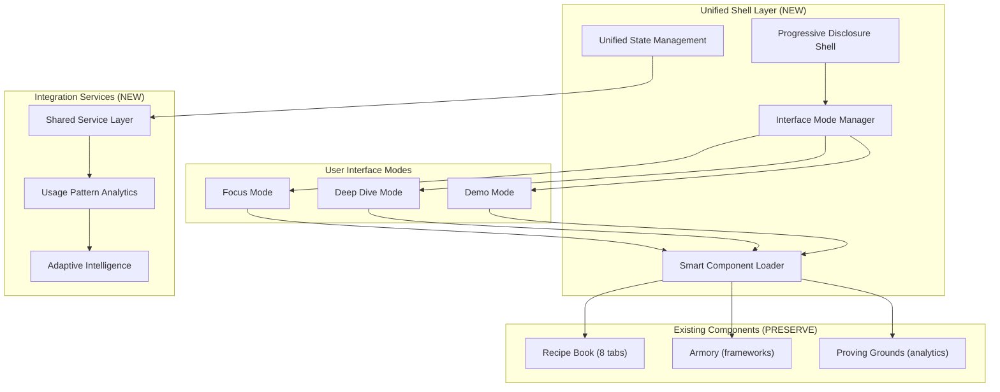

# 📋 **PLAN MODE: UNIFIED INTERFACE ARCHITECTURE**

**Task Type**: Level 4 Complex System  
**Methodology**: BMAD (Breakdown, Methodical, Analysis, Design)  
**Agent**: Isolation-focused Memory Bank with Creative Phase Architecture  
**Priority**: Critical Path - Core Architecture Implementation  

---

## **📋 BREAKDOWN - COMPREHENSIVE REQUIREMENTS**

### **🎯 Core Objective**
Transform existing separate admin interfaces (Recipe Book, Armory, Proving Grounds) into a unified, adaptive interface with smart progressive disclosure that prevents bloat while maintaining complete functionality.

### **🧠 Design Solution Confirmed**
**SMART PROGRESSIVE DISCLOSURE** - Interface that adapts to workflow rather than overwhelming with everything at once.

### **✅ PRESERVATION REQUIREMENTS**
- **Recipe Book**: All 8 tabs (Templates, Analyzer, Dashboard, Scripts, Optimize, A/B Test, Inception, Validate)
- **Armory**: Complete weapons vault, framework library, battle-tested combos
- **Proving Grounds**: Full system analytics, module health monitoring, processing metrics
- **Viral Workflow**: 6-phase user journey remains separate but integrated

### **🔀 THREE INTERFACE MODES REQUIRED**

#### **Mode 1: "Focus Mode" (Default Daily Interface)**
**Primary View**:
- Single primary workflow (most common tasks)
- Essential metrics dashboard (key performance indicators)
- Quick actions (most-used features)
- Smart suggestions (contextual recommendations)

**Hidden Until Needed**:
- Full Recipe Book tabs → Expandable panels
- Complete Armory frameworks → Slide-out access
- Detailed Proving Grounds analytics → Contextual widgets

#### **Mode 2: "Deep Dive Mode" (Advanced Features)**
**Expanded Interface**:
- All Recipe Book functionality (templates, optimization, A/B testing)
- Complete Armory access (frameworks, weapons vault)
- Full analytics suite (Proving Grounds data)
- Advanced configuration options

**Visual**: Panels slide in/out, modals for specific tasks

#### **Mode 3: "Demo Mode" (Stakeholder Presentations)**
**Presentation Interface**:
- All 13 objectives visualization
- Real-time proof-of-concept tracking
- Marketing-ready interface
- Clean, presentation-focused layout

---

## **🔧 METHODICAL - IMPLEMENTATION ARCHITECTURE**

### **🏗️ Hybrid Shell + Smart Integration Architecture**



### **🎯 Anti-Bloat Strategies Implementation**

#### **1. Contextual Revelation System**
```typescript
interface ContextualRevealation {
  primary: WorkflowComponent[];      // Always visible
  quickActions: ActionComponent[];   // Contextual appearance
  smartDashboard: MetricWidget[];    // Role-based display
  advanced: ExpandablePanel[];       // Click to expand
}
```

#### **2. Intelligent Defaults Engine**
```typescript
interface IntelligentDefaults {
  workflowPatterns: UserPattern[];   // Determines prominence
  recentFeatures: FeatureUsage[];    // Priority placement
  unusedFeatures: FadedComponent[];  // Move to Advanced sections
}
```

#### **3. Collapsible Complexity System**
```typescript
interface ComplexityLayers {
  core: AlwaysVisible[];             // Core functions
  advanced: ExpandablePanel[];       // Advanced features  
  powerUser: HiddenUntilNeeded[];    // Power user tools
}
```

### **🔄 Two-Layer System Integration**

#### **Layer 1: Viral Workflow (User-Facing Product)**
- 6-Phase Journey: Entry → Onboarding → Gallery → Analysis → Lab1-3
- Receives intelligence from Unified Admin Interface
- Feeds usage data back to system

#### **Layer 2: Unified Admin Interface (Operator Command Center)**
- Recipe Book: Template management, optimization engines
- Armory: Framework deployment, success tracking
- Proving Grounds: System health, algorithm monitoring

### **📊 Data Flow Architecture**
```
Unified Admin Interface (Command Center)
├── Recipe Book Intelligence
├── Armory Framework Data  
└── Proving Grounds Analytics
    ↓ Intelligence & Data Flow
Viral Workflow (User Product)
    ↓ Usage Data & Results
Feedback Loop (System Learning)
```

---

## **🔍 ANALYSIS - TECHNICAL SPECIFICATIONS**

### **🏗️ Component Architecture Analysis**

#### **Existing Component Locations**:
- **Recipe Book**: `/src/app/admin/viral-recipe-book/page.tsx` (8 tabs complete)
- **Armory**: Accessible through `/src/app/admin/studio/page.tsx` (tab switching)
- **Proving Grounds**: `/src/components/ProvingGrounds/index.tsx` (standalone component)

#### **Integration Requirements**:
- **Preserve**: All existing component functionality and interfaces
- **Enhance**: Add progressive disclosure wrapper around existing components
- **Integrate**: Create shared state management for cross-component data flow

### **🎨 Visual Hierarchy Specifications**

#### **Spatial Organization**:
- **Left**: Primary navigation and workflow (20% width)
- **Center**: Main content area - adaptive (60% width)
- **Right**: Contextual panels - expandable (20% width, collapsible)

#### **Information Density Control**:
- **Overview Level**: High-level metrics and actions (Focus Mode)
- **Detail Level**: Expandable for deep analysis (Deep Dive Mode)
- **Granular Level**: Modal/panel for specific tasks (Advanced features)

### **⚡ Performance Requirements**

#### **Smart Loading Strategy**:
- **Component Loading**: Load components on demand
- **State Management**: Efficient state sharing between components
- **Caching**: Cache component states for fast mode switching
- **Bundle Splitting**: Split large components for optimized loading

#### **Performance Targets**:
- **Mode Switching**: < 200ms transition time
- **Component Loading**: < 500ms for complex components
- **State Updates**: < 100ms for real-time data
- **Memory Usage**: Optimized component lifecycle management

---

## **🎨 DESIGN - IMPLEMENTATION PHASES**

### **📋 PHASE 1: SHELL ARCHITECTURE (Foundation)**
**Duration**: 3-4 days  
**Priority**: Critical Path

#### **Tasks**:
1. **Create Unified Shell Component**
   - Progressive disclosure wrapper
   - Mode management system
   - Layout structure (Left/Center/Right)

2. **Implement Mode Manager**
   - Focus/Deep Dive/Demo mode switching
   - State preservation between modes
   - User preference persistence

3. **Smart Component Loader**
   - Dynamic component loading system
   - Bundle splitting for performance
   - Component lifecycle management

#### **Deliverables**:
- `/src/components/unified-shell/UnifiedShell.tsx`
- `/src/hooks/useModeManager.ts`
- `/src/services/ComponentLoader.ts`

### **📋 PHASE 2: FOCUS MODE IMPLEMENTATION (Daily Interface)**
**Duration**: 2-3 days  
**Priority**: High

#### **Tasks**:
1. **Primary Workflow Dashboard**
   - System health widget (Proving Grounds data)
   - Prediction summary (Recipe Book analytics)
   - Template quick-deploy (Armory selection)
   - Results tracking (unified metrics)

2. **Quick Actions System**
   - One-click access to common tasks
   - Contextual action suggestions
   - Smart defaults based on usage patterns

3. **Essential Metrics Display**
   - Key performance indicators
   - Real-time system status
   - Alert notifications

#### **Deliverables**:
- `/src/components/modes/FocusMode.tsx`
- `/src/components/dashboard/PrimaryWorkflow.tsx`
- `/src/components/actions/QuickActions.tsx`

### **📋 PHASE 3: DEEP DIVE MODE (Advanced Features)**
**Duration**: 4-5 days  
**Priority**: High

#### **Tasks**:
1. **Expandable Panels System**
   - Recipe Book tabs integration
   - Slide-out panel animations
   - State preservation in panels

2. **Modal Overlay System**
   - Armory framework access
   - Advanced configuration modals
   - Full-screen detail views

3. **Analytics Suite Integration**
   - Proving Grounds full integration
   - Advanced reporting tools
   - Data visualization components

#### **Deliverables**:
- `/src/components/modes/DeepDiveMode.tsx`
- `/src/components/panels/ExpandablePanel.tsx`
- `/src/components/modals/AdvancedModal.tsx`

### **📋 PHASE 4: DEMO MODE (Presentation Interface)**
**Duration**: 2-3 days  
**Priority**: Medium

#### **Tasks**:
1. **Presentation Layout**
   - Clean, marketing-ready interface
   - All 13 objectives visualization
   - Stakeholder-focused metrics

2. **Real-time Proof-of-Concept**
   - Live system demonstration
   - Performance showcasing
   - Success story highlighting

3. **Export and Sharing**
   - Report generation
   - Presentation export
   - Stakeholder sharing tools

#### **Deliverables**:
- `/src/components/modes/DemoMode.tsx`
- `/src/components/presentation/ObjectivesVisualization.tsx`
- `/src/components/export/PresentationExport.tsx`

### **📋 PHASE 5: ADAPTIVE INTELLIGENCE (Learning System)**
**Duration**: 3-4 days  
**Priority**: Medium

#### **Tasks**:
1. **Usage Pattern Analytics**
   - User behavior tracking
   - Feature usage analysis
   - Workflow pattern recognition

2. **Adaptive Interface System**
   - Smart defaults based on patterns
   - Predictive feature suggestions
   - Interface adaptation over time

3. **Learning Algorithm Integration**
   - Machine learning for user preferences
   - Continuous improvement system
   - Personalization engine

#### **Deliverables**:
- `/src/services/UsageAnalytics.ts`
- `/src/hooks/useAdaptiveInterface.ts`
- `/src/services/LearningEngine.ts`

---

## **🔒 RISK ASSESSMENT & MITIGATION**

### **🚨 HIGH RISK AREAS**

#### **1. Component Integration Complexity**
**Risk**: Existing components may not integrate smoothly
**Mitigation**: 
- Preserve existing component interfaces
- Create wrapper components for integration
- Comprehensive testing at each integration point

#### **2. Performance Impact**
**Risk**: Unified shell may slow down interface
**Mitigation**:
- Implement lazy loading for all components
- Use React.memo and useMemo optimizations
- Monitor performance metrics during development

#### **3. State Management Complexity**
**Risk**: Shared state between components may cause conflicts
**Mitigation**:
- Use proven state management patterns (Redux Toolkit)
- Implement clear state boundaries
- Create comprehensive state flow documentation

### **🟡 MEDIUM RISK AREAS**

#### **1. User Experience Transition**
**Risk**: Users may be confused by new interface
**Mitigation**:
- Provide interface tour and tutorials
- Maintain familiar component layouts
- Implement gradual transition options

#### **2. Mode Switching Performance**
**Risk**: Mode transitions may be slow
**Mitigation**:
- Pre-load critical components
- Implement smooth transition animations
- Optimize state preservation between modes

---

## **✅ SUCCESS CRITERIA**

### **🎯 Functional Requirements**
- [ ] All existing Recipe Book functionality preserved and accessible
- [ ] All existing Armory features integrated and enhanced
- [ ] All existing Proving Grounds analytics maintained
- [ ] Three interface modes working seamlessly
- [ ] Progressive disclosure preventing interface bloat
- [ ] Smart component loading operational

### **⚡ Performance Requirements**
- [ ] Mode switching < 200ms
- [ ] Component loading < 500ms  
- [ ] State updates < 100ms
- [ ] Memory usage optimized

### **🎨 User Experience Requirements**
- [ ] Intuitive navigation between modes
- [ ] Clean, uncluttered daily interface (Focus Mode)
- [ ] Complete feature access when needed (Deep Dive Mode)
- [ ] Professional presentation interface (Demo Mode)
- [ ] Adaptive intelligence learns user patterns

---

## **🔄 NEXT STEPS**

### **Immediate Actions**:
1. **Complete this PLAN phase** ✅
2. **Enter CREATIVE PHASE** → Design progressive disclosure architecture
3. **VAN QA Validation** → Technical validation before implementation
4. **BUILD PHASE** → Implementation in planned phases

### **Creative Phase Requirements**:
- **Creative Phase 1**: Progressive disclosure architecture design
- **Creative Phase 2**: Smart component loading system design  
- **Creative Phase 3**: Adaptive interface algorithms design

### **Documentation Updates**:
- Update `tasks.md` with phase breakdown
- Create architecture diagrams for creative phase
- Document existing component integration strategy

---

## **📋 PLAN PHASE COMPLETE**

**Summary**: Comprehensive planning complete for Level 4 Unified Interface Architecture with Smart Progressive Disclosure.

**Key Decisions**:
- Preserve all existing component functionality
- Implement three-mode interface (Focus/Deep Dive/Demo)
- Use Hybrid Shell + Smart Integration architecture
- Five-phase implementation approach

**Ready for**: CREATIVE PHASE to design the progressive disclosure architecture and smart component loading system.

**Type "CREATIVE" to proceed to architectural design phase.**